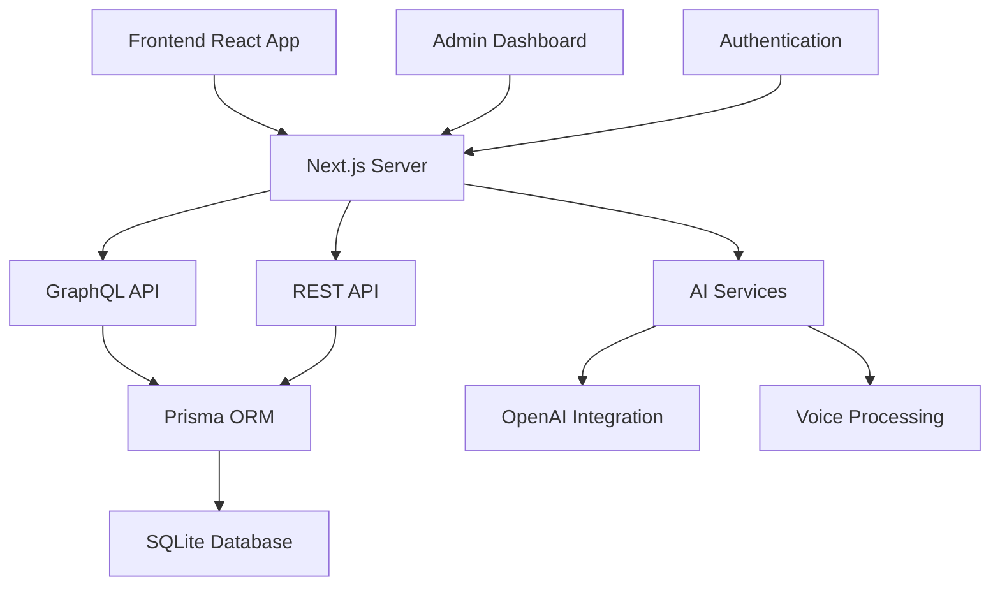

# Marriott Hotels AI Platform

Welcome to the Marriott Hotels AI Platform documentation! This wiki provides comprehensive information about our next-generation hotel management system that combines cutting-edge AI technology with exceptional hospitality services.

## 🌟 Quick Links
- [Technical Documentation](Technical-Documentation)
- [Development Setup](Development-Setup)
- [API Reference](API-Reference)
- [Contributing Guidelines](Contributing)

## 📱 Demo Videos
- [Marriott Hotel Platform Demo](docs/Marriott%20Hotel%20Platform.mov)
- [Platform Documentation Overview](docs/Marriott%20Hotel%20Documentation.mov)
- [Admin Dashboard Walkthrough](docs/Marriott%20Hotel%20Admin.mov)
- [Feature Walkthrough](docs/Marriott%20Hotel%20Walkthrough.mov)

## 🎯 Overview

The Marriott Hotels AI Platform represents a revolutionary approach to hotel management and guest services, combining traditional hospitality excellence with cutting-edge artificial intelligence.

### Core Features

#### 🤖 AI-Powered Services
- **AI Concierge Assistant**: 24/7 natural language guest support
- **Voice-Enabled Interactions**: Seamless voice commands and queries
- **Smart Recommendations**: Personalized guest experience suggestions
- **Automated Booking Management**: AI-assisted reservation handling

#### 🏨 Hotel Management
- **Dynamic Room Management**: Real-time availability and pricing
- **Intelligent Booking System**: Automated scheduling and confirmation
- **Resource Optimization**: AI-driven resource allocation
- **Guest Experience Tracking**: Personalized preference management

#### 🎛️ Admin Dashboard
- **Comprehensive Control Center**: All-in-one management interface
- **Real-time Analytics**: Advanced metrics and reporting
- **Staff Management**: Scheduling and task assignment
- **Inventory Control**: Automated stock management

### Technical Architecture

### Technology Stack

#### Frontend
- **Framework**: React with Next.js
- **Language**: TypeScript
- **Styling**: Tailwind CSS
- **State Management**: React Context + Custom Hooks

#### Backend
- **Server**: Node.js with Next.js API Routes
- **API**: GraphQL + REST endpoints
- **Database**: SQLite with Prisma ORM
- **Authentication**: NextAuth.js

#### AI Integration
- **Language Model**: OpenAI GPT
- **Voice Processing**: Custom Pipeline
- **Natural Language Understanding**: Custom Intent Processing

#### Testing & Quality
- **E2E Testing**: Cypress
- **Type Safety**: TypeScript
- **Code Quality**: ESLint + Prettier

## 🚀 Getting Started

To get started with the Marriott Hotels AI Platform, check out:
1. [Development Setup Guide](Development-Setup)
2. [Local Environment Configuration](Environment-Configuration)
3. [Contributing Guidelines](Contributing)

## 📚 Documentation Structure

Our documentation is organized into the following main sections:

- **[Technical Documentation](Technical-Documentation)**
  - Architecture Overview
  - Component Documentation
  - API Reference
  - Database Schema

- **[User Guides](User-Guides)**
  - Admin Dashboard Guide
  - Booking Management
  - AI Assistant Usage
  - Voice Command Reference

- **[Development](Development)**
  - Setup Guide
  - Best Practices
  - Testing Guidelines
  - Deployment Procedures

- **[API Reference](API-Reference)**
  - GraphQL Schema
  - REST Endpoints
  - Authentication
  - Rate Limiting

## 🤝 Contributing

We welcome contributions! Please see our [Contributing Guidelines](Contributing) for details on:
- Code of Conduct
- Development Process
- Pull Request Guidelines
- Testing Requirements

## 📞 Support

For support and questions:
- Create an issue in the repository
- Contact the development team
- Check the [FAQ](FAQ) section

---

*Last updated: [Current Date]* 