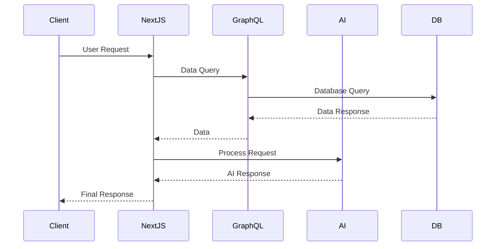

# Technical Documentation

This section provides detailed technical documentation for the Marriott Hotels AI Platform.

## System Architecture

### Overview Diagram

## Component Structure

### Frontend Components
- **AppWrapper**: Main application container
- **AdminLayout**: Admin dashboard layout
- **AIChatBot**: AI assistant interface
- **BookingModal**: Reservation system
- **HotelDetails**: Property information display

### AI Components
- **AIMonitoringDashboard**: AI system monitoring
- **LangGraphFlow**: Language processing flow
- **ModelTopologyGraph**: Model architecture visualization
- **ContinuousModeModal**: Continuous conversation handler

### Backend Services
- **Authentication Service**: User authentication and authorization
- **Booking Service**: Reservation management
- **AI Service**: Natural language and voice processing
- **Hotel Service**: Property and inventory management

## Database Schema

### Core Tables
- **Users**: User management
- **Hotels**: Property information
- **Rooms**: Room inventory
- **Bookings**: Reservation records
- **Conversations**: AI chat history

### Relationships
- Users -> Bookings (1:N)
- Hotels -> Rooms (1:N)
- Rooms -> Bookings (1:N)
- Users -> Conversations (1:N)

## API Structure

### GraphQL Schema
- Queries: Data retrieval operations
- Mutations: Data modification operations
- Subscriptions: Real-time updates

### REST Endpoints
- Authentication routes
- File upload handlers
- Webhook processors
- Legacy API support

## AI Integration

### OpenAI Implementation
- Model: GPT-4
- Purpose: Natural language understanding
- Integration: Direct API calls

### Voice Processing
- Speech-to-Text: Custom pipeline
- Text-to-Speech: OpenAI API
- Voice Commands: Custom intent processor

## Security Measures

### Authentication
- NextAuth.js implementation
- JWT token management
- Role-based access control

### Data Protection
- Input sanitization
- SQL injection prevention
- XSS protection
- CSRF protection

## Performance Optimization

### Frontend
- Code splitting
- Lazy loading
- Image optimization
- Cache management

### Backend
- Query optimization
- Connection pooling
- Rate limiting
- Response caching

## Monitoring and Logging

### System Metrics
- Response times
- Error rates
- Resource usage
- User activity

### AI Metrics
- Model performance
- Response accuracy
- Processing times
- Usage patterns

## Development Guidelines

### Code Standards
- TypeScript strict mode
- ESLint configuration
- Prettier formatting
- Git commit conventions

### Testing Requirements
- Unit tests coverage
- Integration tests
- E2E test scenarios
- Performance benchmarks

## Deployment Process

### Environment Setup
- Development
- Staging
- Production
- Testing

### CI/CD Pipeline
- GitHub Actions workflow
- Automated testing
- Deployment automation
- Rollback procedures

---

For more detailed information about specific components or systems, please refer to the respective subsections in the documentation. 