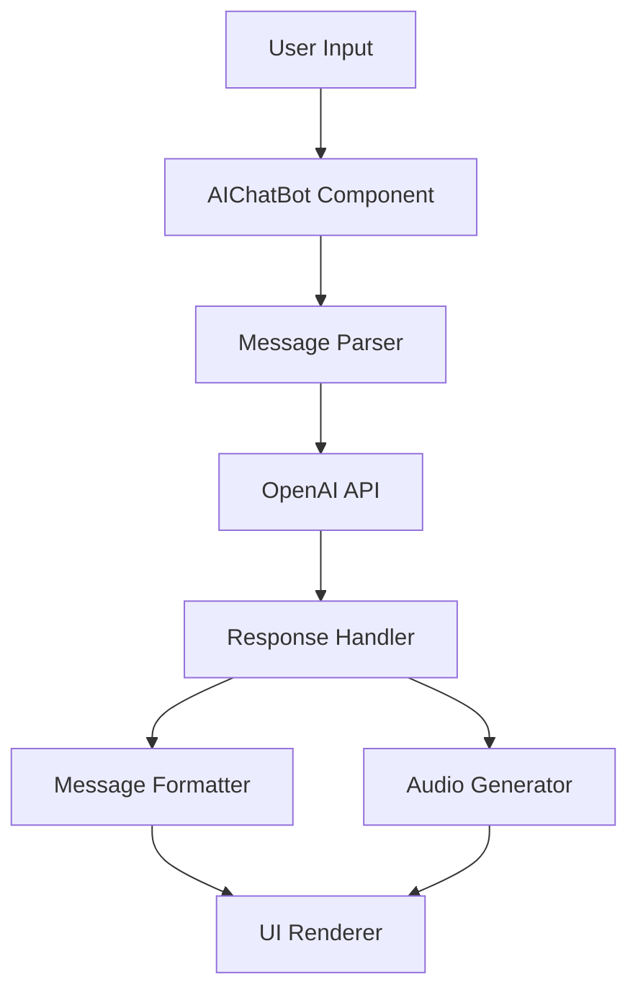

# AI Assistant Architecture

## Overview
The Marriott AI Assistant is built on a sophisticated architecture that combines OpenAI's powerful language models with custom conversation management and voice processing capabilities. This document outlines the core components and their interactions.

## Architecture Components

### 1. Conversation Layer

### 2. Core Components

#### AIChatBot Component
- **Purpose**: Main interface for user interactions
- **Location**: `src/components/AIChatBot.tsx`
- **Responsibilities**:
  - Manages chat UI and interactions
  - Handles message state
  - Coordinates audio playback
  - Processes user input
  - Manages conversation threading

#### Message Processing Pipeline
1. **Input Processing**
   - Sanitizes user input
   - Manages conversation context
   - Handles special commands

2. **OpenAI Integration**
   - Manages API calls
   - Handles rate limiting
   - Error recovery
   - Response validation

3. **Response Processing**
   - JSON parsing and validation
   - Error handling
   - Message formatting
   - Audio generation coordination

### 3. Voice Integration

#### Audio Processing
- Text-to-Speech generation
- Audio playback management
- Stream handling
- Error recovery

#### Voice Features
- Real-time audio generation
- Playback controls
- Audio state management
- Format handling (MP3)

## Data Flow

### Message Flow
1. User sends message
2. Message is processed and validated
3. OpenAI API call is made with context
4. Response is received and parsed
5. Audio is generated if needed
6. Response is rendered to UI

### State Management
- Thread ID tracking
- Conversation history
- Audio playback state
- Loading states
- Error states

## Error Handling

### Recovery Strategies
1. API failure recovery
2. Message parsing fallbacks
3. Audio generation alternatives
4. Network error handling

### Error Types
- Connection errors
- API rate limits
- Parsing errors
- Audio playback issues

## Performance Considerations

### Optimization Techniques
1. Message batching
2. Response caching
3. Audio preloading
4. State optimization

### Resource Management
- API call optimization
- Memory management
- Audio buffer handling
- Thread cleanup

## Security

### Data Protection
- API key management
- User data handling
- Conversation privacy
- Audio data security

### Access Control
- Rate limiting
- User authentication
- API access management
- Error logging

## Scaling Considerations

### Horizontal Scaling
- Load balancing
- API distribution
- State management
- Cache distribution

### Vertical Scaling
- Resource optimization
- Performance tuning
- Memory management
- Thread optimization

## Future Enhancements

### Planned Features
1. Multi-language support
2. Enhanced context awareness
3. Improved voice quality
4. Advanced conversation threading

### Integration Opportunities
1. Additional AI models
2. Enhanced audio capabilities
3. Real-time translation
4. Sentiment analysis

## Monitoring and Maintenance

### Key Metrics
- Response times
- Error rates
- API usage
- User engagement

### Maintenance Tasks
- Regular updates
- Performance monitoring
- Error tracking
- Usage analytics

## Development Guidelines

### Best Practices
1. Code organization
2. Error handling
3. Testing strategies
4. Documentation

### Integration Guidelines
1. API usage
2. State management
3. Error handling
4. Performance optimization 