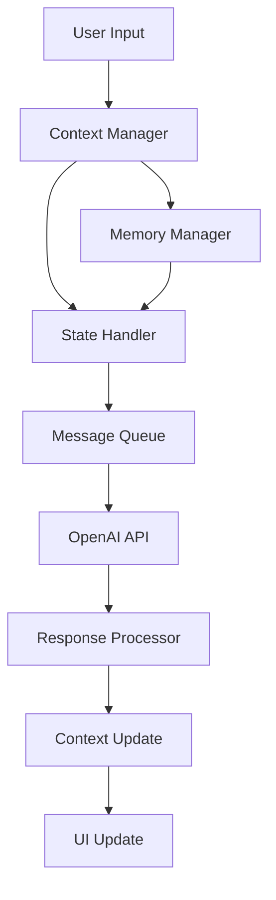

# Conversation Management

## Overview
The conversation management system in the Marriott Hotels platform handles the complex task of maintaining context, managing state, and ensuring natural dialogue flow between users and the AI assistant. This document outlines the architecture and implementation of the conversation management system.

## Architecture

### System Components


## Core Components

### 1. Context Management
```typescript
interface ConversationContext {
  threadId: string;
  userProfile: UserProfile;
  currentTopic: string;
  messageHistory: Message[];
  preferences: UserPreferences;
}
```

### 2. State Handler
```typescript
interface ConversationState {
  isProcessing: boolean;
  lastMessageTimestamp: number;
  currentAudioState: AudioState;
  errorState: ErrorState | null;
}
```

## Implementation Details

### 1. Message Processing
- Input validation
- Context enrichment
- State updates
- Response handling

### 2. Context Preservation
- Short-term memory
- Long-term memory
- Context pruning
- State persistence

### 3. Thread Management
- Thread creation
- Context association
- Thread cleanup
- State synchronization

## Conversation Flow

### 1. Message Lifecycle
1. User input received
2. Context loaded
3. State updated
4. API request made
5. Response processed
6. Context updated
7. UI refreshed

### 2. State Management
- Active states
- Transition handling
- Error states
- Recovery procedures

## Memory Management

### 1. Short-term Memory
- Recent messages
- Current context
- Active state
- Temporary data

### 2. Long-term Memory
- User preferences
- Conversation history
- Important details
- Persistent state

## Error Handling

### Types of Errors
1. Context loss
2. State corruption
3. API failures
4. Threading issues

### Recovery Strategies
1. State restoration
2. Context rebuild
3. Graceful degradation
4. User notification

## Performance Optimization

### 1. Memory Usage
- Context optimization
- State compression
- History pruning
- Resource management

### 2. Response Time
- Queue management
- Cache utilization
- Async processing
- Load balancing

## Security

### Data Protection
1. Context encryption
2. State security
3. History protection
4. Access control

### Privacy
1. Data retention
2. User consent
3. Data anonymization
4. Access logging

## Development Guidelines

### Code Structure
```typescript
class ConversationManager {
  private context: ConversationContext;
  private state: ConversationState;
  private memory: MemoryManager;

  constructor() {
    this.initializeContext();
    this.setupState();
    this.initializeMemory();
  }

  async processMessage(message: UserMessage): Promise<AIResponse> {
    try {
      // Update context
      this.updateContext(message);

      // Process message
      const response = await this.generateResponse(message);

      // Update state
      this.updateState(response);

      return response;
    } catch (error) {
      // Error handling
    }
  }

  private updateContext(message: UserMessage): void {
    // Context update logic
  }

  private async generateResponse(message: UserMessage): Promise<AIResponse> {
    // Response generation logic
  }

  private updateState(response: AIResponse): void {
    // State update logic
  }
}
```

### Best Practices
1. Context management
2. State handling
3. Error recovery
4. Performance optimization

## Testing

### Test Categories
1. Unit tests
2. Integration tests
3. State tests
4. Performance tests

### Test Scenarios
1. Normal flow
2. Error conditions
3. State transitions
4. Recovery procedures

## Monitoring

### Key Metrics
1. Response times
2. Error rates
3. Memory usage
4. State transitions

### Logging
1. State changes
2. Error events
3. Performance data
4. User interactions

## Future Enhancements

### Planned Features
1. Enhanced context
2. Better memory
3. Improved state
4. Advanced recovery

### Integration Options
1. Custom handlers
2. Enhanced security
3. Advanced analytics
4. Extended features

## Maintenance

### Regular Tasks
1. Context cleanup
2. State verification
3. Memory optimization
4. Error analysis

### Troubleshooting
1. Common issues
2. Debug procedures
3. Recovery steps
4. Support process

## Documentation

### API Reference
1. Methods
2. Parameters
3. Return values
4. Error codes

### Usage Examples
1. Basic usage
2. Advanced features
3. Error handling
4. Best practices 