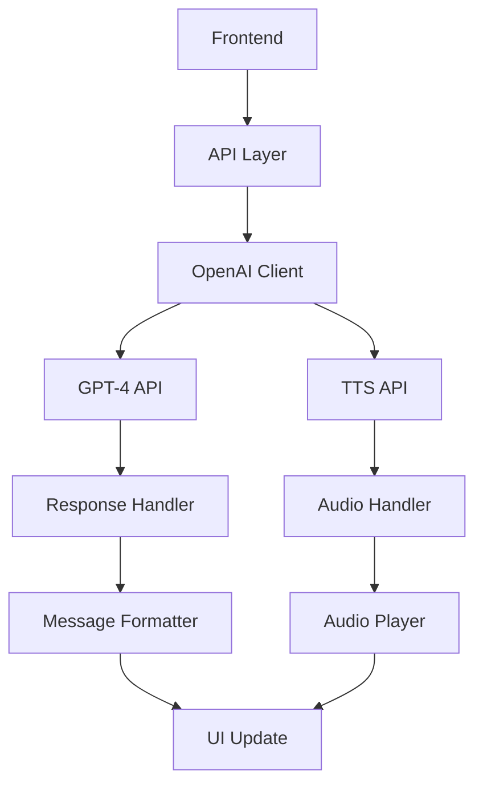

# OpenAI Integration

## Overview
The Marriott Hotels platform integrates OpenAI's GPT models and Text-to-Speech capabilities to provide an intelligent, conversational AI assistant. This document details the integration architecture, implementation details, and best practices.

## Integration Architecture

### Components


## Implementation Details

### 1. API Configuration
```typescript
// Configuration setup
const openai = new OpenAI({
  apiKey: process.env.OPENAI_API_KEY,
  organization: process.env.OPENAI_ORG_ID
});
```

### 2. Assistant Configuration
```typescript
const ASSISTANT_CONFIG = {
  model: 'gpt-4-turbo-preview',
  temperature: 0.7,
  max_tokens: 500,
  presence_penalty: 0.6,
  frequency_penalty: 0.5
};
```

### 3. Message Processing
- Thread management
- Context preservation
- Response parsing
- Error handling

### 4. Voice Generation
- Text-to-Speech processing
- Audio format handling
- Stream management
- Playback control

## API Usage

### 1. Chat Completion
- Model selection
- Parameter optimization
- Response handling
- Error management

### 2. Voice Generation
- Voice selection
- Audio quality settings
- Format configuration
- Stream handling

## Best Practices

### 1. API Management
- Rate limiting
- Error handling
- Retry strategies
- Timeout handling

### 2. Security
- API key protection
- Request validation
- Response sanitization
- Error logging

### 3. Performance
- Response caching
- Request batching
- Stream optimization
- Memory management

## Error Handling

### Types of Errors
1. API Connection
2. Rate Limits
3. Invalid Responses
4. Token Limits

### Recovery Strategies
1. Automatic retry
2. Fallback responses
3. Graceful degradation
4. User feedback

## Monitoring

### Key Metrics
1. API usage
2. Response times
3. Error rates
4. Token consumption

### Logging
1. Request tracking
2. Error logging
3. Usage analytics
4. Performance metrics

## Cost Management

### Optimization Strategies
1. Token optimization
2. Caching implementation
3. Request batching
4. Model selection

### Usage Tracking
1. Token counting
2. Request monitoring
3. Cost analysis
4. Usage patterns

## Development Guidelines

### Code Organization
```typescript
// Example service structure
class OpenAIService {
  private client: OpenAI;
  private config: AssistantConfig;

  constructor() {
    this.initializeClient();
    this.setupConfig();
  }

  async processMessage(message: string): Promise<AIResponse> {
    try {
      // Message processing logic
    } catch (error) {
      // Error handling
    }
  }

  async generateAudio(text: string): Promise<AudioData> {
    try {
      // Audio generation logic
    } catch (error) {
      // Error handling
    }
  }
}
```

### Testing Strategy
1. Unit tests
2. Integration tests
3. Mock responses
4. Error scenarios

## Production Considerations

### Scaling
1. Load balancing
2. Request distribution
3. Cache implementation
4. Resource management

### Security
1. API key rotation
2. Request validation
3. Response sanitization
4. Access control

## Future Enhancements

### Planned Features
1. Model upgrades
2. Enhanced context
3. Improved voice
4. Advanced analytics

### Integration Options
1. Additional models
2. Custom fine-tuning
3. Enhanced features
4. New capabilities 