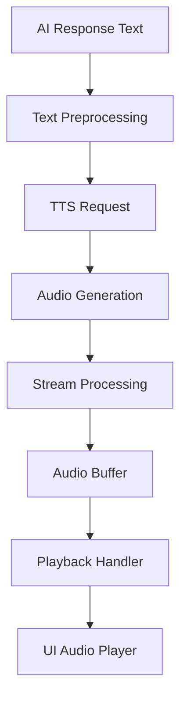

# Voice Processing Pipeline

## Overview
The voice processing pipeline in the Marriott Hotels platform converts AI-generated text responses into natural-sounding speech using OpenAI's Text-to-Speech API. This document details the complete pipeline from text generation to audio playback.

## Architecture

### Pipeline Flow


## Components

### 1. Text Preprocessing
- Sentence segmentation
- SSML markup (if needed)
- Special character handling
- Length optimization

### 2. TTS Configuration
```typescript
const TTS_CONFIG = {
  model: 'tts-1',
  voice: 'alloy',
  format: 'mp3',
  speed: 1.0,
  quality: 'high'
};
```

### 3. Audio Processing
- Stream handling
- Buffer management
- Format conversion
- Quality control

## Implementation Details

### 1. Voice Selection
- Available voices
- Use cases
- Quality considerations
- Language support

### 2. Audio Format
- MP3 encoding
- Bit rate settings
- Quality options
- Size optimization

### 3. Playback Control
- Play/pause functionality
- Volume control
- Speed adjustment
- Position tracking

## Performance Optimization

### 1. Stream Management
- Chunk size optimization
- Buffer handling
- Memory management
- Garbage collection

### 2. Caching Strategy
- Audio caching
- Response storage
- Cache invalidation
- Storage limits

### 3. Resource Usage
- Memory allocation
- CPU utilization
- Network bandwidth
- Storage requirements

## Error Handling

### Types of Errors
1. API failures
2. Stream interruptions
3. Playback issues
4. Format errors

### Recovery Strategies
1. Retry logic
2. Fallback options
3. Error reporting
4. User feedback

## Quality Assurance

### Audio Quality
1. Bit rate standards
2. Format validation
3. Quality testing
4. Performance metrics

### Testing Procedures
1. Unit testing
2. Integration testing
3. Performance testing
4. User acceptance

## Production Deployment

### Scaling Considerations
1. Load distribution
2. Resource allocation
3. Cache management
4. Error handling

### Monitoring
1. Performance metrics
2. Error tracking
3. Usage statistics
4. Quality metrics

## Security

### Data Protection
1. Audio storage
2. Stream encryption
3. Access control
4. Privacy compliance

### API Security
1. Authentication
2. Rate limiting
3. Request validation
4. Error logging

## Development Guidelines

### Code Structure
```typescript
class VoiceProcessor {
  private ttsClient: TTSClient;
  private audioPlayer: AudioPlayer;

  constructor() {
    this.initializeTTS();
    this.setupAudioPlayer();
  }

  async generateSpeech(text: string): Promise<AudioStream> {
    try {
      // Text preprocessing
      const processedText = this.preprocessText(text);

      // TTS generation
      const audioStream = await this.ttsClient.generate(processedText);

      // Audio processing
      return this.processAudioStream(audioStream);
    } catch (error) {
      // Error handling
    }
  }

  private preprocessText(text: string): string {
    // Text preprocessing logic
    return processedText;
  }

  private async processAudioStream(stream: Stream): Promise<AudioStream> {
    // Stream processing logic
    return processedStream;
  }
}
```

### Best Practices
1. Error handling
2. Resource management
3. Performance optimization
4. Code organization

## Future Enhancements

### Planned Features
1. Multiple voices
2. Language support
3. SSML integration
4. Advanced controls

### Integration Options
1. Custom voices
2. Enhanced quality
3. Real-time processing
4. Advanced effects

## Maintenance

### Regular Tasks
1. Performance monitoring
2. Error checking
3. Quality assessment
4. Updates and patches

### Troubleshooting
1. Common issues
2. Debug procedures
3. Error resolution
4. Support escalation

## Documentation

### API Reference
1. Endpoints
2. Parameters
3. Response formats
4. Error codes

### Usage Examples
1. Basic implementation
2. Advanced features
3. Error handling
4. Best practices 