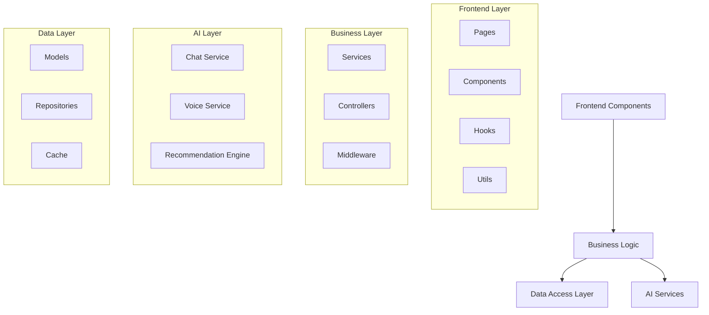

# Component Architecture

## Overview
This document details the component architecture of the Marriott Hotels platform, focusing on the organization, interaction, and implementation of various system components. Special attention is given to AI components and their integration with the rest of the system.

## Component Organization

### System Components


## Frontend Components

### 1. Page Components
```typescript
interface PageStructure {
  pages: {
    home: 'HomePage',
    hotels: 'HotelsPage',
    booking: 'BookingPage',
    profile: 'ProfilePage',
    admin: 'AdminPage'
  };
  layouts: {
    main: 'MainLayout',
    admin: 'AdminLayout',
    auth: 'AuthLayout'
  };
}
```

### 2. Shared Components
```typescript
interface SharedComponents {
  ui: {
    Button: 'CustomButton',
    Input: 'FormInput',
    Modal: 'DialogModal',
    Card: 'ContentCard'
  };
  features: {
    Search: 'SearchBar',
    Filter: 'FilterPanel',
    Sort: 'SortControl',
    Pagination: 'PageControl'
  };
}
```

## AI Components

### 1. Chat Components
```typescript
interface ChatComponents {
  main: {
    ChatBot: 'AIChatBot',
    MessageList: 'ChatMessages',
    InputArea: 'ChatInput'
  };
  features: {
    VoiceInput: 'VoiceRecorder',
    ResponseHandler: 'AIResponse',
    ContextManager: 'ChatContext'
  };
}
```

### 2. Voice Components
```typescript
interface VoiceComponents {
  recording: {
    Recorder: 'AudioRecorder',
    Player: 'AudioPlayer',
    Controls: 'AudioControls'
  };
  processing: {
    STT: 'SpeechToText',
    TTS: 'TextToSpeech',
    AudioHandler: 'AudioProcessor'
  };
}
```

## Business Components

### 1. Service Layer
```typescript
interface ServiceLayer {
  core: {
    BookingService: 'HotelBooking',
    UserService: 'UserManagement',
    PaymentService: 'PaymentProcessing'
  };
  ai: {
    ChatService: 'ConversationHandler',
    VoiceService: 'AudioProcessor',
    RecommendationService: 'Recommendations'
  };
}
```

### 2. Controller Layer
```typescript
interface ControllerLayer {
  api: {
    BookingController: 'BookingAPI',
    UserController: 'UserAPI',
    AIController: 'AIAPI'
  };
  web: {
    PageController: 'PageHandler',
    AuthController: 'AuthHandler',
    AdminController: 'AdminHandler'
  };
}
```

## Data Components

### 1. Model Layer
```typescript
interface DataModels {
  entities: {
    User: 'UserModel',
    Hotel: 'HotelModel',
    Booking: 'BookingModel',
    Review: 'ReviewModel'
  };
  ai: {
    Conversation: 'ChatModel',
    VoiceRecord: 'AudioModel',
    Recommendation: 'RecommendationModel'
  };
}
```

### 2. Repository Layer
```typescript
interface Repositories {
  data: {
    UserRepo: 'UserRepository',
    HotelRepo: 'HotelRepository',
    BookingRepo: 'BookingRepository'
  };
  cache: {
    SessionCache: 'SessionStore',
    ResponseCache: 'AIResponseCache',
    DataCache: 'DataStore'
  };
}
```

## Component Communication

### 1. Event System
```typescript
interface EventSystem {
  channels: {
    user: 'UserEvents',
    booking: 'BookingEvents',
    ai: 'AIEvents'
  };
  handlers: {
    userHandler: 'UserEventHandler',
    bookingHandler: 'BookingEventHandler',
    aiHandler: 'AIEventHandler'
  };
}
```

### 2. State Management
```typescript
interface StateManagement {
  global: {
    user: 'UserState',
    app: 'AppState',
    ai: 'AIState'
  };
  local: {
    page: 'PageState',
    component: 'ComponentState',
    form: 'FormState'
  };
}
```

## Component Lifecycle

### 1. Initialization
- Component creation
- Dependency injection
- State initialization
- Event binding
- Resource allocation

### 2. Runtime
- State updates
- Event handling
- Error management
- Resource management
- Performance optimization

## Component Testing

### 1. Test Structure
```typescript
interface TestStructure {
  unit: {
    components: 'ComponentTests',
    services: 'ServiceTests',
    utils: 'UtilityTests'
  };
  integration: {
    flows: 'FlowTests',
    api: 'APITests',
    ai: 'AITests'
  };
}
```

### 2. Test Coverage
- Component tests
- Integration tests
- Performance tests
- Security tests
- AI/ML tests

## Documentation

### 1. Component Docs
- Usage guides
- API documentation
- Props/methods
- Examples
- Best practices

### 2. Maintenance
- Update procedures
- Version control
- Dependencies
- Breaking changes
- Migration guides

## Future Improvements

### 1. Component Roadmap
- Enhanced modularity
- Better performance
- Improved testing
- Advanced features
- Better documentation

### 2. Research Areas
- New patterns
- Better tools
- Improved methods
- Advanced features
- Enhanced integration 