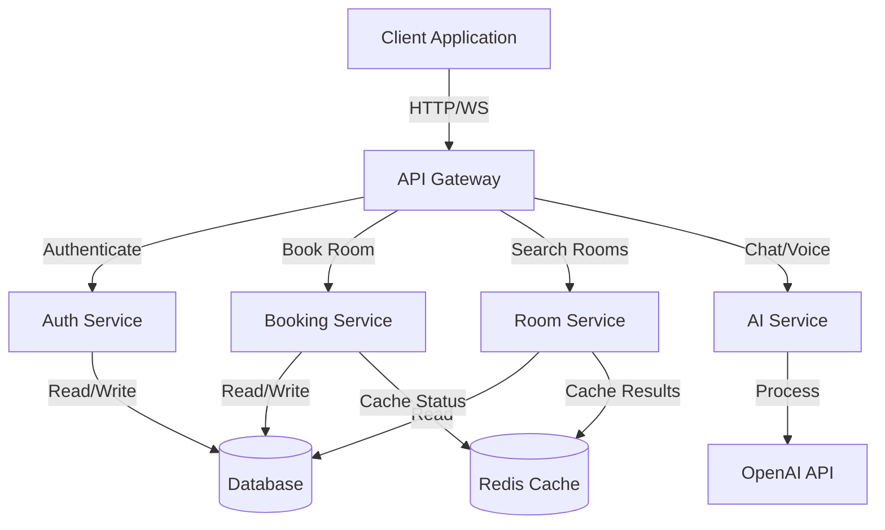
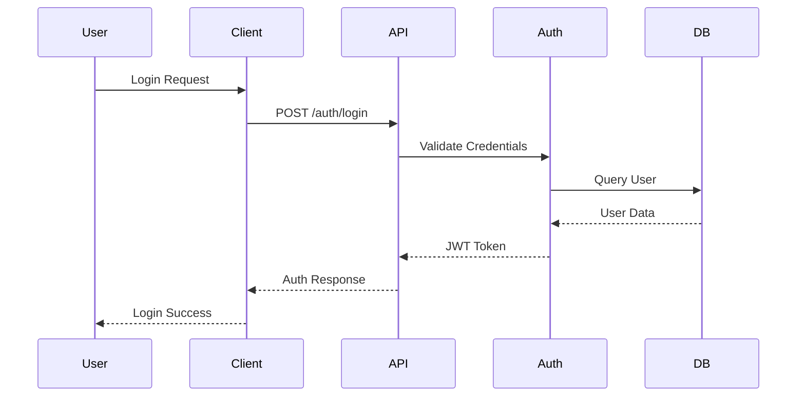
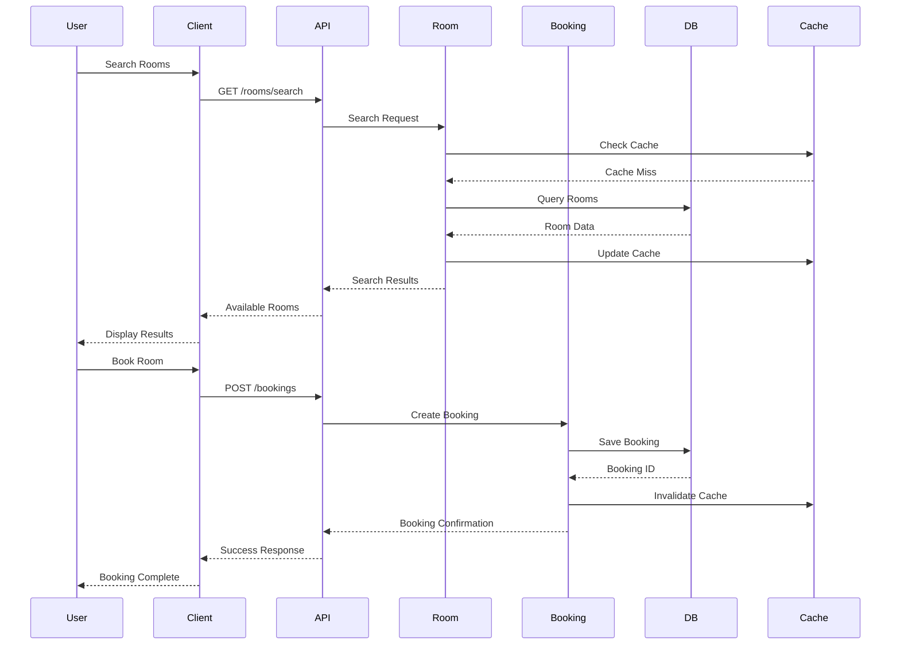
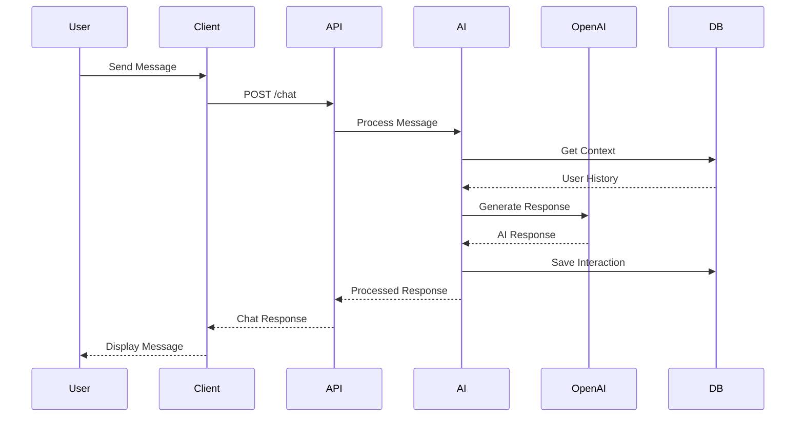
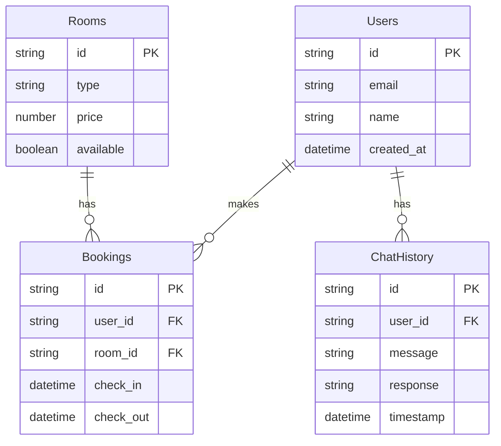
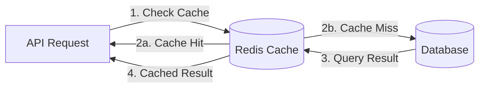
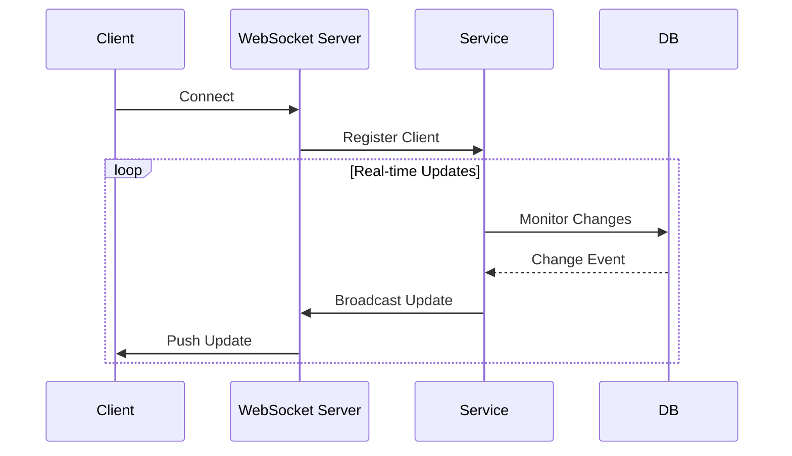
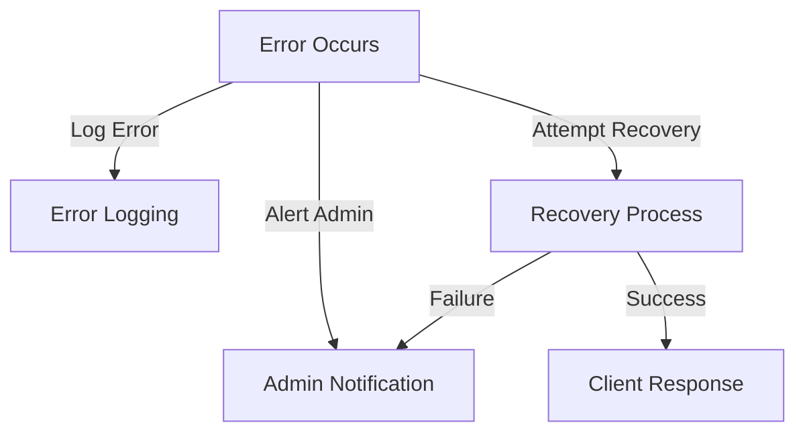
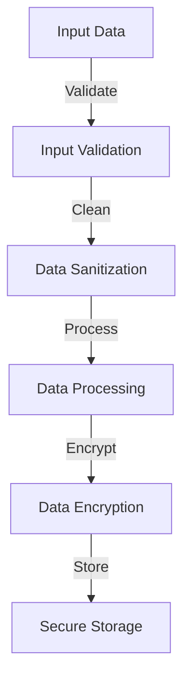

# Data Flow Architecture

## Overview
This document outlines the data flow architecture of the Marriott Hotels platform, describing how data moves between different components and services.

## System Data Flow Diagram

## Component Data Flows

### 1. User Authentication Flow

### 2. Room Booking Flow

### 3. AI Interaction Flow

## Data Storage Patterns

### 1. Database Schema

### 2. Caching Strategy

## Real-time Data Flow

### WebSocket Communication

## Error Handling Flow

## Data Security Flow

## Best Practices

1. **Data Consistency**
   - Use transactions for critical operations
   - Implement retry mechanisms
   - Maintain data integrity constraints

2. **Performance Optimization**
   - Cache frequently accessed data
   - Use database indexes effectively
   - Implement pagination for large datasets

3. **Security Measures**
   - Encrypt sensitive data
   - Implement rate limiting
   - Use proper authentication/authorization

4. **Error Handling**
   - Implement graceful degradation
   - Provide meaningful error messages
   - Log errors for debugging

5. **Monitoring**
   - Track data flow metrics
   - Monitor system performance
   - Set up alerts for anomalies

## Maintenance Guidelines

1. Regular review of data flow patterns
2. Update documentation for new features
3. Optimize based on usage patterns
4. Monitor and adjust caching strategies
5. Regular security audits