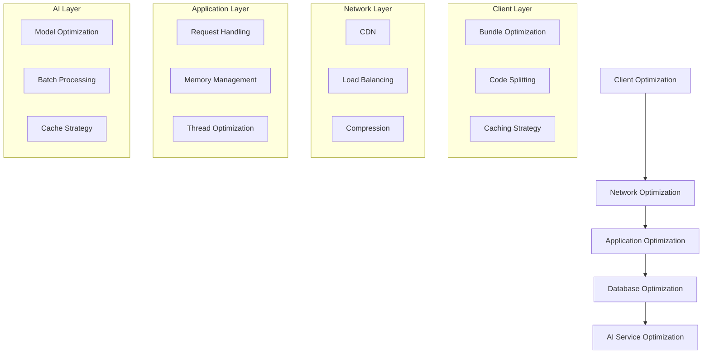

# Performance Optimization

## Overview
This document outlines the performance optimization strategies implemented in the Marriott Hotels platform. It covers frontend optimization, backend performance, AI processing optimization, and infrastructure tuning to ensure optimal system performance under various load conditions.

## Performance Architecture

### System Performance Layers


## Frontend Optimization

### 1. Bundle Optimization
```typescript
const WEBPACK_CONFIG = {
  optimization: {
    splitChunks: {
      chunks: 'all',
      minSize: 20000,
      maxSize: 244000,
      cacheGroups: {
        vendor: {
          test: /[\\/]node_modules[\\/]/,
          name: 'vendors',
          chunks: 'all'
        }
      }
    },
    minimize: true
  }
};
```

### 2. Loading Strategy
- Code splitting
- Lazy loading
- Route-based chunking
- Dynamic imports
- Preloading critical assets

### 3. Caching Implementation
```typescript
const CACHE_CONFIG = {
  static: {
    maxAge: '30d',
    immutable: true
  },
  dynamic: {
    maxAge: '1h',
    revalidate: true
  },
  api: {
    maxAge: '5m',
    staleWhileRevalidate: true
  }
};
```

## Backend Performance

### 1. Request Processing
```typescript
const SERVER_CONFIG = {
  clustering: {
    enabled: true,
    workers: 'auto'
  },
  compression: {
    level: 6,
    threshold: '1kb'
  },
  caching: {
    enabled: true,
    strategy: 'adaptive'
  }
};
```

### 2. Memory Management
- Garbage collection
- Memory pooling
- Resource limits
- Leak prevention
- Monitoring

## AI Service Optimization

### 1. Model Optimization
```typescript
const AI_OPTIMIZATION = {
  caching: {
    responses: true,
    embeddings: true,
    ttl: '1h'
  },
  batching: {
    enabled: true,
    maxSize: 10,
    timeout: '100ms'
  },
  streaming: {
    enabled: true,
    chunkSize: '1kb'
  }
};
```

### 2. Processing Strategy
- Request batching
- Response caching
- Parallel processing
- Load distribution
- Error handling

## Database Optimization

### 1. Query Optimization
```typescript
const DB_CONFIG = {
  pooling: {
    min: 5,
    max: 20,
    idleTimeout: '30s'
  },
  indexing: {
    automatic: true,
    analyze: true
  },
  caching: {
    results: true,
    ttl: '5m'
  }
};
```

### 2. Data Access
- Connection pooling
- Query caching
- Index optimization
- Partition strategy
- Replication setup

## Caching Strategy

### 1. Multi-level Caching
```typescript
const CACHE_HIERARCHY = {
  browser: {
    static: true,
    api: true
  },
  cdn: {
    static: true,
    dynamic: true
  },
  application: {
    memory: true,
    distributed: true
  },
  database: {
    query: true,
    results: true
  }
};
```

### 2. Cache Management
- Invalidation strategy
- Consistency handling
- Storage optimization
- Hit ratio monitoring
- Cache warming

## Load Testing

### 1. Performance Metrics
```typescript
const PERFORMANCE_METRICS = {
  response_time: {
    p95: '200ms',
    p99: '500ms'
  },
  throughput: {
    rps: 1000,
    concurrent: 100
  },
  resource_usage: {
    cpu: '80%',
    memory: '85%'
  }
};
```

### 2. Testing Strategy
- Load simulation
- Stress testing
- Endurance testing
- Spike testing
- Bottleneck identification

## Monitoring and Alerts

### 1. Performance Monitoring
```typescript
const MONITORING_CONFIG = {
  metrics: {
    collection: '10s',
    retention: '30d'
  },
  alerts: {
    response_time: '500ms',
    error_rate: '1%',
    cpu_usage: '90%'
  }
};
```

### 2. Alert System
- Threshold alerts
- Trend analysis
- Anomaly detection
- Alert correlation
- Response automation

## Resource Optimization

### 1. Infrastructure Tuning
- Server configuration
- Network optimization
- Storage optimization
- Service scaling
- Resource allocation

### 2. Cost Optimization
- Resource utilization
- Scaling efficiency
- Service costs
- Storage optimization
- Traffic management

## Development Guidelines

### 1. Performance Best Practices
- Code optimization
- Resource management
- Error handling
- Logging strategy
- Testing requirements

### 2. Review Process
- Performance review
- Load testing
- Code analysis
- Resource profiling
- Optimization verification

## Future Improvements

### 1. Optimization Roadmap
- Enhanced caching
- Better algorithms
- Improved monitoring
- Advanced analytics
- Infrastructure updates

### 2. Research Areas
- New technologies
- Better tools
- Improved methods
- Advanced metrics
- Enhanced automation

## Documentation

### 1. Performance Guides
- Optimization guides
- Best practices
- Troubleshooting
- Monitoring guides
- Testing procedures

### 2. Maintenance
- Regular reviews
- Update procedures
- Testing schedules
- Documentation updates
- Training materials 