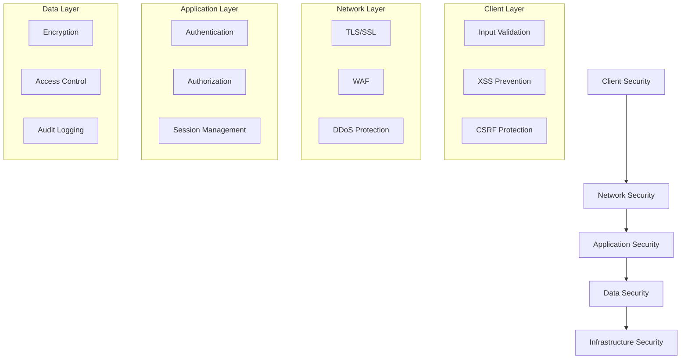

# Security Architecture

## Overview
This document outlines the comprehensive security architecture of the Marriott Hotels platform, covering authentication, authorization, data protection, and compliance measures. Security is implemented at every layer of the application to ensure robust protection of user data and system resources.

## Security Architecture Diagram

### System Security Layers


## Authentication System

### 1. Authentication Flow
```typescript
interface AuthConfig {
  jwt: {
    secret: string;
    expiresIn: string;
    algorithm: string;
  };
  oauth: {
    providers: string[];
    callbackUrl: string;
  };
  mfa: {
    enabled: boolean;
    methods: string[];
  };
}
```

### 2. Implementation Details
- JWT-based authentication
- OAuth 2.0 integration
- Multi-factor authentication
- Session management
- Token refresh mechanism

## Authorization Framework

### 1. Role-Based Access Control
```typescript
interface RolePermissions {
  admin: {
    all: boolean;
    specific: string[];
  };
  staff: {
    bookings: boolean;
    customers: boolean;
    reports: boolean;
  };
  customer: {
    profile: boolean;
    bookings: boolean;
    reviews: boolean;
  };
}
```

### 2. Permission System
- Granular permissions
- Role hierarchy
- Access policies
- Permission inheritance
- Dynamic authorization

## Data Protection

### 1. Encryption Strategy
```typescript
const ENCRYPTION_CONFIG = {
  algorithm: 'AES-256-GCM',
  keyRotation: '30d',
  saltRounds: 10,
  storage: {
    atRest: true,
    inTransit: true,
    inUse: true
  }
};
```

### 2. Data Classification
- Personal data
- Payment information
- System credentials
- Audit logs
- Analytics data

## Network Security

### 1. Infrastructure Protection
- Firewall configuration
- DDoS protection
- Rate limiting
- IP filtering
- Traffic monitoring

### 2. Communication Security
- TLS 1.3
- Certificate management
- Secure headers
- CORS policies
- CSP implementation

## Application Security

### 1. Input Validation
```typescript
const VALIDATION_RULES = {
  input: {
    sanitization: true,
    validation: true,
    encoding: true
  },
  files: {
    typeCheck: true,
    sizeLimit: true,
    virusScan: true
  },
  api: {
    rateLimit: true,
    authentication: true,
    validation: true
  }
};
```

### 2. Output Encoding
- HTML encoding
- JavaScript encoding
- URL encoding
- SQL escaping
- XML encoding

## Session Management

### 1. Session Security
- Secure cookie flags
- Session timeout
- Rotation policy
- Invalidation rules
- Concurrent sessions

### 2. Token Management
- Token generation
- Validation rules
- Expiration handling
- Refresh mechanism
- Revocation system

## Audit and Logging

### 1. Audit System
```typescript
interface AuditConfig {
  events: {
    auth: boolean;
    data: boolean;
    admin: boolean;
    system: boolean;
  };
  retention: {
    period: string;
    archival: boolean;
  };
  alerts: {
    severity: string[];
    notification: string[];
  };
}
```

### 2. Log Management
- Centralized logging
- Log rotation
- Access logging
- Error logging
- Security events

## Compliance Framework

### 1. Standards Compliance
- GDPR
- PCI DSS
- SOC 2
- ISO 27001
- HIPAA

### 2. Privacy Controls
- Data minimization
- Consent management
- Rights management
- Data retention
- Privacy notices

## Security Monitoring

### 1. Real-time Monitoring
```typescript
const MONITORING_CONFIG = {
  alerts: {
    authentication: {
      failedAttempts: 5,
      timeWindow: '5m'
    },
    api: {
      rateLimit: 1000,
      timeWindow: '1m'
    },
    security: {
      severity: ['high', 'critical'],
      notification: ['email', 'slack']
    }
  }
};
```

### 2. Incident Response
- Alert triggers
- Response procedures
- Escalation paths
- Recovery steps
- Post-mortem analysis

## Development Security

### 1. Secure Development
- Code review
- Security testing
- Dependency scanning
- Vulnerability assessment
- Penetration testing

### 2. CI/CD Security
- Build security
- Deploy security
- Runtime security
- Container security
- Infrastructure security

## Disaster Recovery

### 1. Backup Strategy
- Data backups
- System backups
- Configuration backups
- Recovery testing
- Retention policy

### 2. Business Continuity
- Failover systems
- Recovery procedures
- Communication plan
- Testing schedule
- Documentation

## Future Enhancements

### 1. Security Roadmap
- Enhanced MFA
- Advanced encryption
- Improved monitoring
- Better automation
- Enhanced compliance

### 2. Emerging Threats
- Threat monitoring
- Risk assessment
- Mitigation planning
- Security updates
- Training programs 