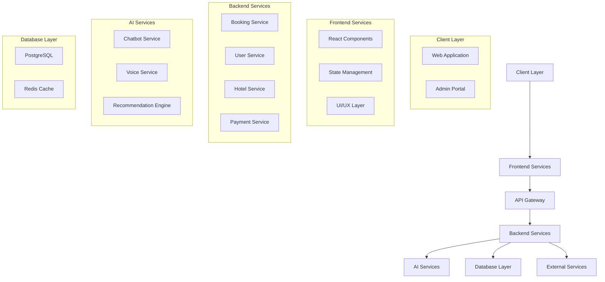
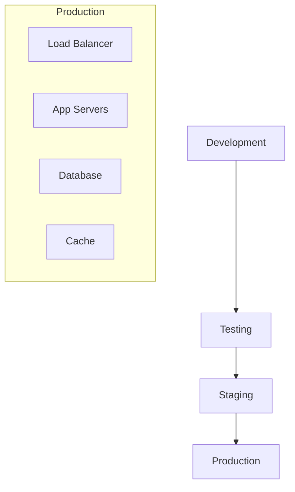

# System Architecture Overview

## Overview
The Marriott Hotels platform is a modern, AI-powered hotel management system built with a microservices architecture. This document provides a comprehensive overview of the system architecture, components, and their interactions.

## High-Level Architecture

### System Components


## Core Components

### 1. Frontend Architecture
- React-based SPA
- Next.js framework
- Tailwind CSS
- State management
- Component library

### 2. Backend Services
- Node.js/Express
- RESTful APIs
- GraphQL endpoints
- Microservices
- Service mesh

### 3. AI Integration
- OpenAI services
- Voice processing
- Chatbot system
- Recommendation engine
- Context management

### 4. Database Layer
- PostgreSQL (Primary)
- Redis (Caching)
- Prisma ORM
- Data migrations
- Backup systems

## Technology Stack

### 1. Frontend Technologies
```typescript
const FRONTEND_STACK = {
  framework: 'Next.js',
  language: 'TypeScript',
  styling: 'Tailwind CSS',
  stateManagement: 'React Context + Hooks',
  buildTool: 'Vite'
};
```

### 2. Backend Technologies
```typescript
const BACKEND_STACK = {
  runtime: 'Node.js',
  framework: 'Express',
  database: 'PostgreSQL',
  cache: 'Redis',
  orm: 'Prisma'
};
```

### 3. AI Technologies
```typescript
const AI_STACK = {
  llm: 'GPT-4',
  voice: 'OpenAI TTS',
  vectorStore: 'PostgreSQL + pgvector',
  embeddings: 'OpenAI Ada'
};
```

## Data Flow

### 1. Request Flow
1. Client request
2. API Gateway
3. Service routing
4. Data processing
5. Response generation
6. Client update

### 2. Data Processing
- Input validation
- Authentication
- Authorization
- Business logic
- Response formatting

## Security Architecture

### 1. Authentication
- JWT tokens
- OAuth 2.0
- Role-based access
- Session management

### 2. Data Protection
- Encryption at rest
- TLS in transit
- API security
- Input validation

## Scalability

### 1. Horizontal Scaling
- Load balancing
- Service replication
- Database sharding
- Cache distribution

### 2. Vertical Scaling
- Resource optimization
- Performance tuning
- Memory management
- CPU utilization

## Deployment Architecture

### 1. Environment Structure


### 2. CI/CD Pipeline
- GitHub Actions
- Automated testing
- Deployment automation
- Monitoring integration

## Performance Optimization

### 1. Frontend
- Code splitting
- Lazy loading
- Cache strategy
- Bundle optimization

### 2. Backend
- Query optimization
- Cache utilization
- Connection pooling
- Resource management

## Monitoring

### 1. System Metrics
- Response times
- Error rates
- Resource usage
- User activity

### 2. Logging
- Application logs
- Error tracking
- Audit trails
- Performance data

## Disaster Recovery

### 1. Backup Strategy
- Database backups
- Configuration backups
- Code repositories
- Recovery procedures

### 2. Failover
- High availability
- Service redundancy
- Data replication
- Recovery automation

## Development Guidelines

### 1. Code Organization
```typescript
// Example service structure
src/
  ├── components/    # React components
  ├── pages/         # Next.js pages
  ├── services/      # Business logic
  ├── utils/         # Utilities
  ├── types/         # TypeScript types
  ├── hooks/         # React hooks
  └── config/        # Configuration
```

### 2. Best Practices
1. Code standards
2. Testing requirements
3. Documentation
4. Review process

## Future Enhancements

### 1. Planned Features
- Enhanced AI capabilities
- Advanced analytics
- Mobile applications
- International expansion

### 2. Technical Improvements
- Performance optimization
- Security enhancements
- Scalability improvements
- Feature additions

## Documentation

### 1. Technical Documentation
- API documentation
- Code documentation
- Architecture guides
- Deployment guides

### 2. User Documentation
- User guides
- Admin guides
- API guides
- Integration guides 