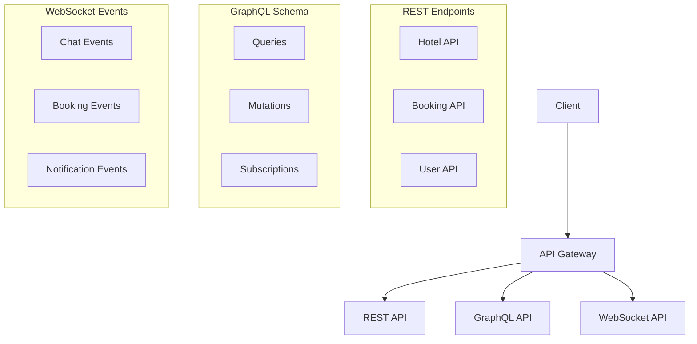

# API Design

## Overview
This document outlines the API design for the Marriott Hotels platform, including REST endpoints, GraphQL schema, and WebSocket connections. Special attention is given to AI-related endpoints and real-time features.

## API Architecture

### System APIs


## REST API

### 1. Hotel Endpoints
```typescript
interface HotelAPI {
  endpoints: {
    // Hotels
    'GET /api/hotels': 'List all hotels',
    'GET /api/hotels/:id': 'Get hotel details',
    'POST /api/hotels': 'Create new hotel',
    'PUT /api/hotels/:id': 'Update hotel',
    'DELETE /api/hotels/:id': 'Delete hotel',
    
    // Rooms
    'GET /api/hotels/:id/rooms': 'List hotel rooms',
    'POST /api/hotels/:id/rooms': 'Add room to hotel',
    'PUT /api/hotels/:id/rooms/:roomId': 'Update room',
    'DELETE /api/hotels/:id/rooms/:roomId': 'Delete room'
  };
}
```

### 2. Booking Endpoints
```typescript
interface BookingAPI {
  endpoints: {
    // Bookings
    'GET /api/bookings': 'List user bookings',
    'GET /api/bookings/:id': 'Get booking details',
    'POST /api/bookings': 'Create booking',
    'PUT /api/bookings/:id': 'Update booking',
    'DELETE /api/bookings/:id': 'Cancel booking',
    
    // Availability
    'GET /api/availability': 'Check room availability',
    'POST /api/availability/search': 'Search available rooms'
  };
}
```

## AI API Endpoints

### 1. Chat API
```typescript
interface ChatAPI {
  endpoints: {
    // Conversations
    'POST /api/ai/chat': 'Start chat session',
    'POST /api/ai/chat/:id/messages': 'Send message',
    'GET /api/ai/chat/:id/history': 'Get chat history',
    'DELETE /api/ai/chat/:id': 'End chat session',
    
    // Voice
    'POST /api/ai/voice/text-to-speech': 'Convert text to speech',
    'POST /api/ai/voice/speech-to-text': 'Convert speech to text'
  };
}
```

### 2. Recommendation API
```typescript
interface RecommendationAPI {
  endpoints: {
    'GET /api/recommendations/hotels': 'Get hotel recommendations',
    'GET /api/recommendations/rooms': 'Get room recommendations',
    'GET /api/recommendations/activities': 'Get activity recommendations',
    'POST /api/recommendations/feedback': 'Submit recommendation feedback'
  };
}
```

## GraphQL Schema

### 1. Query Types
```graphql
type Query {
  # Hotel Queries
  hotels(filter: HotelFilter): [Hotel!]!
  hotel(id: ID!): Hotel
  
  # Booking Queries
  bookings(filter: BookingFilter): [Booking!]!
  booking(id: ID!): Booking
  
  # AI Queries
  conversations(filter: ConversationFilter): [Conversation!]!
  recommendations(type: RecommendationType!): [Recommendation!]!
}
```

### 2. Mutation Types
```graphql
type Mutation {
  # Hotel Mutations
  createHotel(input: CreateHotelInput!): Hotel!
  updateHotel(id: ID!, input: UpdateHotelInput!): Hotel!
  
  # Booking Mutations
  createBooking(input: CreateBookingInput!): Booking!
  updateBooking(id: ID!, input: UpdateBookingInput!): Booking!
  
  # AI Mutations
  sendMessage(input: MessageInput!): Message!
  generateVoice(input: VoiceInput!): AudioOutput!
}
```

## WebSocket Events

### 1. Chat Events
```typescript
interface ChatEvents {
  events: {
    'chat:message': 'New chat message',
    'chat:typing': 'User typing status',
    'chat:read': 'Message read status',
    'chat:error': 'Chat error event'
  };
}
```

### 2. Notification Events
```typescript
interface NotificationEvents {
  events: {
    'notification:booking': 'Booking updates',
    'notification:system': 'System notifications',
    'notification:ai': 'AI-related notifications'
  };
}
```

## API Security

### 1. Authentication
```typescript
interface SecurityConfig {
  auth: {
    jwt: 'JWT token auth',
    oauth: 'OAuth 2.0 flow',
    apiKey: 'API key auth'
  };
  rateLimit: {
    window: '15m',
    max: 100
  };
}
```

### 2. Authorization
- Role-based access
- Scope-based access
- Resource ownership
- Rate limiting
- API keys

## Error Handling

### 1. Error Format
```typescript
interface APIError {
  error: {
    code: string;
    message: string;
    details?: object;
    timestamp: string;
    requestId: string;
  };
}
```

### 2. Error Types
- Validation errors
- Authentication errors
- Authorization errors
- Business logic errors
- System errors

## API Versioning

### 1. Version Strategy
```typescript
interface VersionConfig {
  strategy: 'URL prefix',
  current: 'v1',
  supported: ['v1'],
  deprecated: [],
  sunset: {
    'v1': null
  }
}
```

### 2. Compatibility
- Breaking changes
- Deprecation policy
- Migration guide
- Version lifecycle
- Documentation

## Performance

### 1. Optimization
```typescript
interface PerformanceConfig {
  caching: {
    enabled: true,
    ttl: '5m'
  };
  compression: {
    enabled: true,
    level: 6
  };
  rateLimit: {
    enabled: true,
    window: '15m'
  };
}
```

### 2. Monitoring
- Response times
- Error rates
- Usage metrics
- Performance alerts
- Analytics

## Documentation

### 1. API Documentation
- OpenAPI/Swagger
- GraphQL schema
- WebSocket events
- Error codes
- Examples

### 2. Developer Guides
- Getting started
- Authentication
- Best practices
- Migration guides
- Troubleshooting

## Future Improvements

### 1. API Roadmap
- New endpoints
- Better performance
- Enhanced security
- Advanced features
- Better documentation

### 2. Research Areas
- New technologies
- Better tools
- Improved methods
- Advanced features
- Enhanced security 