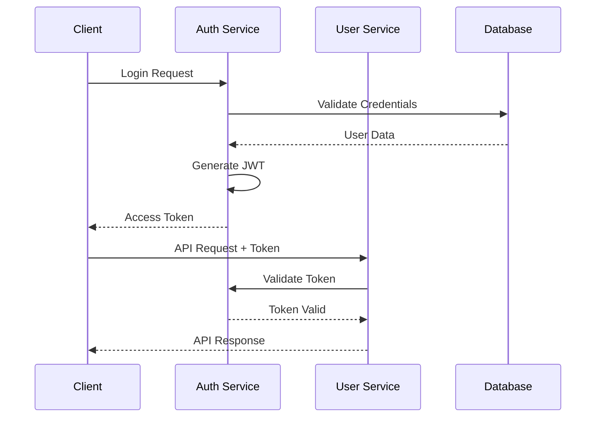

# Authentication System

## Overview
This document outlines the authentication and authorization system used in the Marriott Hotels platform. The system implements OAuth2 with JWT tokens and provides role-based access control (RBAC).

## Architecture

### System Flow


## Implementation

### 1. JWT Configuration
```typescript
// config/jwt.ts
import jwt from 'jsonwebtoken';

export const JWT_CONFIG = {
  secret: process.env.JWT_SECRET!,
  expiresIn: '24h',
  refreshExpiresIn: '7d',
  algorithm: 'HS256' as const,
};

export const generateToken = (payload: any): string => {
  return jwt.sign(payload, JWT_CONFIG.secret, {
    expiresIn: JWT_CONFIG.expiresIn,
    algorithm: JWT_CONFIG.algorithm,
  });
};

export const verifyToken = (token: string): any => {
  return jwt.verify(token, JWT_CONFIG.secret);
};
```

### 2. Authentication Middleware
```typescript
// middleware/auth.ts
import { Request, Response, NextFunction } from 'express';
import { verifyToken } from '../config/jwt';

export const authenticate = async (
  req: Request,
  res: Response,
  next: NextFunction
) => {
  try {
    const token = req.headers.authorization?.split(' ')[1];
    if (!token) {
      throw new Error('No token provided');
    }

    const decoded = verifyToken(token);
    req.user = decoded;
    next();
  } catch (error) {
    res.status(401).json({
      error: 'Unauthorized',
      message: error.message,
    });
  }
};
```

### 3. Role-Based Access Control
```typescript
// middleware/rbac.ts
export enum UserRole {
  GUEST = 'guest',
  USER = 'user',
  ADMIN = 'admin',
  SUPER_ADMIN = 'super_admin',
}

export const checkRole = (roles: UserRole[]) => {
  return (req: Request, res: Response, next: NextFunction) => {
    if (!roles.includes(req.user.role)) {
      return res.status(403).json({
        error: 'Forbidden',
        message: 'Insufficient permissions',
      });
    }
    next();
  };
};
```

## Authentication Flow

### 1. Login Implementation
```typescript
// controllers/auth.ts
export const login = async (req: Request, res: Response) => {
  try {
    const { email, password } = req.body;
    
    // Validate user
    const user = await prisma.user.findUnique({ where: { email } });
    if (!user) {
      throw new Error('User not found');
    }
    
    // Verify password
    const isValid = await bcrypt.compare(password, user.password);
    if (!isValid) {
      throw new Error('Invalid password');
    }
    
    // Generate tokens
    const accessToken = generateToken({
      id: user.id,
      email: user.email,
      role: user.role,
    });
    
    const refreshToken = generateRefreshToken(user.id);
    
    res.json({
      accessToken,
      refreshToken,
      user: {
        id: user.id,
        email: user.email,
        role: user.role,
      },
    });
  } catch (error) {
    res.status(401).json({
      error: 'Authentication failed',
      message: error.message,
    });
  }
};
```

### 2. Token Refresh
```typescript
// controllers/auth.ts
export const refreshToken = async (req: Request, res: Response) => {
  try {
    const { refreshToken } = req.body;
    
    // Validate refresh token
    const decoded = verifyRefreshToken(refreshToken);
    
    // Generate new access token
    const accessToken = generateToken({
      id: decoded.id,
      email: decoded.email,
      role: decoded.role,
    });
    
    res.json({ accessToken });
  } catch (error) {
    res.status(401).json({
      error: 'Token refresh failed',
      message: error.message,
    });
  }
};
```

## OAuth2 Integration

### 1. OAuth2 Configuration
```typescript
// config/oauth.ts
export const OAUTH_CONFIG = {
  google: {
    clientId: process.env.GOOGLE_CLIENT_ID!,
    clientSecret: process.env.GOOGLE_CLIENT_SECRET!,
    callbackUrl: process.env.GOOGLE_CALLBACK_URL!,
  },
  facebook: {
    appId: process.env.FACEBOOK_APP_ID!,
    appSecret: process.env.FACEBOOK_APP_SECRET!,
    callbackUrl: process.env.FACEBOOK_CALLBACK_URL!,
  },
};
```

### 2. OAuth2 Implementation
```typescript
// services/oauth.ts
import passport from 'passport';
import { Strategy as GoogleStrategy } from 'passport-google-oauth20';

passport.use(
  new GoogleStrategy(
    {
      clientID: OAUTH_CONFIG.google.clientId,
      clientSecret: OAUTH_CONFIG.google.clientSecret,
      callbackURL: OAUTH_CONFIG.google.callbackUrl,
    },
    async (accessToken, refreshToken, profile, done) => {
      try {
        // Find or create user
        const user = await prisma.user.upsert({
          where: { email: profile.emails![0].value },
          update: {},
          create: {
            email: profile.emails![0].value,
            name: profile.displayName,
            provider: 'google',
          },
        });
        
        done(null, user);
      } catch (error) {
        done(error);
      }
    }
  )
);
```

## Session Management

### 1. Session Configuration
```typescript
// config/session.ts
import session from 'express-session';
import RedisStore from 'connect-redis';

export const SESSION_CONFIG = {
  secret: process.env.SESSION_SECRET!,
  resave: false,
  saveUninitialized: false,
  store: new RedisStore({
    client: redisClient,
    prefix: 'session:',
  }),
  cookie: {
    secure: process.env.NODE_ENV === 'production',
    maxAge: 24 * 60 * 60 * 1000, // 24 hours
  },
};
```

### 2. Session Management
```typescript
// middleware/session.ts
export const sessionManager = (
  req: Request,
  res: Response,
  next: NextFunction
) => {
  if (req.session.views) {
    req.session.views++;
  } else {
    req.session.views = 1;
  }
  next();
};
```

## Security Measures

### 1. Password Hashing
```typescript
// utils/password.ts
import bcrypt from 'bcrypt';

export const hashPassword = async (password: string): Promise<string> => {
  const salt = await bcrypt.genSalt(10);
  return bcrypt.hash(password, salt);
};

export const verifyPassword = async (
  password: string,
  hash: string
): Promise<boolean> => {
  return bcrypt.compare(password, hash);
};
```

### 2. Rate Limiting
```typescript
// middleware/rateLimit.ts
import rateLimit from 'express-rate-limit';

export const loginLimiter = rateLimit({
  windowMs: 15 * 60 * 1000, // 15 minutes
  max: 5, // 5 attempts
  message: 'Too many login attempts, please try again later',
});

export const apiLimiter = rateLimit({
  windowMs: 60 * 1000, // 1 minute
  max: 100, // 100 requests
});
```

## Error Handling

### 1. Authentication Errors
```typescript
// errors/auth.ts
export class AuthenticationError extends Error {
  constructor(message: string) {
    super(message);
    this.name = 'AuthenticationError';
  }
}

export class AuthorizationError extends Error {
  constructor(message: string) {
    super(message);
    this.name = 'AuthorizationError';
  }
}
```

### 2. Error Handler
```typescript
// middleware/errorHandler.ts
export const authErrorHandler = (
  error: Error,
  req: Request,
  res: Response,
  next: NextFunction
) => {
  if (error instanceof AuthenticationError) {
    res.status(401).json({
      error: 'Authentication failed',
      message: error.message,
    });
  } else if (error instanceof AuthorizationError) {
    res.status(403).json({
      error: 'Authorization failed',
      message: error.message,
    });
  } else {
    next(error);
  }
};
```

## Testing

### 1. Authentication Tests
```typescript
// tests/auth.test.ts
describe('Authentication', () => {
  it('should authenticate valid credentials', async () => {
    const response = await request(app)
      .post('/api/auth/login')
      .send({
        email: 'test@example.com',
        password: 'password123',
      });
      
    expect(response.status).toBe(200);
    expect(response.body).toHaveProperty('accessToken');
  });
  
  it('should reject invalid credentials', async () => {
    const response = await request(app)
      .post('/api/auth/login')
      .send({
        email: 'test@example.com',
        password: 'wrongpassword',
      });
      
    expect(response.status).toBe(401);
  });
});
```

## Documentation

### 1. API Documentation
- Authentication endpoints
- Request/Response formats
- Error codes
- Example usage

### 2. Security Guide
- Password requirements
- Token management
- Session handling
- Security best practices

## Future Improvements

### 1. Technical Roadmap
- Multi-factor authentication
- Biometric authentication
- Single sign-on
- Enhanced session management

### 2. Research Areas
- Advanced security measures
- Performance optimization
- User experience
- Compliance requirements 