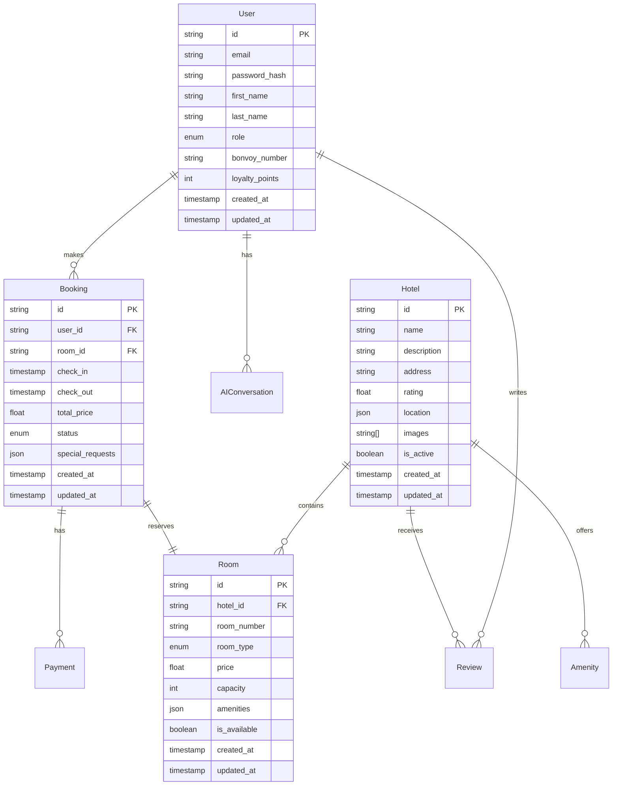
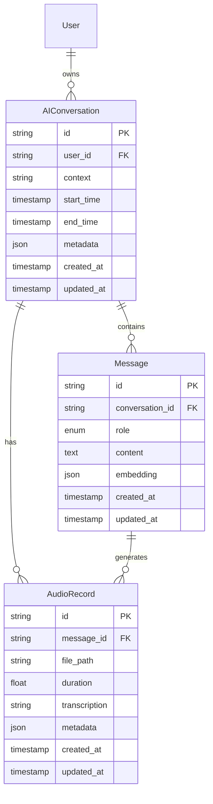

# Database Schema

## Overview
This document details the database schema design for the Marriott Hotels platform, including both traditional relational data and AI-specific data structures. The schema is implemented using PostgreSQL with Prisma as the ORM, and includes specialized tables for AI features.

## Schema Diagram

### Core Schema


### AI Schema


## Table Definitions

### 1. Core Tables

#### User Table
```sql
CREATE TABLE users (
    id UUID PRIMARY KEY DEFAULT uuid_generate_v4(),
    email VARCHAR(255) UNIQUE NOT NULL,
    password_hash VARCHAR(255) NOT NULL,
    first_name VARCHAR(100),
    last_name VARCHAR(100),
    role USER_ROLE NOT NULL DEFAULT 'customer',
    bonvoy_number VARCHAR(20) UNIQUE,
    loyalty_points INTEGER DEFAULT 0,
    created_at TIMESTAMP WITH TIME ZONE DEFAULT CURRENT_TIMESTAMP,
    updated_at TIMESTAMP WITH TIME ZONE DEFAULT CURRENT_TIMESTAMP
);

CREATE TYPE USER_ROLE AS ENUM ('admin', 'staff', 'customer');
```

#### Hotel Table
```sql
CREATE TABLE hotels (
    id UUID PRIMARY KEY DEFAULT uuid_generate_v4(),
    name VARCHAR(255) NOT NULL,
    description TEXT,
    address TEXT NOT NULL,
    rating DECIMAL(2,1),
    location JSONB NOT NULL,
    images TEXT[],
    is_active BOOLEAN DEFAULT true,
    created_at TIMESTAMP WITH TIME ZONE DEFAULT CURRENT_TIMESTAMP,
    updated_at TIMESTAMP WITH TIME ZONE DEFAULT CURRENT_TIMESTAMP
);
```

### 2. AI-Related Tables

#### AIConversation Table
```sql
CREATE TABLE ai_conversations (
    id UUID PRIMARY KEY DEFAULT uuid_generate_v4(),
    user_id UUID REFERENCES users(id),
    context TEXT,
    start_time TIMESTAMP WITH TIME ZONE,
    end_time TIMESTAMP WITH TIME ZONE,
    metadata JSONB,
    created_at TIMESTAMP WITH TIME ZONE DEFAULT CURRENT_TIMESTAMP,
    updated_at TIMESTAMP WITH TIME ZONE DEFAULT CURRENT_TIMESTAMP
);
```

#### Message Table
```sql
CREATE TABLE messages (
    id UUID PRIMARY KEY DEFAULT uuid_generate_v4(),
    conversation_id UUID REFERENCES ai_conversations(id),
    role MESSAGE_ROLE NOT NULL,
    content TEXT NOT NULL,
    embedding vector(1536),
    created_at TIMESTAMP WITH TIME ZONE DEFAULT CURRENT_TIMESTAMP,
    updated_at TIMESTAMP WITH TIME ZONE DEFAULT CURRENT_TIMESTAMP
);

CREATE TYPE MESSAGE_ROLE AS ENUM ('user', 'assistant', 'system');
```

## Indexes and Performance

### 1. Primary Indexes
```sql
-- User Indexes
CREATE INDEX idx_users_email ON users(email);
CREATE INDEX idx_users_bonvoy ON users(bonvoy_number);

-- Hotel Indexes
CREATE INDEX idx_hotels_location ON hotels USING GiST (location);
CREATE INDEX idx_hotels_rating ON hotels(rating);

-- AI Indexes
CREATE INDEX idx_conversations_user ON ai_conversations(user_id);
CREATE INDEX idx_messages_conversation ON messages(conversation_id);
CREATE INDEX idx_messages_embedding ON messages USING ivfflat (embedding vector_cosine_ops);
```

### 2. Performance Considerations
- Partitioning strategy
- Vacuum scheduling
- Index maintenance
- Query optimization
- Cache configuration

## Data Migration

### 1. Migration Strategy
```typescript
const MIGRATION_CONFIG = {
  strategy: 'incremental',
  backups: true,
  validation: true,
  rollback: true
};
```

### 2. Version Control
- Schema versions
- Migration scripts
- Rollback procedures
- Data validation
- Testing strategy

## Data Security

### 1. Access Control
```sql
-- Role-based Access
CREATE ROLE app_readonly;
CREATE ROLE app_readwrite;
CREATE ROLE app_admin;

-- Permissions
GRANT SELECT ON ALL TABLES IN SCHEMA public TO app_readonly;
GRANT SELECT, INSERT, UPDATE ON ALL TABLES IN SCHEMA public TO app_readwrite;
GRANT ALL ON ALL TABLES IN SCHEMA public TO app_admin;
```

### 2. Data Protection
- Encryption at rest
- Column encryption
- Audit logging
- Access monitoring
- Compliance checks

## Backup and Recovery

### 1. Backup Strategy
```typescript
const BACKUP_CONFIG = {
  full: {
    schedule: 'daily',
    retention: '30d'
  },
  incremental: {
    schedule: '6h',
    retention: '7d'
  },
  transaction_logs: {
    retention: '7d'
  }
};
```

### 2. Recovery Procedures
- Point-in-time recovery
- Disaster recovery
- Testing procedures
- Validation checks
- Documentation

## Maintenance

### 1. Regular Tasks
- Index maintenance
- Statistics updates
- Vacuum operations
- Performance monitoring
- Space management

### 2. Monitoring
- Query performance
- Resource usage
- Lock monitoring
- Error tracking
- Alert configuration

## Development Guidelines

### 1. Schema Changes
- Change process
- Review requirements
- Testing needs
- Documentation
- Deployment strategy

### 2. Best Practices
- Naming conventions
- Data types
- Constraints
- Indexing
- Query optimization

## Future Improvements

### 1. Schema Evolution
- Enhanced AI features
- Better performance
- Improved security
- Advanced analytics
- New functionality

### 2. Research Areas
- New technologies
- Better tools
- Improved methods
- Advanced features
- Enhanced security 