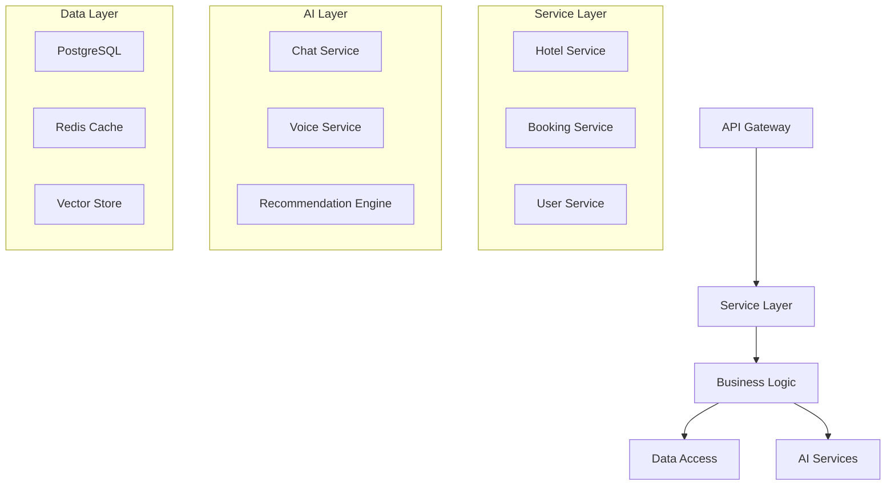

# Backend Architecture

## Overview
This document details the backend architecture of the Marriott Hotels platform, focusing on the server implementation, AI services integration, and data processing. The backend is built using Node.js, Express, and follows a microservices architecture pattern.

## Architecture Overview

### System Architecture


## Service Implementation

### 1. Core Services
```typescript
// Base Service
abstract class BaseService {
  protected logger: Logger;
  protected metrics: MetricsCollector;
  
  constructor() {
    this.initializeService();
  }
  
  protected abstract initializeService(): void;
  protected abstract handleError(error: Error): void;
}

// Hotel Service
class HotelService extends BaseService {
  private repository: HotelRepository;
  private cache: CacheManager;
  
  async findHotels(filters: HotelFilters): Promise<Hotel[]> {
    try {
      const cached = await this.cache.get(filters);
      if (cached) return cached;
      
      const hotels = await this.repository.find(filters);
      await this.cache.set(filters, hotels);
      
      return hotels;
    } catch (error) {
      this.handleError(error);
      throw error;
    }
  }
}
```

### 2. AI Services
```typescript
// AI Service Base
abstract class AIService extends BaseService {
  protected openai: OpenAIClient;
  protected vectorStore: VectorStore;
  
  constructor() {
    super();
    this.initializeAI();
  }
  
  protected abstract processRequest(input: any): Promise<any>;
  protected abstract handleResponse(response: any): Promise<any>;
}

// Chat Service
class ChatService extends AIService {
  private conversationManager: ConversationManager;
  
  async processMessage(message: ChatMessage): Promise<AIResponse> {
    try {
      const context = await this.conversationManager.getContext(message);
      const response = await this.openai.createCompletion({
        model: 'gpt-4',
        messages: context,
        temperature: 0.7
      });
      
      return this.handleResponse(response);
    } catch (error) {
      this.handleError(error);
      throw error;
    }
  }
}
```

## Middleware Implementation

### 1. Core Middleware
```typescript
// Authentication Middleware
const authenticate = async (req: Request, res: Response, next: NextFunction) => {
  try {
    const token = req.headers.authorization?.split(' ')[1];
    if (!token) throw new UnauthorizedError();
    
    const user = await verifyToken(token);
    req.user = user;
    next();
  } catch (error) {
    next(error);
  }
};

// Rate Limiting Middleware
const rateLimiter = rateLimit({
  windowMs: 15 * 60 * 1000,
  max: 100,
  message: 'Too many requests'
});
```

### 2. Error Handling
```typescript
// Error Handler
const errorHandler = (
  error: Error,
  req: Request,
  res: Response,
  next: NextFunction
) => {
  logger.error(error);
  
  if (error instanceof APIError) {
    return res.status(error.status).json({
      error: {
        code: error.code,
        message: error.message
      }
    });
  }
  
  res.status(500).json({
    error: {
      code: 'INTERNAL_ERROR',
      message: 'Internal server error'
    }
  });
};
```

## Data Access Layer

### 1. Repository Pattern
```typescript
// Base Repository
abstract class BaseRepository<T> {
  protected model: Model<T>;
  
  async findById(id: string): Promise<T> {
    const entity = await this.model.findById(id);
    if (!entity) throw new NotFoundError();
    return entity;
  }
  
  async create(data: Partial<T>): Promise<T> {
    return this.model.create(data);
  }
}

// Hotel Repository
class HotelRepository extends BaseRepository<Hotel> {
  async findAvailable(filters: HotelFilters): Promise<Hotel[]> {
    return this.model.find({
      ...filters,
      isActive: true,
      rooms: { $exists: true }
    });
  }
}
```

### 2. Cache Management
```typescript
// Cache Manager
class CacheManager {
  private redis: Redis;
  
  async get<T>(key: string): Promise<T | null> {
    const cached = await this.redis.get(key);
    return cached ? JSON.parse(cached) : null;
  }
  
  async set<T>(key: string, value: T, ttl?: number): Promise<void> {
    await this.redis.set(
      key,
      JSON.stringify(value),
      'EX',
      ttl || 3600
    );
  }
}
```

## Event System

### 1. Event Bus
```typescript
// Event Emitter
class EventBus {
  private emitter: EventEmitter;
  
  emit(event: string, payload: any): void {
    this.emitter.emit(event, payload);
  }
  
  on(event: string, handler: (payload: any) => void): void {
    this.emitter.on(event, handler);
  }
}

// Event Handlers
class BookingEventHandler {
  @OnEvent('booking:created')
  async handleBookingCreated(booking: Booking): Promise<void> {
    // Handle booking creation
  }
}
```

### 2. Message Queue
```typescript
// Queue Manager
class QueueManager {
  private queue: Bull.Queue;
  
  async addJob(type: string, data: any): Promise<void> {
    await this.queue.add(type, data, {
      attempts: 3,
      backoff: {
        type: 'exponential',
        delay: 1000
      }
    });
  }
}
```

## Performance Optimization

### 1. Caching Strategy
```typescript
// Cache Configuration
const CACHE_CONFIG = {
  local: {
    max: 1000,
    ttl: 60
  },
  redis: {
    url: process.env.REDIS_URL,
    ttl: 3600
  }
};

// Cache Implementation
const cacheMiddleware = async (req: Request, res: Response, next: NextFunction) => {
  const key = `${req.method}:${req.path}`;
  const cached = await cache.get(key);
  
  if (cached) {
    return res.json(cached);
  }
  
  next();
};
```

### 2. Query Optimization
```typescript
// Query Builder
class QueryBuilder {
  private query: any;
  
  select(fields: string[]): this {
    this.query = this.query.select(fields.join(' '));
    return this;
  }
  
  paginate(page: number, limit: number): this {
    this.query = this.query.skip((page - 1) * limit).limit(limit);
    return this;
  }
}
```

## Monitoring and Logging

### 1. Logging System
```typescript
// Logger Configuration
const LOGGER_CONFIG = {
  level: 'info',
  format: winston.format.json(),
  transports: [
    new winston.transports.Console(),
    new winston.transports.File({ filename: 'error.log', level: 'error' })
  ]
};

// Logger Implementation
const logger = winston.createLogger(LOGGER_CONFIG);
```

### 2. Metrics Collection
```typescript
// Metrics Collector
class MetricsCollector {
  private metrics: Prometheus.Registry;
  
  recordLatency(route: string, duration: number): void {
    this.metrics.histogram({
      name: 'http_request_duration_ms',
      help: 'HTTP request duration in ms',
      labelNames: ['route']
    }).observe({ route }, duration);
  }
}
```

## Security Implementation

### 1. Security Middleware
```typescript
// Security Configuration
const SECURITY_CONFIG = {
  helmet: {
    contentSecurityPolicy: true,
    crossOriginEmbedderPolicy: true
  },
  cors: {
    origin: process.env.ALLOWED_ORIGINS?.split(','),
    methods: ['GET', 'POST', 'PUT', 'DELETE']
  }
};

// Security Implementation
app.use(helmet(SECURITY_CONFIG.helmet));
app.use(cors(SECURITY_CONFIG.cors));
```

### 2. Input Validation
```typescript
// Validation Middleware
const validateInput = (schema: Joi.Schema) => {
  return async (req: Request, res: Response, next: NextFunction) => {
    try {
      await schema.validateAsync(req.body);
      next();
    } catch (error) {
      next(new ValidationError(error.message));
    }
  };
};
```

## Documentation

### 1. API Documentation
- OpenAPI/Swagger
- API endpoints
- Request/Response
- Error codes
- Examples

### 2. Implementation Guide
- Setup instructions
- Configuration
- Best practices
- Troubleshooting
- Maintenance

## Future Improvements

### 1. Technical Roadmap
- Service mesh
- GraphQL API
- Event sourcing
- CQRS pattern
- Better monitoring

### 2. Research Areas
- New technologies
- Better patterns
- Improved methods
- Advanced features
- Enhanced security 