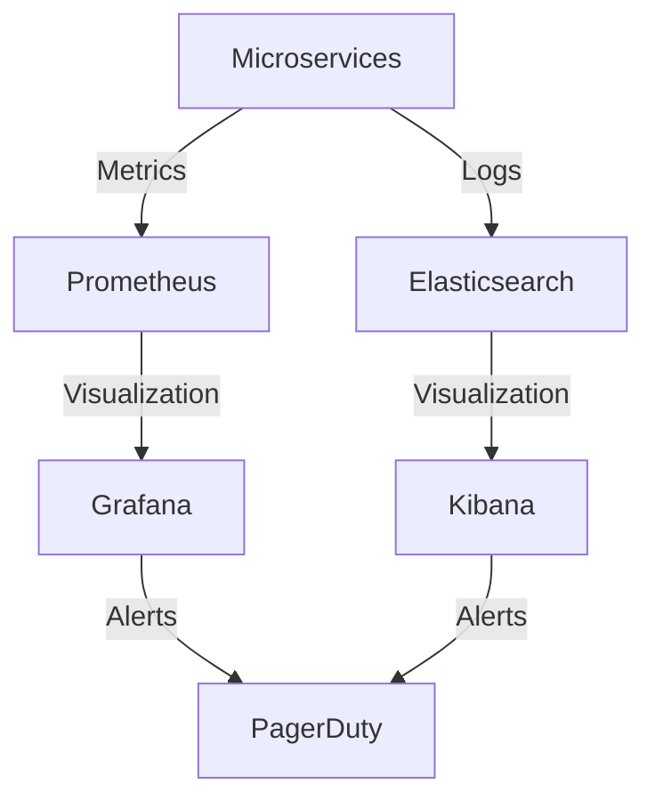
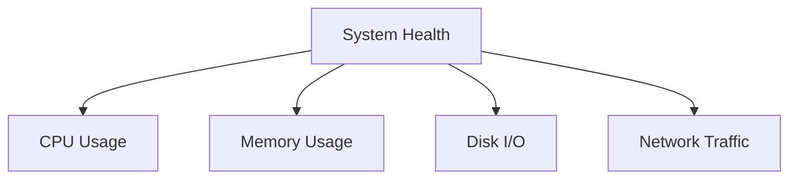
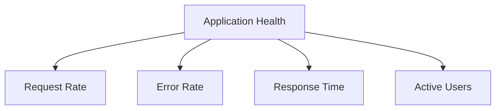
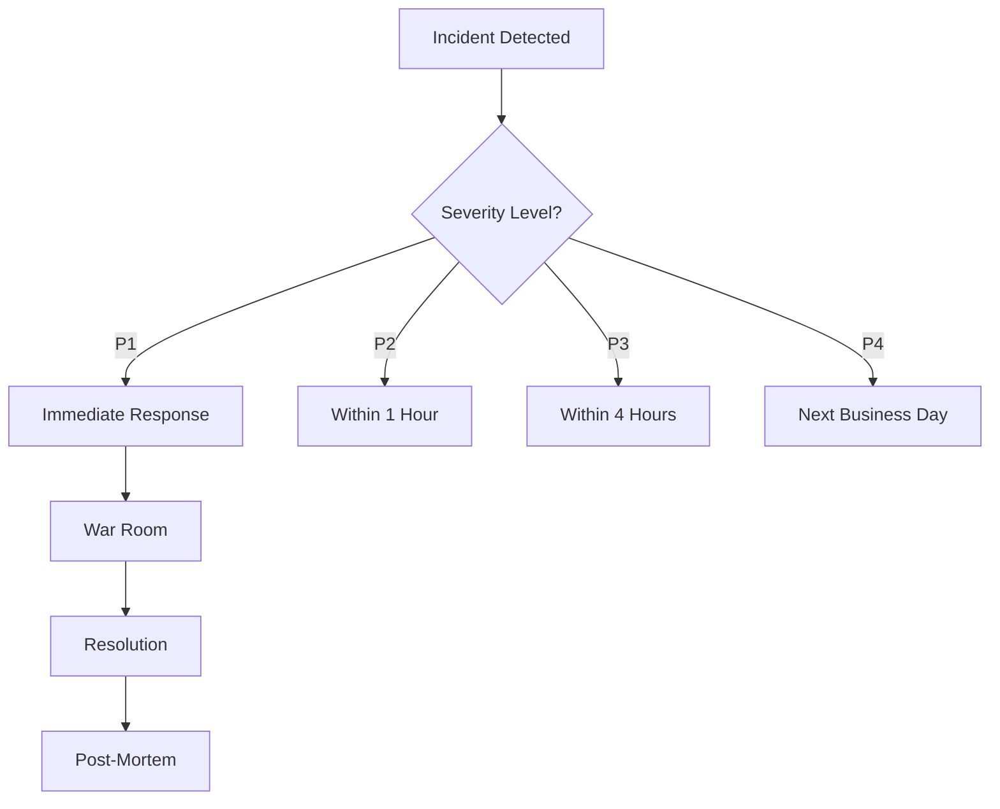

# Production Monitoring Documentation

## Overview
This document outlines the monitoring strategy for the Marriott Hotels platform in production, covering system metrics, logging, alerting, and incident response procedures.

## Table of Contents
- [Monitoring Infrastructure](#monitoring-infrastructure)
- [Metrics Collection](#metrics-collection)
- [Logging Strategy](#logging-strategy)
- [Alert Management](#alert-management)
- [Dashboards](#dashboards)
- [Incident Response](#incident-response)

## Monitoring Infrastructure

### Technology Stack
- Prometheus for metrics collection
- Grafana for visualization
- ELK Stack for log aggregation
- PagerDuty for alerts
- New Relic for APM

### Architecture


## Metrics Collection

### System Metrics
```yaml
# Prometheus Configuration
global:
  scrape_interval: 15s
  evaluation_interval: 15s

scrape_configs:
  - job_name: 'node'
    static_configs:
      - targets: ['localhost:9100']
  
  - job_name: 'api'
    static_configs:
      - targets: ['api:8080']
  
  - job_name: 'booking-service'
    static_configs:
      - targets: ['booking:8081']
```

### Application Metrics
```typescript
// Example Custom Metrics
const metrics = {
  bookingLatency: new prometheus.Histogram({
    name: 'booking_latency_seconds',
    help: 'Booking request latency in seconds',
    buckets: [0.1, 0.5, 1, 2, 5]
  }),
  
  activeUsers: new prometheus.Gauge({
    name: 'active_users',
    help: 'Number of currently active users'
  }),
  
  bookingTotal: new prometheus.Counter({
    name: 'booking_total',
    help: 'Total number of bookings'
  })
};
```

## Logging Strategy

### Log Levels
```typescript
// Example Logging Configuration
const logger = winston.createLogger({
  levels: {
    error: 0,
    warn: 1,
    info: 2,
    debug: 3
  },
  format: winston.format.json(),
  defaultMeta: { service: 'booking-service' },
  transports: [
    new winston.transports.File({ filename: 'error.log', level: 'error' }),
    new winston.transports.File({ filename: 'combined.log' })
  ]
});
```

### Log Aggregation
```yaml
# Filebeat Configuration
filebeat.inputs:
- type: log
  enabled: true
  paths:
    - /var/log/marriott/*.log
  fields:
    service: booking-service
    environment: production

output.elasticsearch:
  hosts: ["elasticsearch:9200"]
  index: "marriott-logs-%{+yyyy.MM.dd}"
```

## Alert Management

### Alert Rules
```yaml
# Prometheus Alert Rules
groups:
- name: marriott-alerts
  rules:
  - alert: HighErrorRate
    expr: rate(http_requests_total{status=~"5.."}[5m]) > 0.1
    for: 5m
    labels:
      severity: critical
    annotations:
      summary: High error rate detected
      
  - alert: APILatency
    expr: http_request_duration_seconds > 2
    for: 5m
    labels:
      severity: warning
    annotations:
      summary: API latency above threshold
```

### Alert Routing
```yaml
# PagerDuty Integration
receivers:
- name: 'pagerduty'
  pagerduty_configs:
  - service_key: '<integration-key>'
    severity: '{{ if eq .CommonLabels.severity "critical" }}critical{{ else }}warning{{ end }}'
```

## Dashboards

### System Overview


### Application Metrics


### Example Grafana Dashboard
```json
{
  "dashboard": {
    "panels": [
      {
        "title": "Request Rate",
        "type": "graph",
        "datasource": "Prometheus",
        "targets": [
          {
            "expr": "rate(http_requests_total[5m])"
          }
        ]
      },
      {
        "title": "Error Rate",
        "type": "graph",
        "datasource": "Prometheus",
        "targets": [
          {
            "expr": "rate(http_requests_total{status=~\"5..\"}[5m])"
          }
        ]
      }
    ]
  }
}
```

## Incident Response

### Severity Levels
1. **P1 - Critical**
   - System-wide outage
   - Data loss/corruption
   - Security breach

2. **P2 - High**
   - Partial service degradation
   - Performance issues
   - Feature unavailability

3. **P3 - Medium**
   - Minor functionality issues
   - Non-critical bugs
   - UI/UX issues

4. **P4 - Low**
   - Cosmetic issues
   - Minor improvements
   - Documentation updates

### Response Procedures


### Communication Templates
```markdown
# Incident Report Template

## Summary
- Incident ID: INC-{date}-{number}
- Severity: P{level}
- Start Time: {datetime}
- End Time: {datetime}
- Duration: {duration}

## Impact
- Affected Services: {services}
- User Impact: {description}
- Business Impact: {description}

## Root Cause
{detailed analysis}

## Resolution
{steps taken}

## Prevention
{future measures}
```

## Best Practices

### 1. Monitoring
- Set appropriate thresholds
- Regular review of metrics
- Clean up stale metrics
- Document all custom metrics

### 2. Logging
- Use structured logging
- Include relevant context
- Implement log rotation
- Regular log analysis

### 3. Alerting
- Avoid alert fatigue
- Clear escalation paths
- Regular alert review
- Update alert thresholds

### 4. Incident Management
- Clear communication channels
- Regular drills
- Updated contact information
- Document lessons learned

## Maintenance Procedures

1. **Daily Tasks**
   - Review active alerts
   - Check system health
   - Monitor error rates
   - Review resource usage

2. **Weekly Tasks**
   - Alert threshold review
   - Dashboard updates
   - Performance analysis
   - Capacity planning

3. **Monthly Tasks**
   - Metric cleanup
   - Log rotation
   - Alert rule review
   - Documentation updates

4. **Quarterly Tasks**
   - Incident review
   - Process improvements
   - Tool evaluation
   - Training updates