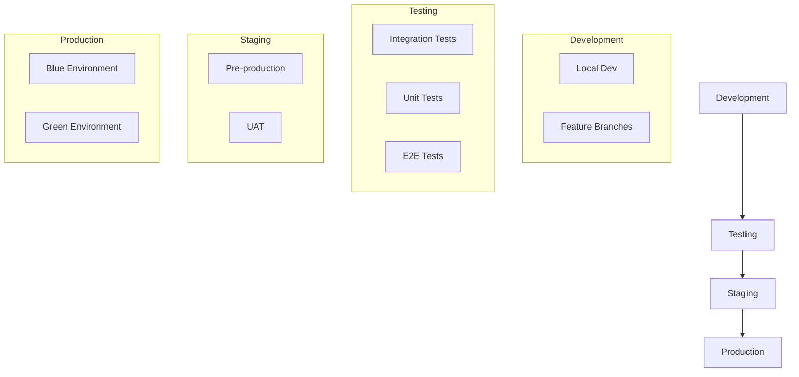

# Production Deployment Pipeline

## Overview
This document outlines the production deployment strategy for the Marriott Hotels platform, including CI/CD pipeline, environment management, and deployment procedures. The system uses a robust deployment pipeline to ensure reliable and consistent deployments across all environments.

## Deployment Architecture

### Environment Structure


## CI/CD Pipeline

### 1. GitHub Actions Workflow
```yaml
name: Production Deployment

on:
  push:
    branches:
      - main
  pull_request:
    branches:
      - main

jobs:
  test:
    runs-on: ubuntu-latest
    steps:
      - name: Run Tests
        # Test configuration
  
  build:
    needs: test
    runs-on: ubuntu-latest
    steps:
      - name: Build Application
        # Build configuration
  
  deploy:
    needs: build
    runs-on: ubuntu-latest
    steps:
      - name: Deploy to Production
        # Deployment configuration
```

### 2. Deployment Stages
1. Code validation
2. Test execution
3. Build process
4. Security scanning
5. Deployment
6. Health checks

## Environment Setup

### 1. Production Environment
```typescript
const PRODUCTION_CONFIG = {
  scaling: {
    minInstances: 3,
    maxInstances: 10,
    targetCPU: 70
  },
  database: {
    replicas: 2,
    backupSchedule: '0 */4 * * *'
  },
  cache: {
    instances: 3,
    maxMemory: '4gb'
  },
  monitoring: {
    metrics: true,
    logging: true,
    alerts: true
  }
};
```

### 2. Infrastructure
- Load balancers
- Application servers
- Database clusters
- Cache clusters
- Storage systems

## Deployment Process

### 1. Pre-deployment
- Version tagging
- Change documentation
- Backup verification
- Resource validation

### 2. Deployment Steps
1. Blue/Green setup
2. Database migrations
3. Service deployment
4. Health validation
5. Traffic switching
6. Rollback preparation

## Security Measures

### 1. Access Control
- Role-based access
- Authentication
- Authorization
- Audit logging

### 2. Data Protection
- Encryption
- Secure configs
- Secret management
- Compliance checks

## Monitoring and Alerts

### 1. System Monitoring
```typescript
const MONITORING_CONFIG = {
  metrics: {
    response_time: {
      threshold: '200ms',
      alert: true
    },
    error_rate: {
      threshold: '1%',
      alert: true
    },
    cpu_usage: {
      threshold: '80%',
      alert: true
    },
    memory_usage: {
      threshold: '85%',
      alert: true
    }
  }
};
```

### 2. Alert Configuration
- Performance alerts
- Error notifications
- Security alerts
- Resource warnings

## Rollback Procedures

### 1. Automated Rollback
- Trigger conditions
- Process steps
- Data handling
- Verification

### 2. Manual Intervention
- Decision points
- Authorization
- Execution steps
- Validation

## Performance Optimization

### 1. Load Balancing
- Traffic distribution
- Health checking
- Session affinity
- SSL termination

### 2. Caching Strategy
- Content caching
- API caching
- Database caching
- Static assets

## Disaster Recovery

### 1. Backup Systems
- Database backups
- Configuration backups
- Code repositories
- Documentation

### 2. Recovery Procedures
- System restore
- Data recovery
- Service restoration
- Validation steps

## Documentation

### 1. Deployment Guides
- Setup instructions
- Configuration guides
- Troubleshooting
- Best practices

### 2. Runbooks
- Deployment procedures
- Rollback procedures
- Emergency responses
- Maintenance tasks

## Maintenance

### 1. Regular Tasks
- Security updates
- Performance tuning
- Resource cleanup
- Log rotation

### 2. Emergency Procedures
- Incident response
- Communication plan
- Resolution steps
- Post-mortem

## Scaling Strategy

### 1. Auto-scaling
```typescript
const SCALING_CONFIG = {
  rules: {
    cpu: {
      target: 70,
      min: 3,
      max: 10
    },
    memory: {
      target: 80,
      min: 3,
      max: 10
    }
  },
  cooldown: {
    scaleUp: '3m',
    scaleDown: '5m'
  }
};
```

### 2. Manual Scaling
- Capacity planning
- Resource allocation
- Performance monitoring
- Cost optimization

## Testing Strategy

### 1. Automated Tests
- Unit tests
- Integration tests
- E2E tests
- Performance tests

### 2. Manual Testing
- UAT
- Security testing
- Performance testing
- Compliance testing

## Future Improvements

### 1. Pipeline Enhancements
- Automated canary
- Advanced monitoring
- Enhanced security
- Better automation

### 2. Infrastructure Updates
- Container orchestration
- Service mesh
- Enhanced monitoring
- Advanced security 