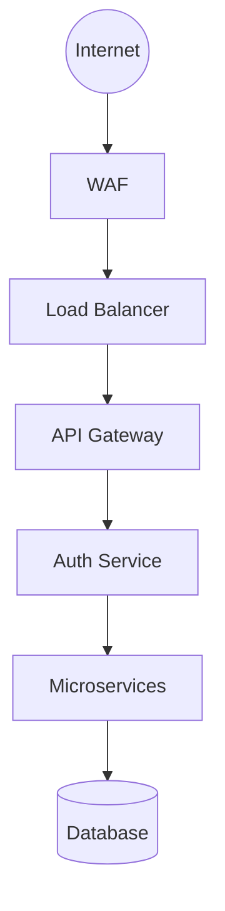
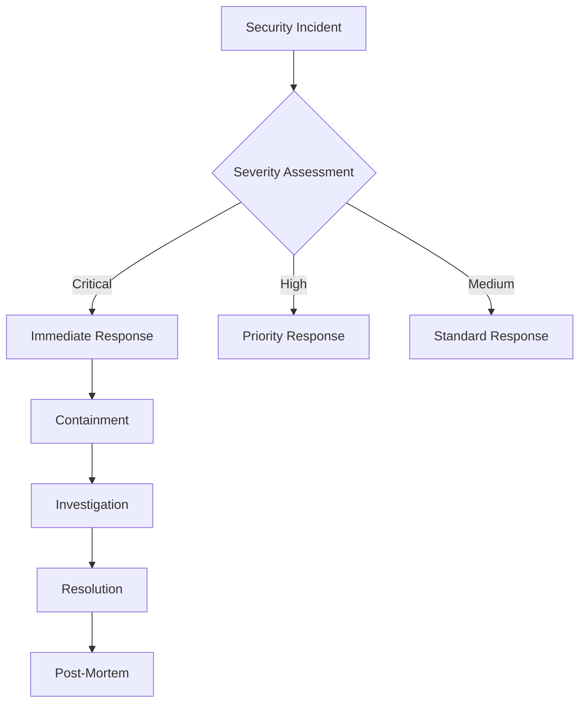
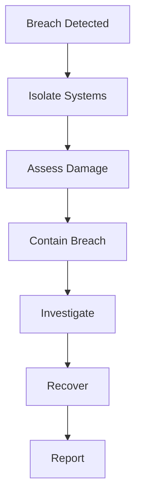

# Production Security Documentation

## Overview
This document outlines the security measures and best practices implemented in the Marriott Hotels platform production environment.

## Table of Contents
- [Security Architecture](#security-architecture)
- [Access Control](#access-control)
- [Data Protection](#data-protection)
- [Network Security](#network-security)
- [Monitoring and Incident Response](#monitoring-and-incident-response)
- [Compliance](#compliance)

## Security Architecture

### High-Level Overview


### Security Layers
1. Edge Security (WAF, DDoS protection)
2. Network Security (VPC, Security Groups)
3. Application Security (Authentication, Authorization)
4. Data Security (Encryption, Access Control)

## Access Control

### Authentication
```typescript
// JWT Configuration
const jwtConfig = {
  algorithm: 'RS256',
  expiresIn: '1h',
  issuer: 'marriott-auth',
  audience: 'marriott-api'
};

// OAuth2 Configuration
const oauthConfig = {
  authorizationURL: 'https://auth.marriott.com/oauth/authorize',
  tokenURL: 'https://auth.marriott.com/oauth/token',
  clientID: process.env.OAUTH_CLIENT_ID,
  clientSecret: process.env.OAUTH_CLIENT_SECRET,
  callbackURL: 'https://api.marriott.com/auth/callback'
};
```

### Authorization
```typescript
// RBAC Configuration
const roles = {
  ADMIN: {
    permissions: ['read:all', 'write:all', 'delete:all']
  },
  MANAGER: {
    permissions: ['read:all', 'write:bookings']
  },
  STAFF: {
    permissions: ['read:bookings', 'write:bookings']
  },
  GUEST: {
    permissions: ['read:own', 'write:own']
  }
};
```

## Data Protection

### Encryption
```typescript
// Data Encryption Configuration
const encryptionConfig = {
  algorithm: 'aes-256-gcm',
  keyLength: 32,
  ivLength: 16,
  saltLength: 64
};

// Database Encryption
const dbConfig = {
  ssl: true,
  encryption: {
    serverEncryption: true,
    columnEncryption: {
      enabled: true,
      keys: ['payment_info', 'personal_data']
    }
  }
};
```

### Data Classification
1. **Highly Sensitive**
   - Payment information
   - Authentication credentials
   - Personal identification

2. **Sensitive**
   - Contact information
   - Booking details
   - User preferences

3. **Internal**
   - Business metrics
   - Operational data
   - Analytics

4. **Public**
   - Room information
   - Location details
   - General policies

## Network Security

### VPC Configuration
```yaml
# VPC Configuration
vpc:
  cidr: 10.0.0.0/16
  subnets:
    public:
      - 10.0.1.0/24
      - 10.0.2.0/24
    private:
      - 10.0.3.0/24
      - 10.0.4.0/24
    database:
      - 10.0.5.0/24
      - 10.0.6.0/24
```

### Security Groups
```yaml
# Security Group Rules
security_groups:
  api_gateway:
    ingress:
      - port: 443
        source: 0.0.0.0/0
        protocol: tcp
    
  application:
    ingress:
      - port: 8080
        source: api_gateway
        protocol: tcp
    
  database:
    ingress:
      - port: 5432
        source: application
        protocol: tcp
```

## Monitoring and Incident Response

### Security Monitoring
```yaml
# WAF Rules
waf_rules:
  - name: sql_injection
    priority: 1
    action: block
  
  - name: xss_attack
    priority: 2
    action: block
  
  - name: rate_limit
    priority: 3
    action: throttle
    limit: 1000/minute
```

### Alert Configuration
```yaml
# Security Alerts
alerts:
  - name: unauthorized_access
    condition: count(failed_login) > 10
    period: 5m
    severity: high
    
  - name: suspicious_activity
    condition: rate(suspicious_requests) > 100
    period: 1m
    severity: critical
```

### Incident Response Plan


## Compliance

### Regulatory Requirements
1. **PCI DSS**
   - Card data encryption
   - Access control
   - Regular audits

2. **GDPR**
   - Data privacy
   - User consent
   - Data portability

3. **SOC 2**
   - Security controls
   - Availability
   - Confidentiality

### Audit Procedures
```yaml
# Audit Configuration
audit_logging:
  enabled: true
  retention: 365d
  events:
    - user_access
    - data_modification
    - security_changes
    - system_alerts
```

## Best Practices

### 1. Password Policy
```typescript
const passwordPolicy = {
  minLength: 12,
  requireUppercase: true,
  requireLowercase: true,
  requireNumbers: true,
  requireSpecialChars: true,
  maxAge: 90, // days
  preventReuse: 12 // previous passwords
};
```

### 2. Session Management
```typescript
const sessionConfig = {
  secure: true,
  httpOnly: true,
  maxAge: 3600000, // 1 hour
  sameSite: 'strict',
  domain: '.marriott.com'
};
```

### 3. API Security
```typescript
const apiSecurity = {
  rateLimiting: {
    window: 15 * 60 * 1000, // 15 minutes
    max: 100
  },
  cors: {
    origin: ['https://marriott.com'],
    methods: ['GET', 'POST', 'PUT', 'DELETE'],
    credentials: true
  }
};
```

## Maintenance Procedures

1. **Daily Tasks**
   - Review security logs
   - Monitor alerts
   - Check system access
   - Verify backups

2. **Weekly Tasks**
   - Security patch review
   - Access audit
   - Certificate check
   - Vulnerability scan

3. **Monthly Tasks**
   - Policy review
   - User access review
   - Security training
   - Compliance check

4. **Quarterly Tasks**
   - Penetration testing
   - Disaster recovery test
   - Policy updates
   - Security assessment

## Emergency Procedures

### 1. Security Breach Response


### 2. Recovery Procedures
1. System isolation
2. Damage assessment
3. Evidence collection
4. System recovery
5. Post-incident review

### 3. Communication Plan
- Internal notification
- Customer communication
- Regulatory reporting
- Public relations