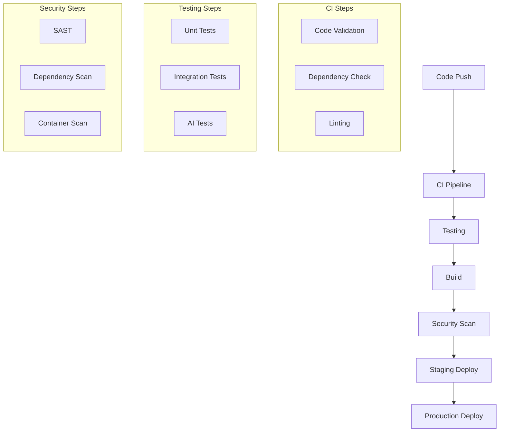

# CI/CD Pipeline

## Overview
This document details the continuous integration and deployment pipeline for the Marriott Hotels platform. The pipeline is built using GitHub Actions and includes specialized workflows for AI components, frontend, and backend services.

## Pipeline Architecture

### Workflow Structure


## CI/CD Configuration

### 1. Main Workflow
```yaml
# .github/workflows/main.yml
name: Main Pipeline

on:
  push:
    branches: [main]
  pull_request:
    branches: [main]

jobs:
  validate:
    runs-on: ubuntu-latest
    steps:
      - name: Checkout code
        uses: actions/checkout@v4
      
      - name: Setup Node.js
        uses: actions/setup-node@v4
        with:
          node-version: '18'
          
      - name: Install dependencies
        run: npm ci
        
      - name: Run linting
        run: npm run lint
        
      - name: Run type checking
        run: npm run type-check

  test:
    needs: validate
    runs-on: ubuntu-latest
    steps:
      - name: Run unit tests
        run: npm run test:unit
        
      - name: Run integration tests
        run: npm run test:integration
        
      - name: Run AI component tests
        run: npm run test:ai

  build:
    needs: test
    runs-on: ubuntu-latest
    steps:
      - name: Build application
        run: npm run build
        
      - name: Build Docker image
        run: docker build -t marriott-app .
```

### 2. Deployment Workflow
```yaml
# .github/workflows/deploy.yml
name: Deployment

on:
  workflow_run:
    workflows: ["Main Pipeline"]
    types:
      - completed

jobs:
  deploy-staging:
    if: github.event.workflow_run.conclusion == 'success'
    runs-on: ubuntu-latest
    steps:
      - name: Deploy to staging
        run: |
          # Staging deployment steps
          
  deploy-production:
    needs: deploy-staging
    if: github.ref == 'refs/heads/main'
    runs-on: ubuntu-latest
    steps:
      - name: Deploy to production
        run: |
          # Production deployment steps
```

## Environment Configuration

### 1. Environment Setup
```typescript
interface EnvironmentConfig {
  development: {
    api: 'http://localhost:3000',
    ai: 'http://localhost:3001',
    database: 'localhost:5432'
  };
  staging: {
    api: 'https://staging-api.marriott.com',
    ai: 'https://staging-ai.marriott.com',
    database: 'staging-db.marriott.com'
  };
  production: {
    api: 'https://api.marriott.com',
    ai: 'https://ai.marriott.com',
    database: 'db.marriott.com'
  };
}
```

### 2. Secret Management
```typescript
interface SecretConfig {
  platform: 'GitHub Secrets',
  categories: {
    api: ['API_KEY', 'API_SECRET'],
    database: ['DB_PASSWORD', 'DB_CONNECTION'],
    ai: ['OPENAI_KEY', 'AI_CONFIG']
  };
}
```

## Testing Strategy

### 1. Test Configuration
```typescript
interface TestConfig {
  unit: {
    runner: 'Jest',
    coverage: 80,
    parallel: true
  };
  integration: {
    runner: 'Jest',
    coverage: 70,
    timeout: '30s'
  };
  ai: {
    runner: 'Custom',
    validation: true,
    performance: true
  };
}
```

### 2. Test Environments
- Development testing
- Staging validation
- Production verification
- Performance testing
- Security testing

## Deployment Process

### 1. Staging Deployment
```typescript
interface StagingDeploy {
  steps: {
    validation: 'Environment check',
    deployment: 'Blue/Green deploy',
    testing: 'Smoke tests',
    monitoring: 'Health check'
  };
  rollback: {
    automatic: true,
    threshold: 'error > 1%'
  };
}
```

### 2. Production Deployment
```typescript
interface ProductionDeploy {
  strategy: 'Blue/Green',
  steps: {
    preparation: 'Resource check',
    deployment: 'Traffic shift',
    validation: 'Health check',
    rollback: 'Automated safety'
  };
}
```

## Monitoring and Alerts

### 1. Health Checks
```typescript
interface HealthChecks {
  endpoints: {
    api: '/health',
    ai: '/ai/health',
    database: '/db/health'
  };
  intervals: {
    staging: '1m',
    production: '30s'
  };
}
```

### 2. Alert Configuration
```typescript
interface AlertConfig {
  channels: ['email', 'slack', 'pager'],
  triggers: {
    error_rate: '1%',
    response_time: '500ms',
    cpu_usage: '80%'
  };
}
```

## Security Measures

### 1. Security Scans
```typescript
interface SecurityScans {
  static: {
    tool: 'SonarQube',
    frequency: 'per-commit'
  };
  dynamic: {
    tool: 'OWASP ZAP',
    frequency: 'daily'
  };
  dependency: {
    tool: 'Snyk',
    frequency: 'per-pr'
  };
}
```

### 2. Compliance Checks
- GDPR compliance
- PCI DSS checks
- Security standards
- Access controls
- Audit logging

## Rollback Procedures

### 1. Automated Rollback
```typescript
interface RollbackConfig {
  triggers: {
    error_rate: '1%',
    response_time: '500ms',
    health_check: 'failed'
  };
  procedure: {
    stop_deployment: true,
    revert_version: true,
    notify_team: true
  };
}
```

### 2. Manual Rollback
- Command procedures
- Verification steps
- Data handling
- Communication plan
- Documentation

## Documentation

### 1. Pipeline Documentation
- Setup guides
- Configuration
- Best practices
- Troubleshooting
- Recovery procedures

### 2. Runbooks
- Deployment guides
- Rollback procedures
- Emergency responses
- Maintenance tasks
- Debug guides

## Future Improvements

### 1. Pipeline Enhancements
- Automated canary
- Advanced monitoring
- Enhanced security
- Better automation
- Improved testing

### 2. Infrastructure Updates
- Container orchestration
- Service mesh
- Enhanced monitoring
- Advanced security
- Better scalability 