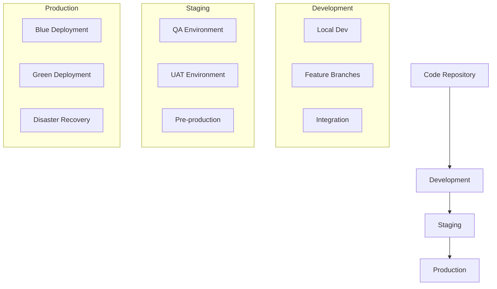

# Environment Management

## Overview
This document outlines the environment management strategy for the Marriott Hotels platform, covering development, staging, and production environments.

## Environment Architecture

### System Flow


## Environment Configuration

### 1. Environment Variables
```typescript
// config/environment.ts
export const ENV_CONFIG = {
  development: {
    api: {
      url: 'http://localhost:3000',
      timeout: 5000,
    },
    database: {
      host: 'localhost',
      port: 5432,
    },
    redis: {
      host: 'localhost',
      port: 6379,
    },
  },
  staging: {
    api: {
      url: 'https://api-staging.marriott.com',
      timeout: 10000,
    },
    database: {
      host: 'staging-db.marriott.com',
      port: 5432,
    },
    redis: {
      host: 'staging-redis.marriott.com',
      port: 6379,
    },
  },
  production: {
    api: {
      url: 'https://api.marriott.com',
      timeout: 15000,
    },
    database: {
      host: 'prod-db.marriott.com',
      port: 5432,
    },
    redis: {
      host: 'prod-redis.marriott.com',
      port: 6379,
    },
  },
};
```

### 2. Feature Flags
```typescript
// config/features.ts
export const FEATURE_FLAGS = {
  development: {
    newBookingSystem: true,
    aiRecommendations: true,
    voiceAssistant: true,
  },
  staging: {
    newBookingSystem: true,
    aiRecommendations: true,
    voiceAssistant: false,
  },
  production: {
    newBookingSystem: false,
    aiRecommendations: false,
    voiceAssistant: false,
  },
};
```

## Infrastructure Management

### 1. Terraform Configuration
```hcl
# infrastructure/environments/staging/main.tf
provider "aws" {
  region = "us-east-1"
}

module "vpc" {
  source = "../../modules/vpc"
  
  environment = "staging"
  cidr_block = "10.0.0.0/16"
  
  public_subnets = [
    "10.0.1.0/24",
    "10.0.2.0/24",
  ]
  
  private_subnets = [
    "10.0.3.0/24",
    "10.0.4.0/24",
  ]
}

module "ecs" {
  source = "../../modules/ecs"
  
  environment = "staging"
  vpc_id = module.vpc.vpc_id
  
  cluster_name = "marriott-staging"
  instance_type = "t3.medium"
  min_size = 2
  max_size = 4
}
```

### 2. Kubernetes Configuration
```yaml
# kubernetes/environments/staging/deployment.yaml
apiVersion: apps/v1
kind: Deployment
metadata:
  name: marriott-web
  namespace: staging
spec:
  replicas: 3
  selector:
    matchLabels:
      app: marriott-web
  template:
    metadata:
      labels:
        app: marriott-web
    spec:
      containers:
      - name: web
        image: marriott/web:staging
        env:
        - name: NODE_ENV
          value: staging
        - name: API_URL
          valueFrom:
            configMapKeyRef:
              name: api-config
              key: url
```

## Database Management

### 1. Migration Strategy
```typescript
// prisma/migrate.ts
import { PrismaClient } from '@prisma/client';

const prisma = new PrismaClient();

async function migrate() {
  try {
    await prisma.$executeRaw`
      CREATE EXTENSION IF NOT EXISTS "uuid-ossp";
    `;
    
    await prisma.$executeRaw`
      CREATE TABLE IF NOT EXISTS migrations (
        id uuid PRIMARY KEY DEFAULT uuid_generate_v4(),
        name VARCHAR(255) NOT NULL,
        executed_at TIMESTAMP DEFAULT CURRENT_TIMESTAMP
      );
    `;
    
    console.log('Migration completed successfully');
  } catch (error) {
    console.error('Migration failed:', error);
    process.exit(1);
  }
}

migrate();
```

### 2. Backup Strategy
```bash
#!/bin/bash
# scripts/backup-database.sh

# Set environment variables
DB_NAME="marriott"
BACKUP_DIR="/backups"
DATE=$(date +%Y%m%d_%H%M%S)

# Create backup
pg_dump $DB_NAME > $BACKUP_DIR/backup_$DATE.sql

# Compress backup
gzip $BACKUP_DIR/backup_$DATE.sql

# Upload to S3
aws s3 cp $BACKUP_DIR/backup_$DATE.sql.gz \
  s3://marriott-backups/$ENVIRONMENT/
```

## Monitoring Setup

### 1. Prometheus Configuration
```yaml
# monitoring/prometheus/config.yml
global:
  scrape_interval: 15s
  evaluation_interval: 15s

scrape_configs:
  - job_name: 'marriott-web'
    static_configs:
      - targets: ['web:3000']
    
  - job_name: 'marriott-api'
    static_configs:
      - targets: ['api:8080']
```

### 2. Grafana Dashboards
```json
{
  "dashboard": {
    "id": null,
    "title": "Environment Metrics",
    "panels": [
      {
        "title": "CPU Usage",
        "type": "graph",
        "datasource": "Prometheus",
        "targets": [
          {
            "expr": "container_cpu_usage_seconds_total"
          }
        ]
      }
    ]
  }
}
```

## Security Configuration

### 1. Network Policies
```yaml
# security/network-policies.yml
apiVersion: networking.k8s.io/v1
kind: NetworkPolicy
metadata:
  name: environment-isolation
spec:
  podSelector:
    matchLabels:
      environment: staging
  policyTypes:
  - Ingress
  - Egress
  ingress:
  - from:
    - podSelector:
        matchLabels:
          environment: staging
```

### 2. Access Control
```yaml
# security/rbac.yml
apiVersion: rbac.authorization.k8s.io/v1
kind: Role
metadata:
  namespace: staging
  name: environment-admin
rules:
- apiGroups: [""]
  resources: ["pods", "services"]
  verbs: ["get", "list", "watch", "create", "update", "delete"]
```

## Deployment Strategy

### 1. Blue-Green Deployment
```yaml
# deployment/blue-green.yml
apiVersion: apps/v1
kind: Deployment
metadata:
  name: marriott-web-blue
spec:
  replicas: 3
  template:
    spec:
      containers:
      - name: web
        image: marriott/web:blue
---
apiVersion: apps/v1
kind: Deployment
metadata:
  name: marriott-web-green
spec:
  replicas: 3
  template:
    spec:
      containers:
      - name: web
        image: marriott/web:green
```

### 2. Rollback Procedures
```bash
#!/bin/bash
# scripts/rollback.sh

# Set variables
DEPLOYMENT="marriott-web"
NAMESPACE="staging"
VERSION=$1

# Rollback deployment
kubectl rollout undo deployment/$DEPLOYMENT \
  -n $NAMESPACE \
  --to-revision=$VERSION

# Verify rollback
kubectl rollout status deployment/$DEPLOYMENT \
  -n $NAMESPACE
```

## Testing Strategy

### 1. Environment Tests
```typescript
// tests/environment.test.ts
describe('Environment Configuration', () => {
  it('should load correct environment variables', () => {
    const env = process.env.NODE_ENV;
    const config = ENV_CONFIG[env];
    
    expect(config).toBeDefined();
    expect(config.api.url).toMatch(/^https?:\/\//);
  });
  
  it('should have correct feature flags', () => {
    const env = process.env.NODE_ENV;
    const flags = FEATURE_FLAGS[env];
    
    expect(flags).toBeDefined();
    expect(flags.newBookingSystem).toBeDefined();
  });
});
```

### 2. Integration Tests
```typescript
// tests/integration.test.ts
describe('Environment Integration', () => {
  it('should connect to database', async () => {
    const connection = await prisma.$connect();
    expect(connection).toBeTruthy();
  });
  
  it('should connect to redis', async () => {
    const client = await redis.connect();
    expect(client.isReady).toBe(true);
  });
});
```

## Documentation

### 1. Setup Guide
- Environment setup
- Configuration management
- Deployment procedures
- Monitoring setup

### 2. Maintenance Guide
- Environment updates
- Backup procedures
- Security measures
- Performance tuning

## Future Improvements

### 1. Technical Roadmap
- Multi-region deployment
- Environment automation
- Enhanced monitoring
- Security hardening

### 2. Research Areas
- Infrastructure as code
- Container orchestration
- Service mesh
- Zero-trust security 