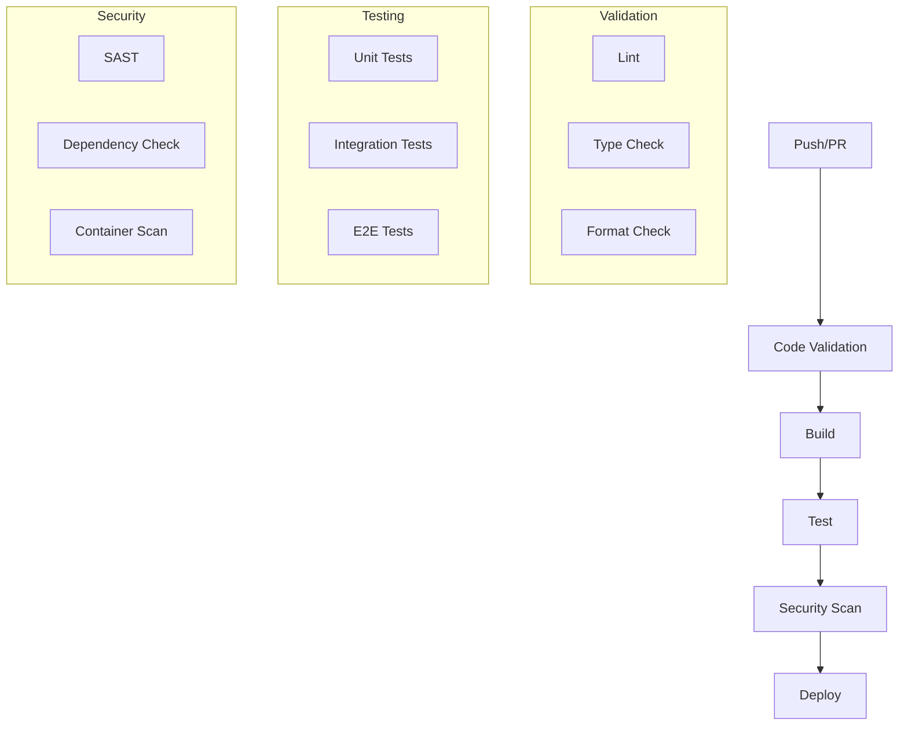

# GitHub Actions Workflow

## Overview
This document outlines the GitHub Actions workflows used in the Marriott Hotels platform for continuous integration and deployment (CI/CD).

## Workflow Architecture

### Pipeline Flow


## Main Workflow

### 1. CI Pipeline
```yaml
# .github/workflows/ci.yml
name: CI Pipeline

on:
  push:
    branches: [main, develop]
  pull_request:
    branches: [main, develop]

jobs:
  validate:
    runs-on: ubuntu-latest
    steps:
      - uses: actions/checkout@v2
      
      - name: Setup Node.js
        uses: actions/setup-node@v2
        with:
          node-version: '16'
          
      - name: Install dependencies
        run: npm ci
        
      - name: Run linting
        run: npm run lint
        
      - name: Check types
        run: npm run type-check
        
      - name: Check formatting
        run: npm run format-check

  test:
    needs: validate
    runs-on: ubuntu-latest
    steps:
      - uses: actions/checkout@v2
      
      - name: Setup Node.js
        uses: actions/setup-node@v2
        with:
          node-version: '16'
          
      - name: Install dependencies
        run: npm ci
        
      - name: Run tests
        run: |
          npm run test:unit
          npm run test:integration
          
      - name: Upload coverage
        uses: actions/upload-artifact@v2
        with:
          name: coverage
          path: coverage/
```

### 2. CD Pipeline
```yaml
# .github/workflows/cd.yml
name: CD Pipeline

on:
  push:
    branches: [main]
    tags: ['v*']

jobs:
  build:
    runs-on: ubuntu-latest
    steps:
      - uses: actions/checkout@v2
      
      - name: Set up Docker Buildx
        uses: docker/setup-buildx-action@v1
        
      - name: Login to DockerHub
        uses: docker/login-action@v1
        with:
          username: ${{ secrets.DOCKERHUB_USERNAME }}
          password: ${{ secrets.DOCKERHUB_TOKEN }}
          
      - name: Build and push
        uses: docker/build-push-action@v2
        with:
          push: true
          tags: marriott/web:${{ github.sha }}
          
  deploy:
    needs: build
    runs-on: ubuntu-latest
    steps:
      - name: Configure AWS credentials
        uses: aws-actions/configure-aws-credentials@v1
        with:
          aws-access-key-id: ${{ secrets.AWS_ACCESS_KEY_ID }}
          aws-secret-access-key: ${{ secrets.AWS_SECRET_ACCESS_KEY }}
          aws-region: us-east-1
          
      - name: Update ECS service
        run: |
          aws ecs update-service \
            --cluster marriott-cluster \
            --service web-service \
            --force-new-deployment
```

## Security Workflows

### 1. Security Scanning
```yaml
# .github/workflows/security.yml
name: Security Scan

on:
  schedule:
    - cron: '0 0 * * *'
  push:
    branches: [main]

jobs:
  security:
    runs-on: ubuntu-latest
    steps:
      - uses: actions/checkout@v2
      
      - name: Run SAST
        uses: github/codeql-action/analyze@v1
        
      - name: Run dependency check
        uses: snyk/actions/node@master
        env:
          SNYK_TOKEN: ${{ secrets.SNYK_TOKEN }}
          
      - name: Run container scan
        uses: aquasecurity/trivy-action@master
        with:
          image-ref: 'marriott/web:latest'
```

### 2. Compliance Checks
```yaml
# .github/workflows/compliance.yml
name: Compliance Checks

on:
  pull_request:
    branches: [main]

jobs:
  compliance:
    runs-on: ubuntu-latest
    steps:
      - uses: actions/checkout@v2
      
      - name: Check license compliance
        uses: fossas/fossa-action@v1
        with:
          api-key: ${{ secrets.FOSSA_API_KEY }}
          
      - name: Check secrets
        uses: gitleaks/gitleaks-action@v1
        env:
          GITLEAKS_LICENSE: ${{ secrets.GITLEAKS_LICENSE }}
```

## Environment Deployments

### 1. Staging Deployment
```yaml
# .github/workflows/staging.yml
name: Staging Deployment

on:
  push:
    branches: [develop]

jobs:
  deploy-staging:
    runs-on: ubuntu-latest
    environment: staging
    steps:
      - uses: actions/checkout@v2
      
      - name: Deploy to staging
        uses: azure/webapps-deploy@v2
        with:
          app-name: marriott-staging
          publish-profile: ${{ secrets.AZURE_WEBAPP_PUBLISH_PROFILE }}
```

### 2. Production Deployment
```yaml
# .github/workflows/production.yml
name: Production Deployment

on:
  release:
    types: [published]

jobs:
  deploy-production:
    runs-on: ubuntu-latest
    environment: production
    steps:
      - uses: actions/checkout@v2
      
      - name: Deploy to production
        uses: azure/webapps-deploy@v2
        with:
          app-name: marriott-production
          publish-profile: ${{ secrets.AZURE_WEBAPP_PUBLISH_PROFILE }}
```

## Testing Workflows

### 1. E2E Tests
```yaml
# .github/workflows/e2e.yml
name: E2E Tests

on:
  schedule:
    - cron: '0 */6 * * *'
  workflow_dispatch:

jobs:
  e2e:
    runs-on: ubuntu-latest
    steps:
      - uses: actions/checkout@v2
      
      - name: Install Playwright
        run: npx playwright install --with-deps
        
      - name: Run E2E tests
        run: npm run test:e2e
        
      - name: Upload test results
        uses: actions/upload-artifact@v2
        with:
          name: playwright-report
          path: playwright-report/
```

### 2. Performance Tests
```yaml
# .github/workflows/performance.yml
name: Performance Tests

on:
  schedule:
    - cron: '0 0 * * 1'
  workflow_dispatch:

jobs:
  performance:
    runs-on: ubuntu-latest
    steps:
      - uses: actions/checkout@v2
      
      - name: Run k6 tests
        uses: grafana/k6-action@v0.2.0
        with:
          filename: performance/load-test.js
```

## Monitoring and Notifications

### 1. Status Checks
```yaml
# .github/workflows/status.yml
name: Status Checks

on:
  schedule:
    - cron: '*/15 * * * *'

jobs:
  health-check:
    runs-on: ubuntu-latest
    steps:
      - name: Check API health
        uses: jtalk/url-health-check-action@v2
        with:
          url: https://api.marriott.com/health
          max-attempts: 3
          retry-delay: 5s
```

### 2. Notifications
```yaml
# .github/workflows/notify.yml
name: Notifications

on:
  workflow_run:
    workflows: ['CI Pipeline', 'CD Pipeline']
    types: [completed]

jobs:
  notify:
    runs-on: ubuntu-latest
    steps:
      - name: Send Slack notification
        uses: 8398a7/action-slack@v3
        with:
          status: ${{ job.status }}
          fields: repo,message,commit,author,action,eventName,ref,workflow
        env:
          SLACK_WEBHOOK_URL: ${{ secrets.SLACK_WEBHOOK_URL }}
```

## Documentation

### 1. Workflow Guidelines
- Branch protection rules
- Required status checks
- Environment configurations
- Secret management

### 2. Maintenance Guide
- Workflow updates
- Environment variables
- Secrets rotation
- Performance tuning

## Future Improvements

### 1. Technical Roadmap
- Matrix testing
- Parallel job execution
- Caching optimization
- Custom actions

### 2. Research Areas
- Workflow optimization
- Security enhancements
- Deployment strategies
- Monitoring improvements 