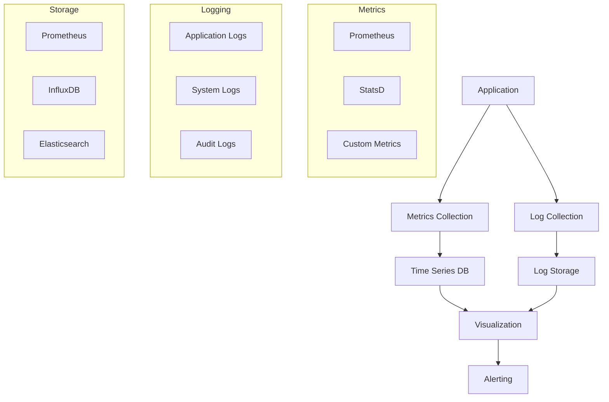

# Monitoring and Logging

## Overview
This document outlines the monitoring and logging strategy for the Marriott Hotels platform, covering metrics collection, log aggregation, alerting, and visualization.

## Architecture

### System Flow


## Metrics Collection

### 1. Application Metrics
```typescript
// monitoring/metrics.ts
import { Counter, Histogram } from 'prom-client';

// HTTP request metrics
export const httpRequestsTotal = new Counter({
  name: 'http_requests_total',
  help: 'Total number of HTTP requests',
  labelNames: ['method', 'path', 'status'],
});

// Response time metrics
export const httpRequestDuration = new Histogram({
  name: 'http_request_duration_seconds',
  help: 'HTTP request duration in seconds',
  labelNames: ['method', 'path'],
  buckets: [0.1, 0.5, 1, 2, 5],
});

// Business metrics
export const bookingsTotal = new Counter({
  name: 'bookings_total',
  help: 'Total number of bookings',
  labelNames: ['hotel', 'room_type'],
});
```

### 2. System Metrics
```typescript
// monitoring/system.ts
import { Gauge } from 'prom-client';

// CPU usage metrics
export const cpuUsage = new Gauge({
  name: 'system_cpu_usage',
  help: 'System CPU usage percentage',
  labelNames: ['core'],
});

// Memory metrics
export const memoryUsage = new Gauge({
  name: 'system_memory_usage_bytes',
  help: 'System memory usage in bytes',
  labelNames: ['type'],
});

// Disk metrics
export const diskUsage = new Gauge({
  name: 'system_disk_usage_bytes',
  help: 'System disk usage in bytes',
  labelNames: ['mount'],
});
```

## Log Management

### 1. Logger Configuration
```typescript
// logging/logger.ts
import winston from 'winston';

export const logger = winston.createLogger({
  level: 'info',
  format: winston.format.combine(
    winston.format.timestamp(),
    winston.format.json()
  ),
  defaultMeta: { service: 'marriott-web' },
  transports: [
    new winston.transports.File({
      filename: 'logs/error.log',
      level: 'error',
    }),
    new winston.transports.File({
      filename: 'logs/combined.log',
    }),
  ],
});

if (process.env.NODE_ENV !== 'production') {
  logger.add(new winston.transports.Console({
    format: winston.format.simple(),
  }));
}
```

### 2. Log Aggregation
```yaml
# logging/fluentd/config.yml
<source>
  @type tail
  path /var/log/containers/*.log
  pos_file /var/log/fluentd-containers.log.pos
  tag kubernetes.*
  read_from_head true
  <parse>
    @type json
    time_key time
    time_format %Y-%m-%dT%H:%M:%S.%NZ
  </parse>
</source>

<match kubernetes.**>
  @type elasticsearch
  host elasticsearch
  port 9200
  logstash_format true
  logstash_prefix k8s
  <buffer>
    @type file
    path /var/log/fluentd-buffers/kubernetes.buffer
    flush_mode interval
    retry_type exponential_backoff
    flush_interval 5s
    retry_forever false
    retry_max_interval 30
    chunk_limit_size 2M
    queue_limit_length 8
    overflow_action block
  </buffer>
</match>
```

## Alerting System

### 1. Alert Rules
```yaml
# monitoring/prometheus/alerts.yml
groups:
- name: application
  rules:
  - alert: HighErrorRate
    expr: |
      sum(rate(http_requests_total{status=~"5.."}[5m])) /
      sum(rate(http_requests_total[5m])) > 0.1
    for: 5m
    labels:
      severity: critical
    annotations:
      summary: High HTTP error rate
      description: Error rate is above 10% for 5 minutes

  - alert: SlowResponses
    expr: |
      histogram_quantile(0.95, sum(rate(http_request_duration_seconds_bucket[5m]))
      by (le)) > 2
    for: 5m
    labels:
      severity: warning
    annotations:
      summary: Slow HTTP responses
      description: 95th percentile of response times is above 2 seconds
```

### 2. Alert Manager
```yaml
# monitoring/alertmanager/config.yml
global:
  resolve_timeout: 5m
  slack_api_url: 'https://hooks.slack.com/services/XXX/YYY/ZZZ'

route:
  group_by: ['alertname', 'cluster', 'service']
  group_wait: 30s
  group_interval: 5m
  repeat_interval: 4h
  receiver: 'slack-notifications'

receivers:
- name: 'slack-notifications'
  slack_configs:
  - channel: '#alerts'
    send_resolved: true
    title: '{{ template "slack.default.title" . }}'
    text: '{{ template "slack.default.text" . }}'
```

## Visualization

### 1. Grafana Dashboards
```json
{
  "dashboard": {
    "id": null,
    "title": "Application Overview",
    "panels": [
      {
        "title": "Request Rate",
        "type": "graph",
        "datasource": "Prometheus",
        "targets": [
          {
            "expr": "sum(rate(http_requests_total[5m])) by (method, path)"
          }
        ]
      },
      {
        "title": "Error Rate",
        "type": "graph",
        "datasource": "Prometheus",
        "targets": [
          {
            "expr": "sum(rate(http_requests_total{status=~\"5..\"}[5m])) / sum(rate(http_requests_total[5m]))"
          }
        ]
      },
      {
        "title": "Response Time",
        "type": "graph",
        "datasource": "Prometheus",
        "targets": [
          {
            "expr": "histogram_quantile(0.95, sum(rate(http_request_duration_seconds_bucket[5m])) by (le))"
          }
        ]
      }
    ]
  }
}
```

### 2. Kibana Visualizations
```json
{
  "visualization": {
    "title": "Log Analysis",
    "type": "visualization",
    "visualization": {
      "type": "line",
      "aggs": [
        {
          "id": "1",
          "enabled": true,
          "type": "count",
          "schema": "metric",
          "params": {}
        },
        {
          "id": "2",
          "enabled": true,
          "type": "date_histogram",
          "schema": "segment",
          "params": {
            "field": "@timestamp",
            "interval": "auto"
          }
        }
      ]
    }
  }
}
```

## Performance Monitoring

### 1. APM Configuration
```typescript
// monitoring/apm.ts
import { apm } from 'elastic-apm-node';

apm.start({
  serviceName: 'marriott-web',
  serverUrl: process.env.APM_SERVER_URL,
  environment: process.env.NODE_ENV,
  captureBody: 'errors',
  captureHeaders: true,
  captureSpanStackTraces: true,
});
```

### 2. Tracing Setup
```typescript
// monitoring/tracing.ts
import { trace } from '@opentelemetry/api';
import { NodeTracerProvider } from '@opentelemetry/node';
import { SimpleSpanProcessor } from '@opentelemetry/tracing';
import { JaegerExporter } from '@opentelemetry/exporter-jaeger';

const provider = new NodeTracerProvider();
const exporter = new JaegerExporter({
  endpoint: process.env.JAEGER_ENDPOINT,
});

provider.addSpanProcessor(new SimpleSpanProcessor(exporter));
provider.register();

export const tracer = trace.getTracer('marriott-web');
```

## Documentation

### 1. Setup Guide
- Metrics collection
- Log aggregation
- Alert configuration
- Dashboard setup

### 2. Maintenance Guide
- Alert tuning
- Log rotation
- Performance optimization
- Troubleshooting

## Future Improvements

### 1. Technical Roadmap
- Distributed tracing
- Machine learning for anomaly detection
- Advanced visualization
- Automated remediation

### 2. Research Areas
- Observability patterns
- Performance analysis
- Correlation techniques
- Predictive monitoring 