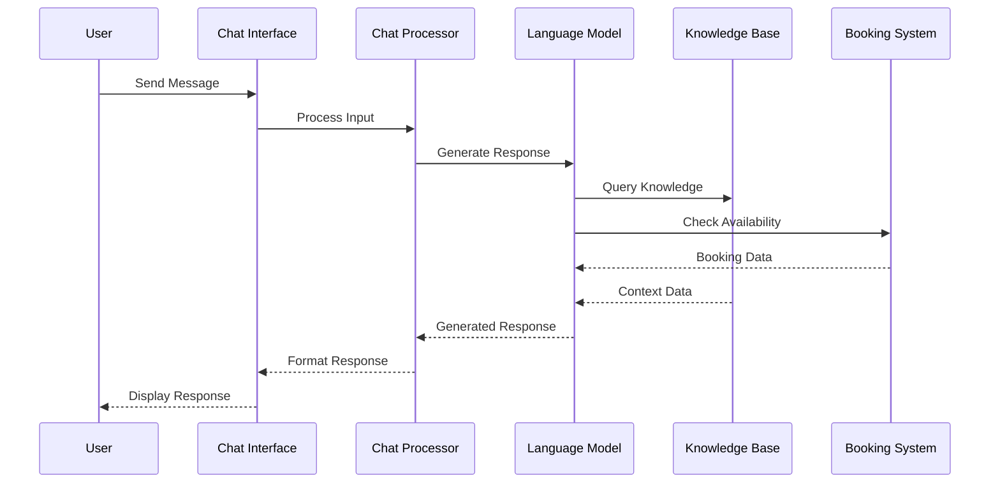

# Chatbot Implementation

## Overview
This document outlines the implementation of the AI-powered chatbot in the Marriott Hotels platform. The chatbot uses OpenAI's GPT models for natural language understanding and generation, combined with custom logic for hotel-specific functionality.

## Architecture

### System Flow


## Implementation

### 1. Chat Interface
```typescript
// components/AIChatBot.tsx
import React, { useState } from 'react';
import { useChat } from '@/hooks/useChat';

export const AIChatBot: React.FC = () => {
  const [message, setMessage] = useState('');
  const { messages, sendMessage, isLoading } = useChat();

  const handleSubmit = async (e: React.FormEvent) => {
    e.preventDefault();
    if (!message.trim()) return;
    
    await sendMessage(message);
    setMessage('');
  };

  return (
    <div className="chat-container">
      <div className="chat-messages">
        {messages.map((msg, index) => (
          <div
            key={index}
            className={`message ${msg.role === 'user' ? 'user' : 'bot'}`}
          >
            {msg.content}
          </div>
        ))}
      </div>
      
      <form onSubmit={handleSubmit} className="chat-input">
        <input
          type="text"
          value={message}
          onChange={(e) => setMessage(e.target.value)}
          placeholder="Ask about bookings, amenities, or services..."
          disabled={isLoading}
        />
        <button type="submit" disabled={isLoading}>
          {isLoading ? 'Thinking...' : 'Send'}
        </button>
      </form>
    </div>
  );
};
```

### 2. Chat Processing
```typescript
// services/chat.ts
import { OpenAI } from 'openai';
import { ChatMessage, ChatResponse } from '@/types/chat';
import { processBookingIntent } from './booking';
import { processAmenitiesIntent } from './amenities';

const openai = new OpenAI({
  apiKey: process.env.OPENAI_API_KEY,
});

export class ChatProcessor {
  private context: ChatMessage[] = [];
  
  async processMessage(message: string): Promise<ChatResponse> {
    try {
      // Add user message to context
      this.context.push({
        role: 'user',
        content: message,
      });
      
      // Generate AI response
      const completion = await openai.chat.completions.create({
        model: 'gpt-4',
        messages: this.context,
        temperature: 0.7,
        max_tokens: 150,
      });
      
      const response = completion.choices[0].message;
      
      // Process intents
      if (this.detectBookingIntent(message)) {
        return await processBookingIntent(message, response);
      }
      
      if (this.detectAmenitiesIntent(message)) {
        return await processAmenitiesIntent(message, response);
      }
      
      // Add AI response to context
      this.context.push({
        role: 'assistant',
        content: response.content,
      });
      
      // Maintain context window
      if (this.context.length > 10) {
        this.context = this.context.slice(-10);
      }
      
      return {
        text: response.content,
        type: 'text',
      };
    } catch (error) {
      console.error('Chat processing error:', error);
      throw new Error('Failed to process message');
    }
  }
  
  private detectBookingIntent(message: string): boolean {
    const bookingKeywords = [
      'book',
      'reserve',
      'stay',
      'room',
      'night',
      'accommodation',
    ];
    
    return bookingKeywords.some(keyword =>
      message.toLowerCase().includes(keyword)
    );
  }
  
  private detectAmenitiesIntent(message: string): boolean {
    const amenityKeywords = [
      'amenity',
      'facility',
      'pool',
      'gym',
      'spa',
      'restaurant',
    ];
    
    return amenityKeywords.some(keyword =>
      message.toLowerCase().includes(keyword)
    );
  }
}
```

### 3. Intent Processing
```typescript
// services/booking.ts
import { ChatResponse } from '@/types/chat';
import { checkAvailability } from '@/services/hotels';
import { extractDateRange } from '@/utils/dates';

export async function processBookingIntent(
  message: string,
  aiResponse: any
): Promise<ChatResponse> {
  // Extract dates from message
  const dateRange = extractDateRange(message);
  
  if (!dateRange) {
    return {
      text: 'I can help you book a room. Could you please specify your desired dates?',
      type: 'prompt',
    };
  }
  
  // Check room availability
  const availability = await checkAvailability(dateRange);
  
  if (!availability.available) {
    return {
      text: `I'm sorry, but we don't have rooms available for those dates. Would you like to check different dates?`,
      type: 'error',
    };
  }
  
  return {
    text: aiResponse.content,
    type: 'booking',
    data: {
      dates: dateRange,
      rooms: availability.rooms,
    },
  };
}
```

### 4. Knowledge Base Integration
```typescript
// services/knowledge.ts
import { PrismaClient } from '@prisma/client';
import { redis } from '@/lib/redis';

const prisma = new PrismaClient();

export class KnowledgeBase {
  async queryHotelInfo(query: string): Promise<any> {
    // Try cache first
    const cached = await redis.get(`hotel:info:${query}`);
    if (cached) {
      return JSON.parse(cached);
    }
    
    // Query database
    const results = await prisma.hotel.findMany({
      where: {
        OR: [
          { name: { contains: query } },
          { description: { contains: query } },
        ],
      },
      include: {
        amenities: true,
        rooms: true,
      },
    });
    
    // Cache results
    await redis.setex(
      `hotel:info:${query}`,
      3600,
      JSON.stringify(results)
    );
    
    return results;
  }
  
  async getAmenityDetails(amenityType: string): Promise<any> {
    return prisma.amenity.findMany({
      where: {
        type: amenityType,
      },
      include: {
        availability: true,
        pricing: true,
      },
    });
  }
}
```

## Natural Language Processing

### 1. Message Understanding
```typescript
// nlp/understanding.ts
import { NLPProcessor } from '@/lib/nlp';

export class MessageUnderstanding {
  private nlp: NLPProcessor;
  
  constructor() {
    this.nlp = new NLPProcessor();
  }
  
  async extractEntities(message: string): Promise<any> {
    const entities = await this.nlp.extractEntities(message);
    
    return {
      dates: entities.dates,
      locations: entities.locations,
      preferences: entities.preferences,
    };
  }
  
  async classifyIntent(message: string): Promise<string> {
    const intent = await this.nlp.classifyIntent(message);
    return intent;
  }
  
  async extractSentiment(message: string): Promise<number> {
    const sentiment = await this.nlp.analyzeSentiment(message);
    return sentiment;
  }
}
```

### 2. Response Generation
```typescript
// nlp/generation.ts
import { OpenAI } from 'openai';

export class ResponseGenerator {
  private openai: OpenAI;
  
  constructor() {
    this.openai = new OpenAI({
      apiKey: process.env.OPENAI_API_KEY,
    });
  }
  
  async generateResponse(
    context: any,
    intent: string,
    entities: any
  ): Promise<string> {
    const prompt = this.buildPrompt(context, intent, entities);
    
    const completion = await this.openai.chat.completions.create({
      model: 'gpt-4',
      messages: [
        {
          role: 'system',
          content: 'You are a helpful hotel concierge.',
        },
        {
          role: 'user',
          content: prompt,
        },
      ],
      temperature: 0.7,
      max_tokens: 150,
    });
    
    return completion.choices[0].message.content;
  }
  
  private buildPrompt(
    context: any,
    intent: string,
    entities: any
  ): string {
    // Build context-aware prompt
    return `
      Intent: ${intent}
      Entities: ${JSON.stringify(entities)}
      Context: ${JSON.stringify(context)}
      
      Generate a helpful response for a hotel guest.
    `;
  }
}
```

## Testing

### 1. Unit Tests
```typescript
// tests/chatbot.test.ts
import { ChatProcessor } from '@/services/chat';
import { MessageUnderstanding } from '@/nlp/understanding';

describe('Chatbot', () => {
  let chatProcessor: ChatProcessor;
  let messageUnderstanding: MessageUnderstanding;
  
  beforeEach(() => {
    chatProcessor = new ChatProcessor();
    messageUnderstanding = new MessageUnderstanding();
  });
  
  it('should detect booking intent', async () => {
    const message = 'I want to book a room for next week';
    const intent = await messageUnderstanding.classifyIntent(message);
    
    expect(intent).toBe('booking');
  });
  
  it('should extract dates correctly', async () => {
    const message = 'Book a room from July 1st to July 5th';
    const entities = await messageUnderstanding.extractEntities(message);
    
    expect(entities.dates).toEqual({
      start: '2024-07-01',
      end: '2024-07-05',
    });
  });
});
```

### 2. Integration Tests
```typescript
// tests/chat-integration.test.ts
describe('Chat Integration', () => {
  it('should process booking request', async () => {
    const response = await fetch('/api/chat', {
      method: 'POST',
      body: JSON.stringify({
        message: 'I want to book a room for two nights',
      }),
    });
    
    const data = await response.json();
    expect(data.type).toBe('booking');
    expect(data.data).toHaveProperty('rooms');
  });
  
  it('should handle amenity inquiries', async () => {
    const response = await fetch('/api/chat', {
      method: 'POST',
      body: JSON.stringify({
        message: 'What amenities do you have?',
      }),
    });
    
    const data = await response.json();
    expect(data.type).toBe('amenities');
    expect(data.data).toHaveProperty('list');
  });
});
```

## Documentation

### 1. Usage Guide
- Chat interface integration
- Message handling
- Response processing
- Error handling

### 2. Maintenance Guide
- Model updates
- Context management
- Performance tuning
- Error monitoring

## Future Improvements

### 1. Technical Roadmap
- Multi-language support
- Voice interface
- Personalization
- Advanced analytics

### 2. Research Areas
- Context understanding
- Response generation
- Intent classification
- Entity extraction 