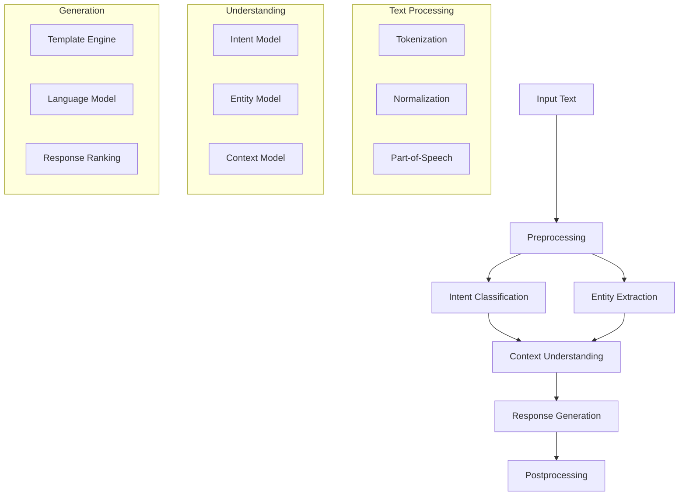

# Natural Language Processing

## Overview
This document outlines the Natural Language Processing (NLP) system used in the Marriott Hotels platform. The system handles text understanding, intent classification, entity extraction, and response generation using advanced language models and custom NLP pipelines.

## Architecture

### System Flow


## Implementation

### 1. Text Preprocessing
```typescript
// nlp/preprocessing.ts
import { TokenizerOptions, Tokenizer } from '@/lib/nlp';
import { normalize, stem, lemmatize } from '@/utils/text';

export class TextPreprocessor {
  private tokenizer: Tokenizer;
  
  constructor(options: TokenizerOptions = {}) {
    this.tokenizer = new Tokenizer(options);
  }
  
  async process(text: string): Promise<ProcessedText> {
    // Normalize text
    const normalized = normalize(text);
    
    // Tokenize
    const tokens = this.tokenizer.tokenize(normalized);
    
    // Part-of-speech tagging
    const tagged = await this.tagPOS(tokens);
    
    // Lemmatization
    const lemmatized = await this.lemmatizeTokens(tagged);
    
    return {
      original: text,
      normalized,
      tokens,
      tagged,
      lemmatized,
    };
  }
  
  private async tagPOS(tokens: string[]): Promise<TaggedToken[]> {
    const tagger = await import('@/lib/nlp/pos-tagger');
    return tagger.tag(tokens);
  }
  
  private async lemmatizeTokens(
    tagged: TaggedToken[]
  ): Promise<string[]> {
    return tagged.map(token => lemmatize(token.word, token.pos));
  }
}
```

### 2. Intent Classification
```typescript
// nlp/intent.ts
import { BertTokenizer, BertModel } from '@/lib/nlp/bert';
import { IntentClassifier } from '@/models/intent';

export class IntentProcessor {
  private tokenizer: BertTokenizer;
  private model: BertModel;
  private classifier: IntentClassifier;
  
  constructor() {
    this.tokenizer = new BertTokenizer();
    this.model = new BertModel();
    this.classifier = new IntentClassifier();
  }
  
  async classifyIntent(text: string): Promise<Intent> {
    // Tokenize input
    const tokens = await this.tokenizer.encode(text);
    
    // Get BERT embeddings
    const embeddings = await this.model.embed(tokens);
    
    // Classify intent
    const intent = await this.classifier.predict(embeddings);
    
    return {
      type: intent.type,
      confidence: intent.confidence,
      slots: intent.slots,
    };
  }
  
  async trainClassifier(
    data: TrainingData[]
  ): Promise<void> {
    const processedData = await Promise.all(
      data.map(async item => {
        const tokens = await this.tokenizer.encode(item.text);
        const embeddings = await this.model.embed(tokens);
        return {
          embeddings,
          intent: item.intent,
        };
      })
    );
    
    await this.classifier.train(processedData);
  }
}
```

### 3. Entity Extraction
```typescript
// nlp/entity.ts
import { NER } from '@/lib/nlp/ner';
import { DateParser } from '@/utils/dates';
import { LocationMatcher } from '@/utils/location';

export class EntityExtractor {
  private ner: NER;
  private dateParser: DateParser;
  private locationMatcher: LocationMatcher;
  
  constructor() {
    this.ner = new NER();
    this.dateParser = new DateParser();
    this.locationMatcher = new LocationMatcher();
  }
  
  async extractEntities(text: string): Promise<Entities> {
    // Named Entity Recognition
    const entities = await this.ner.extract(text);
    
    // Parse dates
    const dates = await this.extractDates(text);
    
    // Extract locations
    const locations = await this.extractLocations(text);
    
    // Extract numbers
    const numbers = this.extractNumbers(text);
    
    return {
      dates,
      locations,
      numbers,
      ...entities,
    };
  }
  
  private async extractDates(text: string): Promise<DateEntity[]> {
    return this.dateParser.parse(text);
  }
  
  private async extractLocations(text: string): Promise<Location[]> {
    return this.locationMatcher.match(text);
  }
  
  private extractNumbers(text: string): number[] {
    const matches = text.match(/\d+/g);
    return matches ? matches.map(Number) : [];
  }
}
```

### 4. Context Understanding
```typescript
// nlp/context.ts
import { DialogueState } from '@/types/dialogue';
import { ContextManager } from '@/lib/context';

export class ContextProcessor {
  private contextManager: ContextManager;
  
  constructor() {
    this.contextManager = new ContextManager();
  }
  
  async processContext(
    text: string,
    intent: Intent,
    entities: Entities,
    state: DialogueState
  ): Promise<DialogueContext> {
    // Update dialogue state
    const updatedState = this.updateState(state, intent, entities);
    
    // Resolve references
    const resolvedEntities = await this.resolveReferences(
      entities,
      updatedState
    );
    
    // Track context
    const context = await this.contextManager.track({
      text,
      intent,
      entities: resolvedEntities,
      state: updatedState,
    });
    
    return {
      state: updatedState,
      entities: resolvedEntities,
      context,
    };
  }
  
  private updateState(
    state: DialogueState,
    intent: Intent,
    entities: Entities
  ): DialogueState {
    return {
      ...state,
      currentIntent: intent,
      lastEntities: entities,
      turnCount: state.turnCount + 1,
    };
  }
  
  private async resolveReferences(
    entities: Entities,
    state: DialogueState
  ): Promise<Entities> {
    // Resolve pronouns
    const resolvedPronouns = await this.resolvePronounReferences(
      entities,
      state
    );
    
    // Resolve implicit references
    const resolvedImplicit = await this.resolveImplicitReferences(
      resolvedPronouns,
      state
    );
    
    return resolvedImplicit;
  }
}
```

### 5. Response Generation
```typescript
// nlp/generation.ts
import { OpenAI } from 'openai';
import { TemplateEngine } from '@/lib/templates';
import { ResponseRanker } from '@/lib/ranking';

export class ResponseGenerator {
  private openai: OpenAI;
  private templateEngine: TemplateEngine;
  private responseRanker: ResponseRanker;
  
  constructor() {
    this.openai = new OpenAI({
      apiKey: process.env.OPENAI_API_KEY,
    });
    this.templateEngine = new TemplateEngine();
    this.responseRanker = new ResponseRanker();
  }
  
  async generateResponse(
    context: DialogueContext
  ): Promise<string> {
    // Generate candidates
    const candidates = await this.generateCandidates(context);
    
    // Rank responses
    const ranked = await this.responseRanker.rank(
      candidates,
      context
    );
    
    // Select best response
    const selected = ranked[0];
    
    // Post-process response
    return this.postProcess(selected);
  }
  
  private async generateCandidates(
    context: DialogueContext
  ): Promise<string[]> {
    // Try template first
    const templateResponse = await this.templateEngine.generate(
      context
    );
    
    if (templateResponse) {
      return [templateResponse];
    }
    
    // Fall back to language model
    const modelResponses = await this.generateFromModel(context);
    
    return modelResponses;
  }
  
  private async generateFromModel(
    context: DialogueContext
  ): Promise<string[]> {
    const prompt = this.buildPrompt(context);
    
    const completion = await this.openai.chat.completions.create({
      model: 'gpt-4',
      messages: [
        {
          role: 'system',
          content: 'You are a helpful hotel concierge.',
        },
        {
          role: 'user',
          content: prompt,
        },
      ],
      n: 3,
      temperature: 0.7,
    });
    
    return completion.choices.map(choice => choice.message.content);
  }
}
```

## Language Models

### 1. Model Configuration
```typescript
// models/config.ts
export const MODEL_CONFIG = {
  bert: {
    modelPath: 'models/bert-base-uncased',
    vocabSize: 30522,
    hiddenSize: 768,
    numLayers: 12,
    numHeads: 12,
  },
  gpt: {
    modelName: 'gpt-4',
    maxTokens: 150,
    temperature: 0.7,
    topP: 0.9,
  },
};
```

### 2. Custom Models
```typescript
// models/custom.ts
import { CustomModel } from '@/lib/ml';
import { MODEL_CONFIG } from './config';

export class HotelIntentModel extends CustomModel {
  constructor() {
    super({
      inputSize: MODEL_CONFIG.bert.hiddenSize,
      hiddenSize: 256,
      numClasses: 10,
    });
  }
  
  async predict(embeddings: number[][]): Promise<Intent> {
    const logits = await this.forward(embeddings);
    const probs = this.softmax(logits);
    
    const maxIndex = this.argmax(probs);
    const confidence = probs[maxIndex];
    
    return {
      type: this.indexToIntent(maxIndex),
      confidence,
    };
  }
  
  private indexToIntent(index: number): string {
    const intents = [
      'booking',
      'amenities',
      'information',
      'service',
      'complaint',
      'greeting',
      'farewell',
      'thanks',
      'help',
      'other',
    ];
    
    return intents[index];
  }
}
```

## Testing

### 1. NLP Tests
```typescript
// tests/nlp.test.ts
import { TextPreprocessor } from '@/nlp/preprocessing';
import { IntentProcessor } from '@/nlp/intent';
import { EntityExtractor } from '@/nlp/entity';

describe('NLP Pipeline', () => {
  let preprocessor: TextPreprocessor;
  let intentProcessor: IntentProcessor;
  let entityExtractor: EntityExtractor;
  
  beforeEach(() => {
    preprocessor = new TextPreprocessor();
    intentProcessor = new IntentProcessor();
    entityExtractor = new EntityExtractor();
  });
  
  it('should preprocess text correctly', async () => {
    const text = 'I want to book a room for tomorrow';
    const processed = await preprocessor.process(text);
    
    expect(processed.tokens).toHaveLength(8);
    expect(processed.normalized).toBe(text.toLowerCase());
  });
  
  it('should classify intent correctly', async () => {
    const text = 'Book a room for two nights';
    const intent = await intentProcessor.classifyIntent(text);
    
    expect(intent.type).toBe('booking');
    expect(intent.confidence).toBeGreaterThan(0.9);
  });
  
  it('should extract entities correctly', async () => {
    const text = 'Book a deluxe room at Marriott New York from July 1st to July 5th';
    const entities = await entityExtractor.extractEntities(text);
    
    expect(entities.dates).toHaveLength(2);
    expect(entities.locations).toHaveLength(1);
  });
});
```

### 2. Generation Tests
```typescript
// tests/generation.test.ts
import { ResponseGenerator } from '@/nlp/generation';

describe('Response Generation', () => {
  let generator: ResponseGenerator;
  
  beforeEach(() => {
    generator = new ResponseGenerator();
  });
  
  it('should generate appropriate responses', async () => {
    const context = {
      intent: { type: 'booking' },
      entities: {
        dates: [
          { start: '2024-07-01', end: '2024-07-05' },
        ],
        locations: [
          { city: 'New York' },
        ],
      },
      state: {
        turnCount: 1,
      },
    };
    
    const response = await generator.generateResponse(context);
    
    expect(response).toContain('New York');
    expect(response).toMatch(/July (1st|5th)/);
  });
  
  it('should handle missing information', async () => {
    const context = {
      intent: { type: 'booking' },
      entities: {},
      state: {
        turnCount: 1,
      },
    };
    
    const response = await generator.generateResponse(context);
    
    expect(response).toContain('dates');
    expect(response).toContain('location');
  });
});
```

## Documentation

### 1. Usage Guide
- NLP pipeline integration
- Model configuration
- Response handling
- Error handling

### 2. Maintenance Guide
- Model updates
- Training procedures
- Performance tuning
- Error monitoring

## Future Improvements

### 1. Technical Roadmap
- Multi-language support
- Advanced context tracking
- Improved entity resolution
- Enhanced response generation

### 2. Research Areas
- Context understanding
- Entity recognition
- Intent classification
- Natural language generation 