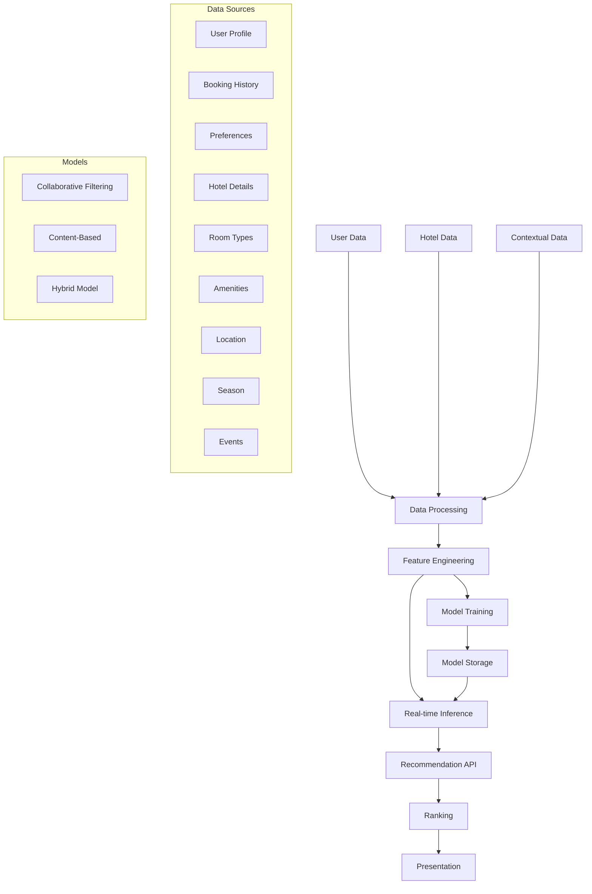

# Recommendation System

## Overview
This document outlines the AI-powered recommendation system used in the Marriott Hotels platform. The system provides personalized hotel, room, and experience recommendations based on user preferences, behavior, and contextual data.

## Architecture

### System Flow


## Implementation

### 1. Feature Engineering
```typescript
// recommendation/features.ts
import { UserFeatures, HotelFeatures } from '@/types/features';
import { normalize, encode } from '@/utils/preprocessing';

export class FeatureProcessor {
  async processUserFeatures(
    userData: UserData
  ): Promise<UserFeatures> {
    // Process user profile
    const profileFeatures = this.processProfile(userData.profile);
    
    // Process booking history
    const bookingFeatures = await this.processBookings(
      userData.bookings
    );
    
    // Process preferences
    const preferenceFeatures = this.processPreferences(
      userData.preferences
    );
    
    return {
      ...profileFeatures,
      ...bookingFeatures,
      ...preferenceFeatures,
      embeddings: await this.generateUserEmbeddings(userData),
    };
  }
  
  async processHotelFeatures(
    hotelData: HotelData
  ): Promise<HotelFeatures> {
    // Process hotel details
    const hotelFeatures = this.processHotelDetails(hotelData);
    
    // Process amenities
    const amenityFeatures = this.processAmenities(
      hotelData.amenities
    );
    
    // Process location
    const locationFeatures = await this.processLocation(
      hotelData.location
    );
    
    return {
      ...hotelFeatures,
      ...amenityFeatures,
      ...locationFeatures,
      embeddings: await this.generateHotelEmbeddings(hotelData),
    };
  }
  
  private async generateUserEmbeddings(
    userData: UserData
  ): Promise<number[]> {
    // Generate embeddings using deep learning model
    const model = await this.loadUserEmbeddingModel();
    return model.predict(userData);
  }
  
  private async generateHotelEmbeddings(
    hotelData: HotelData
  ): Promise<number[]> {
    // Generate embeddings using deep learning model
    const model = await this.loadHotelEmbeddingModel();
    return model.predict(hotelData);
  }
}
```

### 2. Collaborative Filtering
```typescript
// recommendation/collaborative.ts
import { Matrix } from '@/lib/math';
import { SVD } from '@/lib/factorization';

export class CollaborativeFilter {
  private userFactors: Matrix;
  private itemFactors: Matrix;
  
  async train(
    ratings: Rating[]
  ): Promise<void> {
    // Convert ratings to matrix
    const ratingMatrix = this.buildRatingMatrix(ratings);
    
    // Perform matrix factorization
    const svd = new SVD(ratingMatrix, {
      factors: 50,
      iterations: 100,
      learningRate: 0.005,
      regularization: 0.02,
    });
    
    // Train model
    await svd.train();
    
    // Store factors
    this.userFactors = svd.userFactors;
    this.itemFactors = svd.itemFactors;
  }
  
  async predict(
    userId: string,
    hotelId: string
  ): Promise<number> {
    const userVector = this.userFactors.getRow(userId);
    const hotelVector = this.itemFactors.getColumn(hotelId);
    
    return this.computeScore(userVector, hotelVector);
  }
  
  private buildRatingMatrix(ratings: Rating[]): Matrix {
    // Convert ratings to sparse matrix
    const matrix = new Matrix();
    
    for (const rating of ratings) {
      matrix.set(rating.userId, rating.hotelId, rating.score);
    }
    
    return matrix;
  }
  
  private computeScore(
    userVector: number[],
    hotelVector: number[]
  ): number {
    return userVector.reduce(
      (sum, val, i) => sum + val * hotelVector[i],
      0
    );
  }
}
```

### 3. Content-Based Filtering
```typescript
// recommendation/content.ts
import { Similarity } from '@/lib/similarity';
import { FeatureProcessor } from './features';

export class ContentFilter {
  private featureProcessor: FeatureProcessor;
  private similarity: Similarity;
  
  constructor() {
    this.featureProcessor = new FeatureProcessor();
    this.similarity = new Similarity();
  }
  
  async recommend(
    userData: UserData,
    hotels: HotelData[]
  ): Promise<Recommendation[]> {
    // Process user features
    const userFeatures = await this.featureProcessor.processUserFeatures(
      userData
    );
    
    // Process hotel features
    const hotelFeatures = await Promise.all(
      hotels.map(hotel =>
        this.featureProcessor.processHotelFeatures(hotel)
      )
    );
    
    // Compute similarities
    const scores = hotelFeatures.map(features =>
      this.computeSimilarity(userFeatures, features)
    );
    
    // Rank hotels
    const ranked = this.rankHotels(hotels, scores);
    
    return ranked.map(({ hotel, score }) => ({
      hotel,
      score,
      reason: this.generateReason(userFeatures, hotel),
    }));
  }
  
  private computeSimilarity(
    userFeatures: UserFeatures,
    hotelFeatures: HotelFeatures
  ): number {
    return this.similarity.cosine(
      userFeatures.embeddings,
      hotelFeatures.embeddings
    );
  }
  
  private rankHotels(
    hotels: HotelData[],
    scores: number[]
  ): RankedHotel[] {
    return hotels
      .map((hotel, i) => ({
        hotel,
        score: scores[i],
      }))
      .sort((a, b) => b.score - a.score);
  }
  
  private generateReason(
    userFeatures: UserFeatures,
    hotel: HotelData
  ): string {
    // Generate personalized recommendation reason
    const matches = this.findFeatureMatches(
      userFeatures,
      hotel
    );
    
    return this.formatReason(matches);
  }
}
```

### 4. Hybrid Recommender
```typescript
// recommendation/hybrid.ts
import { CollaborativeFilter } from './collaborative';
import { ContentFilter } from './content';
import { ContextProcessor } from './context';

export class HybridRecommender {
  private collaborative: CollaborativeFilter;
  private content: ContentFilter;
  private context: ContextProcessor;
  
  constructor() {
    this.collaborative = new CollaborativeFilter();
    this.content = new ContentFilter();
    this.context = new ContextProcessor();
  }
  
  async recommend(
    userId: string,
    context: Context
  ): Promise<Recommendation[]> {
    // Get collaborative filtering recommendations
    const cfRecommendations = await this.collaborative.recommend(
      userId
    );
    
    // Get content-based recommendations
    const cbRecommendations = await this.content.recommend(
      userId
    );
    
    // Process context
    const contextualScores = await this.context.process(
      context
    );
    
    // Combine recommendations
    const combined = this.combineRecommendations(
      cfRecommendations,
      cbRecommendations,
      contextualScores
    );
    
    // Rank final recommendations
    return this.rankRecommendations(combined);
  }
  
  private combineRecommendations(
    cf: Recommendation[],
    cb: Recommendation[],
    context: ContextScore[]
  ): CombinedRecommendation[] {
    return cf.map(rec => {
      const contentScore = this.findContentScore(rec.hotel.id, cb);
      const contextScore = this.findContextScore(
        rec.hotel.id,
        context
      );
      
      return {
        hotel: rec.hotel,
        scores: {
          collaborative: rec.score,
          content: contentScore,
          context: contextScore,
        },
      };
    });
  }
  
  private rankRecommendations(
    recommendations: CombinedRecommendation[]
  ): Recommendation[] {
    return recommendations
      .map(rec => ({
        hotel: rec.hotel,
        score: this.computeFinalScore(rec.scores),
        reason: this.generateHybridReason(rec),
      }))
      .sort((a, b) => b.score - a.score);
  }
  
  private computeFinalScore(scores: Scores): number {
    return (
      0.4 * scores.collaborative +
      0.4 * scores.content +
      0.2 * scores.context
    );
  }
}
```

### 5. Context Processing
```typescript
// recommendation/context.ts
import { LocationService } from '@/services/location';
import { WeatherService } from '@/services/weather';
import { EventService } from '@/services/events';

export class ContextProcessor {
  private locationService: LocationService;
  private weatherService: WeatherService;
  private eventService: EventService;
  
  constructor() {
    this.locationService = new LocationService();
    this.weatherService = new WeatherService();
    this.eventService = new EventService();
  }
  
  async process(context: Context): Promise<ContextScore[]> {
    // Process location context
    const locationScores = await this.processLocation(
      context.location
    );
    
    // Process temporal context
    const temporalScores = await this.processTemporal(
      context.dates
    );
    
    // Process event context
    const eventScores = await this.processEvents(
      context.location,
      context.dates
    );
    
    return this.combineScores(
      locationScores,
      temporalScores,
      eventScores
    );
  }
  
  private async processLocation(
    location: Location
  ): Promise<LocationScore[]> {
    // Get nearby hotels
    const hotels = await this.locationService.getNearbyHotels(
      location
    );
    
    // Score based on distance
    return hotels.map(hotel => ({
      hotelId: hotel.id,
      score: this.computeDistanceScore(
        location,
        hotel.location
      ),
    }));
  }
  
  private async processTemporal(
    dates: DateRange
  ): Promise<TemporalScore[]> {
    // Get seasonal factors
    const season = this.getSeason(dates);
    
    // Get weather forecast
    const weather = await this.weatherService.getForecast(dates);
    
    return this.computeTemporalScores(season, weather);
  }
  
  private async processEvents(
    location: Location,
    dates: DateRange
  ): Promise<EventScore[]> {
    // Get local events
    const events = await this.eventService.getEvents(
      location,
      dates
    );
    
    return this.computeEventScores(events);
  }
}
```

## Testing

### 1. Recommendation Tests
```typescript
// tests/recommendation.test.ts
import { HybridRecommender } from '@/recommendation/hybrid';

describe('Recommendation System', () => {
  let recommender: HybridRecommender;
  
  beforeEach(() => {
    recommender = new HybridRecommender();
  });
  
  it('should generate personalized recommendations', async () => {
    const userId = 'user123';
    const context = {
      location: { lat: 40.7128, lng: -74.0060 },
      dates: {
        checkIn: '2024-07-01',
        checkOut: '2024-07-05',
      },
    };
    
    const recommendations = await recommender.recommend(
      userId,
      context
    );
    
    expect(recommendations).toHaveLength(10);
    expect(recommendations[0].score).toBeGreaterThan(0.8);
  });
  
  it('should handle cold start users', async () => {
    const userId = 'newuser123';
    const context = {
      location: { lat: 40.7128, lng: -74.0060 },
      dates: {
        checkIn: '2024-07-01',
        checkOut: '2024-07-05',
      },
    };
    
    const recommendations = await recommender.recommend(
      userId,
      context
    );
    
    expect(recommendations).toHaveLength(10);
    expect(recommendations[0].reason).toBeTruthy();
  });
});
```

### 2. Feature Tests
```typescript
// tests/features.test.ts
import { FeatureProcessor } from '@/recommendation/features';

describe('Feature Processing', () => {
  let processor: FeatureProcessor;
  
  beforeEach(() => {
    processor = new FeatureProcessor();
  });
  
  it('should process user features correctly', async () => {
    const userData = {
      profile: {
        preferences: ['luxury', 'spa'],
        travelStyle: 'business',
      },
      bookings: [
        {
          hotelId: 'hotel123',
          rating: 5,
          review: 'Excellent stay!',
        },
      ],
    };
    
    const features = await processor.processUserFeatures(userData);
    
    expect(features.embeddings).toHaveLength(50);
    expect(features.preferences).toContain('luxury');
  });
  
  it('should process hotel features correctly', async () => {
    const hotelData = {
      id: 'hotel123',
      name: 'Marriott Downtown',
      amenities: ['pool', 'spa', 'restaurant'],
      location: {
        lat: 40.7128,
        lng: -74.0060,
      },
    };
    
    const features = await processor.processHotelFeatures(
      hotelData
    );
    
    expect(features.embeddings).toHaveLength(50);
    expect(features.amenities).toContain('spa');
  });
});
```

## Documentation

### 1. Usage Guide
- System integration
- API endpoints
- Parameter tuning
- Error handling

### 2. Maintenance Guide
- Model updates
- Feature engineering
- Performance tuning
- Error monitoring

## Future Improvements

### 1. Technical Roadmap
- Deep learning models
- Real-time personalization
- Multi-criteria optimization
- Advanced contextual features

### 2. Research Areas
- Recommendation algorithms
- Feature extraction
- Contextual modeling
- Evaluation metrics 