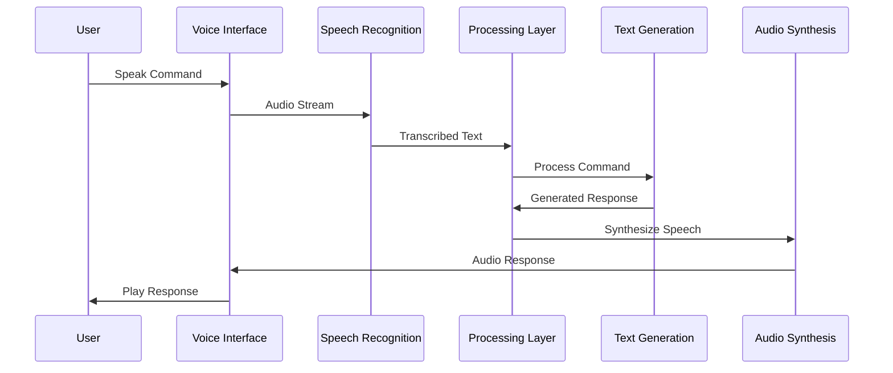

# Voice Integration

## Overview
This document outlines the voice integration system in the Marriott Hotels platform, which enables voice-based interactions for bookings, inquiries, and hotel services. The system uses OpenAI's Whisper for speech-to-text and Azure's Text-to-Speech for voice synthesis.

## Architecture

### System Flow


## Implementation

### 1. Voice Interface
```typescript
// components/VoiceInterface.tsx
import React, { useState, useRef } from 'react';
import { useVoiceRecognition } from '@/hooks/useVoiceRecognition';
import { useSpeechSynthesis } from '@/hooks/useSpeechSynthesis';

export const VoiceInterface: React.FC = () => {
  const [isListening, setIsListening] = useState(false);
  const audioRef = useRef<HTMLAudioElement>(null);
  
  const { startRecording, stopRecording } = useVoiceRecognition({
    onResult: async (text) => {
      const response = await processVoiceCommand(text);
      await synthesizeAndPlay(response);
    },
    onError: (error) => {
      console.error('Voice recognition error:', error);
    },
  });
  
  const { synthesizeSpeech } = useSpeechSynthesis();
  
  const handleToggleListening = () => {
    if (isListening) {
      stopRecording();
    } else {
      startRecording();
    }
    setIsListening(!isListening);
  };
  
  const synthesizeAndPlay = async (text: string) => {
    const audioUrl = await synthesizeSpeech(text);
    if (audioRef.current) {
      audioRef.current.src = audioUrl;
      audioRef.current.play();
    }
  };
  
  return (
    <div className="voice-interface">
      <button
        onClick={handleToggleListening}
        className={`voice-button ${isListening ? 'listening' : ''}`}
      >
        {isListening ? 'Listening...' : 'Start Voice Command'}
      </button>
      
      <audio ref={audioRef} />
    </div>
  );
};
```

### 2. Speech Recognition
```typescript
// services/speechRecognition.ts
import { Configuration, OpenAIApi } from 'openai';

export class SpeechRecognition {
  private openai: OpenAIApi;
  private mediaRecorder: MediaRecorder | null = null;
  private audioChunks: Blob[] = [];
  
  constructor() {
    const configuration = new Configuration({
      apiKey: process.env.OPENAI_API_KEY,
    });
    this.openai = new OpenAIApi(configuration);
  }
  
  async startRecording(): Promise<void> {
    try {
      const stream = await navigator.mediaDevices.getUserMedia({
        audio: true,
      });
      
      this.mediaRecorder = new MediaRecorder(stream);
      this.audioChunks = [];
      
      this.mediaRecorder.ondataavailable = (event) => {
        this.audioChunks.push(event.data);
      };
      
      this.mediaRecorder.start();
    } catch (error) {
      console.error('Recording error:', error);
      throw new Error('Failed to start recording');
    }
  }
  
  async stopRecording(): Promise<string> {
    return new Promise((resolve, reject) => {
      if (!this.mediaRecorder) {
        reject(new Error('No recording in progress'));
        return;
      }
      
      this.mediaRecorder.onstop = async () => {
        try {
          const audioBlob = new Blob(this.audioChunks, {
            type: 'audio/webm',
          });
          
          const transcription = await this.transcribeAudio(audioBlob);
          resolve(transcription);
        } catch (error) {
          reject(error);
        }
      };
      
      this.mediaRecorder.stop();
    });
  }
  
  private async transcribeAudio(audioBlob: Blob): Promise<string> {
    try {
      const formData = new FormData();
      formData.append('file', audioBlob, 'audio.webm');
      formData.append('model', 'whisper-1');
      
      const response = await this.openai.createTranscription(
        formData as any,
        'whisper-1'
      );
      
      return response.data.text;
    } catch (error) {
      console.error('Transcription error:', error);
      throw new Error('Failed to transcribe audio');
    }
  }
}
```

### 3. Speech Synthesis
```typescript
// services/speechSynthesis.ts
import { TextToSpeechClient } from '@azure/cognitiveservices-speech';

export class SpeechSynthesis {
  private client: TextToSpeechClient;
  
  constructor() {
    this.client = new TextToSpeechClient(
      process.env.AZURE_SPEECH_KEY!,
      process.env.AZURE_SPEECH_REGION!
    );
  }
  
  async synthesizeSpeech(text: string): Promise<string> {
    try {
      const response = await this.client.synthesize(text, {
        voiceName: 'en-US-JennyNeural',
        outputFormat: 'audio-16khz-128kbitrate-mono-mp3',
      });
      
      // Convert audio data to URL
      const audioBlob = new Blob([response.audioData], {
        type: 'audio/mp3',
      });
      return URL.createObjectURL(audioBlob);
    } catch (error) {
      console.error('Speech synthesis error:', error);
      throw new Error('Failed to synthesize speech');
    }
  }
  
  async synthesizeSSML(ssml: string): Promise<string> {
    try {
      const response = await this.client.synthesize(ssml, {
        outputFormat: 'audio-16khz-128kbitrate-mono-mp3',
        isSSML: true,
      });
      
      const audioBlob = new Blob([response.audioData], {
        type: 'audio/mp3',
      });
      return URL.createObjectURL(audioBlob);
    } catch (error) {
      console.error('SSML synthesis error:', error);
      throw new Error('Failed to synthesize SSML');
    }
  }
}
```

### 4. Voice Command Processing
```typescript
// services/voiceCommand.ts
import { NLPProcessor } from '@/lib/nlp';
import { BookingService } from '@/services/booking';
import { HotelService } from '@/services/hotel';

export class VoiceCommandProcessor {
  private nlp: NLPProcessor;
  private bookingService: BookingService;
  private hotelService: HotelService;
  
  constructor() {
    this.nlp = new NLPProcessor();
    this.bookingService = new BookingService();
    this.hotelService = new HotelService();
  }
  
  async processCommand(text: string): Promise<string> {
    try {
      // Extract intent and entities
      const intent = await this.nlp.classifyIntent(text);
      const entities = await this.nlp.extractEntities(text);
      
      switch (intent) {
        case 'booking':
          return this.handleBookingCommand(entities);
        case 'amenities':
          return this.handleAmenitiesCommand(entities);
        case 'information':
          return this.handleInformationCommand(entities);
        default:
          return 'I'm sorry, I didn't understand that command. Could you please rephrase it?';
      }
    } catch (error) {
      console.error('Command processing error:', error);
      throw new Error('Failed to process voice command');
    }
  }
  
  private async handleBookingCommand(
    entities: any
  ): Promise<string> {
    const { dates, roomType, guests } = entities;
    
    const availability = await this.bookingService.checkAvailability({
      dates,
      roomType,
      guests,
    });
    
    if (!availability.available) {
      return 'I'm sorry, but we don't have rooms available for those dates. Would you like to check different dates?';
    }
    
    return `I found ${availability.rooms.length} rooms available for your dates. Would you like me to proceed with the booking?`;
  }
  
  private async handleAmenitiesCommand(
    entities: any
  ): Promise<string> {
    const { amenityType } = entities;
    
    const amenities = await this.hotelService.getAmenities(amenityType);
    
    return `Here are the available ${amenityType} amenities: ${amenities.map(a => a.name).join(', ')}. Would you like more information about any of these?`;
  }
  
  private async handleInformationCommand(
    entities: any
  ): Promise<string> {
    const { topic } = entities;
    
    const info = await this.hotelService.getInformation(topic);
    
    return info.description;
  }
}
```

## Voice Enhancement

### 1. Noise Reduction
```typescript
// audio/noiseReduction.ts
import { AudioProcessor } from '@/lib/audio';

export class NoiseReducer {
  private processor: AudioProcessor;
  
  constructor() {
    this.processor = new AudioProcessor();
  }
  
  async reduceNoise(audioBuffer: AudioBuffer): Promise<AudioBuffer> {
    // Apply noise reduction algorithm
    const denoisedBuffer = await this.processor.denoise(audioBuffer, {
      threshold: -50,
      reduction: 20,
    });
    
    return denoisedBuffer;
  }
  
  async enhanceVoice(audioBuffer: AudioBuffer): Promise<AudioBuffer> {
    // Apply voice enhancement
    const enhancedBuffer = await this.processor.enhance(audioBuffer, {
      frequency: {
        low: 100,
        high: 8000,
      },
      gain: 1.5,
    });
    
    return enhancedBuffer;
  }
}
```

### 2. Voice Activity Detection
```typescript
// audio/vadDetection.ts
export class VoiceActivityDetector {
  private readonly energyThreshold: number = 0.01;
  private readonly frameDuration: number = 0.03;
  
  detectVoiceActivity(
    audioBuffer: Float32Array,
    sampleRate: number
  ): boolean[] {
    const frameSize = Math.floor(sampleRate * this.frameDuration);
    const frames = this.splitIntoFrames(audioBuffer, frameSize);
    
    return frames.map(frame => {
      const energy = this.calculateEnergy(frame);
      return energy > this.energyThreshold;
    });
  }
  
  private splitIntoFrames(
    buffer: Float32Array,
    frameSize: number
  ): Float32Array[] {
    const frames: Float32Array[] = [];
    
    for (let i = 0; i < buffer.length; i += frameSize) {
      frames.push(buffer.slice(i, i + frameSize));
    }
    
    return frames;
  }
  
  private calculateEnergy(frame: Float32Array): number {
    return frame.reduce((sum, sample) => sum + sample * sample, 0) / frame.length;
  }
}
```

## Testing

### 1. Voice Recognition Tests
```typescript
// tests/voice-recognition.test.ts
import { SpeechRecognition } from '@/services/speechRecognition';

describe('Speech Recognition', () => {
  let recognition: SpeechRecognition;
  
  beforeEach(() => {
    recognition = new SpeechRecognition();
  });
  
  it('should transcribe audio correctly', async () => {
    const audioBlob = await loadTestAudio('test-audio.webm');
    const text = await recognition.transcribeAudio(audioBlob);
    
    expect(text).toBe('Book a room for tomorrow night');
  });
  
  it('should handle background noise', async () => {
    const noisyAudio = await loadTestAudio('noisy-audio.webm');
    const text = await recognition.transcribeAudio(noisyAudio);
    
    expect(text).toBeTruthy();
  });
});
```

### 2. Speech Synthesis Tests
```typescript
// tests/speech-synthesis.test.ts
import { SpeechSynthesis } from '@/services/speechSynthesis';

describe('Speech Synthesis', () => {
  let synthesis: SpeechSynthesis;
  
  beforeEach(() => {
    synthesis = new SpeechSynthesis();
  });
  
  it('should synthesize text to speech', async () => {
    const text = 'Welcome to Marriott Hotels';
    const audioUrl = await synthesis.synthesizeSpeech(text);
    
    expect(audioUrl).toMatch(/^blob:/);
  });
  
  it('should handle SSML input', async () => {
    const ssml = `
      <speak>
        Welcome to <emphasis>Marriott</emphasis> Hotels
      </speak>
    `;
    const audioUrl = await synthesis.synthesizeSSML(ssml);
    
    expect(audioUrl).toMatch(/^blob:/);
  });
});
```

## Documentation

### 1. Setup Guide
- Voice interface integration
- Recognition configuration
- Synthesis setup
- Error handling

### 2. Maintenance Guide
- Model updates
- Audio processing
- Performance tuning
- Error monitoring

## Future Improvements

### 1. Technical Roadmap
- Multi-language support
- Emotion detection
- Speaker identification
- Background noise filtering

### 2. Research Areas
- Voice recognition accuracy
- Natural speech synthesis
- Real-time processing
- Voice biometrics 