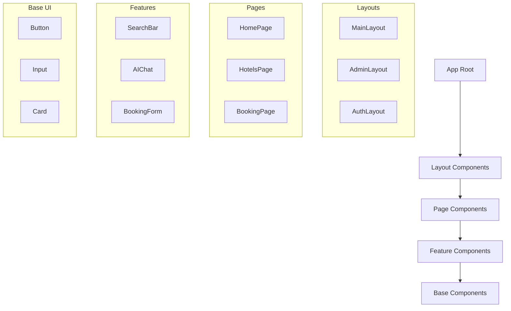

# Frontend Component Architecture

## Overview
This document details the frontend architecture of the Marriott Hotels platform, focusing on React components, state management, and AI integration. The architecture is built using Next.js, TypeScript, and follows modern React best practices.

## Component Organization

### Component Structure


## Component Implementation

### 1. Base Components
```typescript
// Button Component
interface ButtonProps {
  variant: 'primary' | 'secondary' | 'outline';
  size: 'sm' | 'md' | 'lg';
  loading?: boolean;
  disabled?: boolean;
  onClick?: () => void;
  children: React.ReactNode;
}

const Button: React.FC<ButtonProps> = ({
  variant,
  size,
  loading,
  disabled,
  onClick,
  children
}) => {
  // Component implementation
};

// Input Component
interface InputProps {
  type: 'text' | 'email' | 'password';
  value: string;
  onChange: (value: string) => void;
  error?: string;
  label?: string;
}

const Input: React.FC<InputProps> = ({
  type,
  value,
  onChange,
  error,
  label
}) => {
  // Component implementation
};
```

### 2. Feature Components
```typescript
// AI Chat Component
interface ChatProps {
  initialContext?: string;
  onMessage?: (message: string) => void;
  onError?: (error: Error) => void;
}

const AIChat: React.FC<ChatProps> = ({
  initialContext,
  onMessage,
  onError
}) => {
  // Component implementation
};

// Booking Form Component
interface BookingFormProps {
  hotelId: string;
  onSubmit: (booking: BookingData) => void;
  initialData?: Partial<BookingData>;
}

const BookingForm: React.FC<BookingFormProps> = ({
  hotelId,
  onSubmit,
  initialData
}) => {
  // Component implementation
};
```

## State Management

### 1. Global State
```typescript
// App State Types
interface AppState {
  user: {
    profile: UserProfile;
    preferences: UserPreferences;
    auth: AuthState;
  };
  booking: {
    current: BookingData;
    history: BookingHistory[];
  };
  ai: {
    conversation: ConversationState;
    preferences: AIPreferences;
  };
}

// State Provider
const AppStateProvider: React.FC = ({ children }) => {
  // State implementation
};
```

### 2. Local State
```typescript
// Component State Hook
const useComponentState = <T>(initialState: T) => {
  const [state, setState] = useState<T>(initialState);
  
  const updateState = useCallback((newState: Partial<T>) => {
    setState(prev => ({ ...prev, ...newState }));
  }, []);
  
  return { state, updateState };
};
```

## Routing and Navigation

### 1. Route Configuration
```typescript
interface RouteConfig {
  public: {
    home: '/',
    hotels: '/hotels',
    booking: '/booking/:id'
  };
  protected: {
    profile: '/profile',
    bookings: '/bookings',
    admin: '/admin/*'
  };
  auth: {
    login: '/auth/login',
    register: '/auth/register',
    forgot: '/auth/forgot'
  };
}
```

### 2. Navigation Guards
```typescript
const ProtectedRoute: React.FC = ({ children }) => {
  const { isAuthenticated, loading } = useAuth();
  
  if (loading) {
    return <LoadingScreen />;
  }
  
  if (!isAuthenticated) {
    return <Navigate to="/auth/login" />;
  }
  
  return children;
};
```

## AI Integration

### 1. Chat Components
```typescript
// Chat Context
interface ChatContext {
  messages: Message[];
  sendMessage: (text: string) => Promise<void>;
  startVoice: () => Promise<void>;
  stopVoice: () => Promise<void>;
}

const ChatProvider: React.FC = ({ children }) => {
  // Provider implementation
};

// Message Component
interface MessageProps {
  content: string;
  type: 'user' | 'ai';
  timestamp: Date;
  hasAudio?: boolean;
}

const Message: React.FC<MessageProps> = ({
  content,
  type,
  timestamp,
  hasAudio
}) => {
  // Component implementation
};
```

### 2. Voice Integration
```typescript
// Voice Hook
interface VoiceHook {
  isRecording: boolean;
  startRecording: () => Promise<void>;
  stopRecording: () => Promise<string>;
  playAudio: (url: string) => Promise<void>;
}

const useVoice = (): VoiceHook => {
  // Hook implementation
};
```

## Performance Optimization

### 1. Code Splitting
```typescript
// Dynamic Imports
const DynamicComponent = dynamic(() => import('./Component'), {
  loading: () => <LoadingSpinner />,
  ssr: false
});

// Route-based Splitting
const routes = {
  home: lazy(() => import('./pages/Home')),
  hotels: lazy(() => import('./pages/Hotels')),
  booking: lazy(() => import('./pages/Booking'))
};
```

### 2. Performance Hooks
```typescript
// Performance Monitor
const usePerformance = () => {
  const metrics = {
    fcp: useFCP(),
    lcp: useLCP(),
    fid: useFID(),
    cls: useCLS()
  };
  
  return metrics;
};
```

## Testing Strategy

### 1. Component Testing
```typescript
// Button Test
describe('Button Component', () => {
  it('renders correctly', () => {
    render(<Button variant="primary">Click Me</Button>);
    expect(screen.getByText('Click Me')).toBeInTheDocument();
  });
  
  it('handles click events', () => {
    const onClick = jest.fn();
    render(<Button onClick={onClick}>Click Me</Button>);
    fireEvent.click(screen.getByText('Click Me'));
    expect(onClick).toHaveBeenCalled();
  });
});
```

### 2. Integration Testing
```typescript
// Booking Flow Test
describe('Booking Flow', () => {
  it('completes booking process', async () => {
    render(<BookingFlow />);
    
    // Test implementation
  });
});
```

## Error Handling

### 1. Error Boundaries
```typescript
class ErrorBoundary extends React.Component {
  state = { hasError: false, error: null };
  
  static getDerivedStateFromError(error) {
    return { hasError: true, error };
  }
  
  render() {
    if (this.state.hasError) {
      return <ErrorFallback error={this.state.error} />;
    }
    
    return this.props.children;
  }
}
```

### 2. Error Hooks
```typescript
const useErrorHandler = () => {
  const [error, setError] = useState<Error | null>(null);
  
  const handleError = useCallback((error: Error) => {
    setError(error);
    // Error handling logic
  }, []);
  
  return { error, handleError };
};
```

## Documentation

### 1. Component Documentation
- Usage examples
- Props reference
- State management
- Event handling
- Accessibility

### 2. Style Guide
- Design system
- Component patterns
- Code standards
- Best practices
- Performance tips

## Future Improvements

### 1. Component Roadmap
- Enhanced AI features
- Better performance
- Improved accessibility
- Advanced animations
- Better documentation

### 2. Technical Debt
- Code refactoring
- Test coverage
- Performance optimization
- Dependency updates
- Documentation updates 