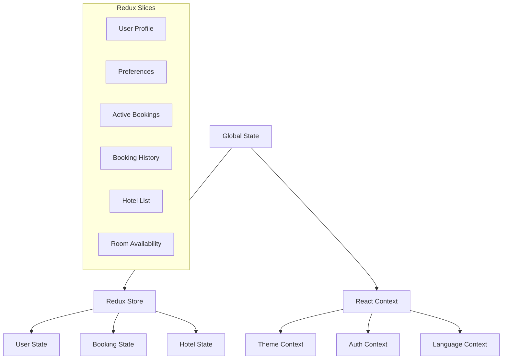

# State Management

## Overview
This document outlines the state management architecture in the Marriott Hotels platform frontend. We use a combination of React Context and Redux for different state management needs.

## State Architecture

### System Diagram


## Redux Implementation

### 1. Store Configuration
```typescript
// store/index.ts
import { configureStore } from '@reduxjs/toolkit';
import userReducer from './slices/userSlice';
import bookingReducer from './slices/bookingSlice';
import hotelReducer from './slices/hotelSlice';

export const store = configureStore({
  reducer: {
    user: userReducer,
    booking: bookingReducer,
    hotel: hotelReducer,
  },
  middleware: (getDefaultMiddleware) =>
    getDefaultMiddleware({
      serializableCheck: false,
      thunk: true,
    }),
});
```

### 2. State Slices
```typescript
// store/slices/userSlice.ts
import { createSlice, PayloadAction } from '@reduxjs/toolkit';

interface UserState {
  profile: UserProfile | null;
  preferences: UserPreferences;
  isAuthenticated: boolean;
}

const initialState: UserState = {
  profile: null,
  preferences: {},
  isAuthenticated: false,
};

export const userSlice = createSlice({
  name: 'user',
  initialState,
  reducers: {
    setProfile: (state, action: PayloadAction<UserProfile>) => {
      state.profile = action.payload;
    },
    setPreferences: (state, action: PayloadAction<UserPreferences>) => {
      state.preferences = action.payload;
    },
    setAuthenticated: (state, action: PayloadAction<boolean>) => {
      state.isAuthenticated = action.payload;
    },
  },
});
```

## React Context Implementation

### 1. Theme Context
```typescript
// contexts/ThemeContext.tsx
import React, { createContext, useContext, useState } from 'react';

interface ThemeContextType {
  theme: 'light' | 'dark';
  toggleTheme: () => void;
}

const ThemeContext = createContext<ThemeContextType | undefined>(undefined);

export const ThemeProvider: React.FC = ({ children }) => {
  const [theme, setTheme] = useState<'light' | 'dark'>('light');

  const toggleTheme = () => {
    setTheme((prev) => (prev === 'light' ? 'dark' : 'light'));
  };

  return (
    <ThemeContext.Provider value={{ theme, toggleTheme }}>
      {children}
    </ThemeContext.Provider>
  );
};
```

### 2. Auth Context
```typescript
// contexts/AuthContext.tsx
import React, { createContext, useContext, useState } from 'react';

interface AuthContextType {
  token: string | null;
  login: (token: string) => void;
  logout: () => void;
}

const AuthContext = createContext<AuthContextType | undefined>(undefined);

export const AuthProvider: React.FC = ({ children }) => {
  const [token, setToken] = useState<string | null>(null);

  const login = (newToken: string) => {
    setToken(newToken);
  };

  const logout = () => {
    setToken(null);
  };

  return (
    <AuthContext.Provider value={{ token, login, logout }}>
      {children}
    </AuthContext.Provider>
  );
};
```

## State Management Best Practices

### 1. When to Use Redux
- Global state that needs to be accessed by many components
- Complex state logic that requires middleware
- State that needs to be persisted
- Actions that need to be tracked or logged

### 2. When to Use Context
- Theme settings
- Authentication state
- Localization preferences
- UI state that doesn't need persistence

### 3. Performance Considerations
- Use selectors for accessing Redux state
- Memoize expensive computations
- Split context to prevent unnecessary re-renders
- Implement proper error boundaries

## State Persistence

### 1. Local Storage
```typescript
// utils/persistence.ts
export const persistState = (key: string, state: any) => {
  try {
    localStorage.setItem(key, JSON.stringify(state));
  } catch (err) {
    console.error('Error persisting state:', err);
  }
};

export const loadState = (key: string) => {
  try {
    const serializedState = localStorage.getItem(key);
    return serializedState ? JSON.parse(serializedState) : undefined;
  } catch (err) {
    console.error('Error loading state:', err);
    return undefined;
  }
};
```

### 2. Redux Persistence
```typescript
// store/persistConfig.ts
import { persistReducer, persistStore } from 'redux-persist';
import storage from 'redux-persist/lib/storage';

const persistConfig = {
  key: 'root',
  storage,
  whitelist: ['user', 'preferences'],
};
```

## Error Handling

### 1. Error Boundaries
```typescript
// components/ErrorBoundary.tsx
class StateErrorBoundary extends React.Component {
  componentDidCatch(error: Error, errorInfo: React.ErrorInfo) {
    console.error('State management error:', error);
    // Reset relevant state
    store.dispatch(resetState());
  }

  render() {
    return this.props.children;
  }
}
```

### 2. Action Error Handling
```typescript
// actions/errorHandling.ts
export const createAsyncAction = (actionCreator: any) => {
  return async (...args: any[]) => {
    try {
      return await actionCreator(...args);
    } catch (error) {
      console.error('Action error:', error);
      throw error;
    }
  };
};
```

## Testing

### 1. Redux Tests
```typescript
// tests/redux/userSlice.test.ts
describe('User Slice', () => {
  it('should handle initial state', () => {
    expect(userReducer(undefined, { type: 'unknown' })).toEqual({
      profile: null,
      preferences: {},
      isAuthenticated: false,
    });
  });

  it('should handle setProfile', () => {
    const actual = userReducer(initialState, setProfile(mockProfile));
    expect(actual.profile).toEqual(mockProfile);
  });
});
```

### 2. Context Tests
```typescript
// tests/contexts/ThemeContext.test.tsx
describe('Theme Context', () => {
  it('should toggle theme', () => {
    const { result } = renderHook(() => useTheme(), {
      wrapper: ThemeProvider,
    });

    act(() => {
      result.current.toggleTheme();
    });

    expect(result.current.theme).toBe('dark');
  });
});
```

## Documentation

### 1. State Structure
- Document state shape
- Explain state relationships
- Define state access patterns
- List state dependencies

### 2. Maintenance Guide
- State updates
- Migration procedures
- Performance monitoring
- Troubleshooting steps

## Future Improvements

### 1. Technical Roadmap
- Implement state machines
- Add real-time sync
- Enhance persistence
- Improve performance

### 2. Research Areas
- State management patterns
- Performance optimization
- Testing strategies
- Error handling methods 