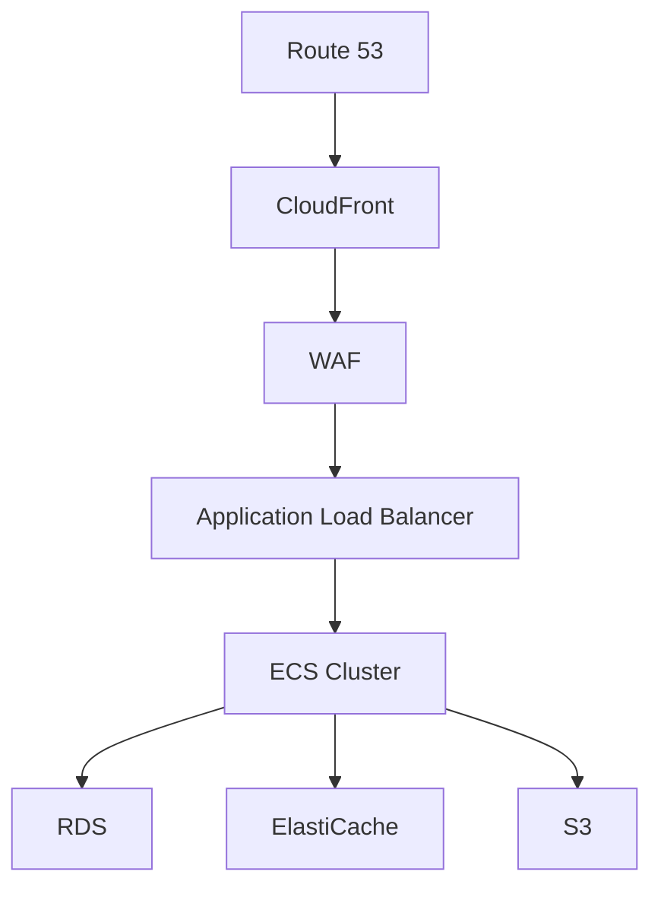
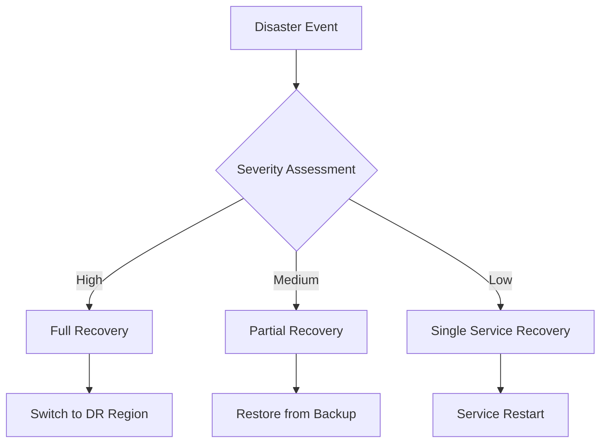

# Cloud Infrastructure Documentation

## Overview
This document outlines the cloud infrastructure setup for the Marriott Hotels platform, detailing the AWS services, configurations, and best practices used in the production environment.

## Table of Contents
- [AWS Architecture](#aws-architecture)
- [Service Configuration](#service-configuration)
- [Resource Management](#resource-management)
- [Cost Optimization](#cost-optimization)
- [Disaster Recovery](#disaster-recovery)

## AWS Architecture

### High-Level Overview


### Regional Distribution
```yaml
regions:
  primary:
    name: us-east-1
    services:
      - ECS
      - RDS
      - ElastiCache
  
  secondary:
    name: us-west-2
    services:
      - RDS Read Replica
      - S3 Backup
```

## Service Configuration

### ECS Configuration
```yaml
# ECS Cluster Configuration
ecs_cluster:
  name: marriott-cluster
  capacity_providers:
    - FARGATE
    - FARGATE_SPOT
  default_capacity_provider_strategy:
    - capacity_provider: FARGATE
      weight: 1
      base: 1

# Task Definition
task_definition:
  cpu: 1024
  memory: 2048
  containers:
    - name: api
      image: marriott/api:latest
      port_mappings:
        - container_port: 8080
    - name: worker
      image: marriott/worker:latest
```

### RDS Configuration
```yaml
# RDS Configuration
rds:
  engine: postgres
  version: 13.7
  instance_class: db.r5.xlarge
  multi_az: true
  storage:
    type: gp3
    size: 100
  backup:
    retention_period: 7
    preferred_window: "03:00-04:00"
```

### ElastiCache Configuration
```yaml
# ElastiCache Configuration
elasticache:
  engine: redis
  version: 6.x
  node_type: cache.r5.large
  num_cache_nodes: 3
  parameter_group:
    family: redis6.x
    parameters:
      maxmemory-policy: allkeys-lru
```

## Resource Management

### Auto Scaling
```yaml
# Auto Scaling Configuration
auto_scaling:
  ecs_service:
    min_capacity: 2
    max_capacity: 10
    target_tracking:
      target_value: 70
      scale_in_cooldown: 300
      scale_out_cooldown: 60

  rds:
    cpu_utilization_threshold: 75
    connections_threshold: 5000
```

### Resource Tagging
```yaml
# Tagging Strategy
tags:
  Environment: production
  Project: marriott-hotels
  Team: platform
  CostCenter: hotel-ops
```

## Cost Optimization

### Reserved Instances
```yaml
# Reserved Instance Strategy
reserved_instances:
  rds:
    instance_class: db.r5.xlarge
    term: 1-year
    payment_option: partial_upfront
  
  elasticache:
    node_type: cache.r5.large
    term: 1-year
    payment_option: all_upfront
```

### Cost Allocation
```yaml
# Cost Allocation Tags
cost_allocation:
  tags:
    - key: Environment
    - key: Project
    - key: Team
    - key: CostCenter
```

## Disaster Recovery

### Backup Strategy
```yaml
# Backup Configuration
backups:
  rds:
    automated_backup:
      retention_period: 7
      copy_tags: true
    snapshot_schedule:
      frequency: daily
      retention: 30
  
  s3:
    versioning: enabled
    lifecycle_rules:
      - transition_to_ia: 30
      - transition_to_glacier: 90
```

### Recovery Procedures


## Best Practices

### 1. Security
- Enable encryption at rest
- Use IAM roles and policies
- Implement network isolation
- Regular security audits

### 2. Performance
- Use appropriate instance sizes
- Implement caching strategies
- Monitor and optimize
- Regular performance testing

### 3. Reliability
- Multi-AZ deployment
- Automated failover
- Regular backup testing
- Incident response plan

### 4. Cost Management
- Right-sizing instances
- Reserved instance planning
- Cost monitoring
- Resource cleanup

## Maintenance Procedures

### Daily Tasks
1. Monitor resource utilization
2. Review CloudWatch metrics
3. Check backup status
4. Verify service health

### Weekly Tasks
1. Review cost reports
2. Update resource tags
3. Performance analysis
4. Security assessment

### Monthly Tasks
1. Capacity planning
2. Reserved instance review
3. Backup testing
4. Documentation updates

### Quarterly Tasks
1. Disaster recovery testing
2. Cost optimization review
3. Security audit
4. Architecture review