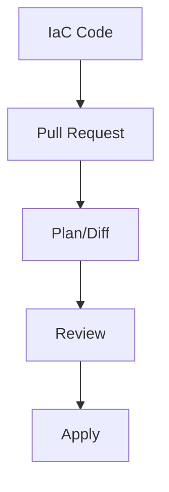

# Infrastructure as Code Documentation

## Overview
This document outlines the Infrastructure as Code (IaC) implementation for the Marriott Hotels platform using Terraform and AWS CDK.

## Table of Contents
- [IaC Architecture](#iac-architecture)
- [Terraform Configuration](#terraform-configuration)
- [AWS CDK Implementation](#aws-cdk-implementation)
- [CI/CD Integration](#cicd-integration)
- [State Management](#state-management)

## IaC Architecture

### Project Structure
```
infrastructure/
├── terraform/
│   ├── environments/
│   │   ├── prod/
│   │   ├── staging/
│   │   └── dev/
│   ├── modules/
│   │   ├── vpc/
│   │   ├── ecs/
│   │   ├── rds/
│   │   └── elasticache/
│   └── shared/
├── cdk/
│   ├── lib/
│   │   ├── vpc-stack.ts
│   │   ├── ecs-stack.ts
│   │   ├── rds-stack.ts
│   │   └── cache-stack.ts
│   └── bin/
└── scripts/
```

### Workflow


## Terraform Configuration

### Provider Configuration
```hcl
# AWS Provider
provider "aws" {
  region = var.aws_region
  
  default_tags {
    tags = {
      Environment = var.environment
      Project     = "marriott-hotels"
      ManagedBy   = "terraform"
    }
  }
}

# Backend Configuration
terraform {
  backend "s3" {
    bucket         = "marriott-terraform-state"
    key            = "environment/terraform.tfstate"
    region         = "us-east-1"
    dynamodb_table = "terraform-state-lock"
    encrypt        = true
  }
}
```

### VPC Module
```hcl
module "vpc" {
  source = "../modules/vpc"
  
  vpc_cidr = "10.0.0.0/16"
  
  public_subnets = [
    "10.0.1.0/24",
    "10.0.2.0/24"
  ]
  
  private_subnets = [
    "10.0.3.0/24",
    "10.0.4.0/24"
  ]
  
  database_subnets = [
    "10.0.5.0/24",
    "10.0.6.0/24"
  ]
  
  enable_nat_gateway = true
  single_nat_gateway = false
}
```

### ECS Module
```hcl
module "ecs" {
  source = "../modules/ecs"
  
  cluster_name = "marriott-cluster"
  
  task_definition = {
    family                = "api"
    cpu                  = 1024
    memory               = 2048
    execution_role_arn   = aws_iam_role.ecs_execution.arn
    task_role_arn        = aws_iam_role.ecs_task.arn
    container_definitions = jsonencode([
      {
        name  = "api"
        image = "${var.ecr_repository}:latest"
        portMappings = [
          {
            containerPort = 8080
            protocol     = "tcp"
          }
        ]
      }
    ])
  }
}
```

## AWS CDK Implementation

### VPC Stack
```typescript
export class VpcStack extends cdk.Stack {
  constructor(scope: cdk.Construct, id: string, props?: cdk.StackProps) {
    super(scope, id, props);
    
    const vpc = new ec2.Vpc(this, 'MarriottVPC', {
      maxAzs: 2,
      subnetConfiguration: [
        {
          cidrMask: 24,
          name: 'Public',
          subnetType: ec2.SubnetType.PUBLIC,
        },
        {
          cidrMask: 24,
          name: 'Private',
          subnetType: ec2.SubnetType.PRIVATE_WITH_NAT,
        },
        {
          cidrMask: 24,
          name: 'Database',
          subnetType: ec2.SubnetType.PRIVATE_ISOLATED,
        },
      ],
    });
  }
}
```

### ECS Stack
```typescript
export class EcsStack extends cdk.Stack {
  constructor(scope: cdk.Construct, id: string, props?: cdk.StackProps) {
    super(scope, id, props);
    
    const cluster = new ecs.Cluster(this, 'MarriottCluster', {
      vpc: props.vpc,
      containerInsights: true,
    });
    
    const taskDefinition = new ecs.FargateTaskDefinition(this, 'ApiTask', {
      memoryLimitMiB: 2048,
      cpu: 1024,
    });
    
    const container = taskDefinition.addContainer('api', {
      image: ecs.ContainerImage.fromEcrRepository(props.repository),
      logging: ecs.LogDrivers.awsLogs({ streamPrefix: 'api' }),
    });
    
    container.addPortMappings({
      containerPort: 8080,
    });
  }
}
```

## CI/CD Integration

### GitHub Actions Workflow
```yaml
name: Infrastructure Deployment

on:
  push:
    branches: [main]
    paths:
      - 'infrastructure/**'
  pull_request:
    paths:
      - 'infrastructure/**'

jobs:
  terraform:
    runs-on: ubuntu-latest
    steps:
      - uses: actions/checkout@v2
      
      - name: Setup Terraform
        uses: hashicorp/setup-terraform@v1
        
      - name: Terraform Init
        run: terraform init
        
      - name: Terraform Plan
        run: terraform plan -out=tfplan
        
      - name: Terraform Apply
        if: github.ref == 'refs/heads/main'
        run: terraform apply tfplan
```

## State Management

### Remote State Configuration
```hcl
# S3 Bucket for State Storage
resource "aws_s3_bucket" "terraform_state" {
  bucket = "marriott-terraform-state"
  
  versioning {
    enabled = true
  }
  
  server_side_encryption_configuration {
    rule {
      apply_server_side_encryption_by_default {
        sse_algorithm = "AES256"
      }
    }
  }
}

# DynamoDB for State Locking
resource "aws_dynamodb_table" "terraform_locks" {
  name         = "terraform-state-lock"
  billing_mode = "PAY_PER_REQUEST"
  hash_key     = "LockID"
  
  attribute {
    name = "LockID"
    type = "S"
  }
}
```

## Best Practices

### 1. Code Organization
- Use consistent naming conventions
- Modularize infrastructure code
- Implement reusable modules
- Document all variables

### 2. Security
- Use state encryption
- Implement least privilege
- Secure sensitive variables
- Regular security audits

### 3. Version Control
- Use feature branches
- Implement PR reviews
- Tag releases
- Maintain changelog

### 4. Testing
- Validate configurations
- Test modules
- Integration testing
- Security scanning

## Maintenance Procedures

### Daily Tasks
1. Review plan outputs
2. Check state files
3. Monitor deployments
4. Verify compliance

### Weekly Tasks
1. Code review
2. Security scanning
3. Update documentation
4. Performance review

### Monthly Tasks
1. Module updates
2. State cleanup
3. Cost optimization
4. Architecture review

### Quarterly Tasks
1. Security audit
2. Disaster recovery test
3. Documentation update
4. Tool evaluation