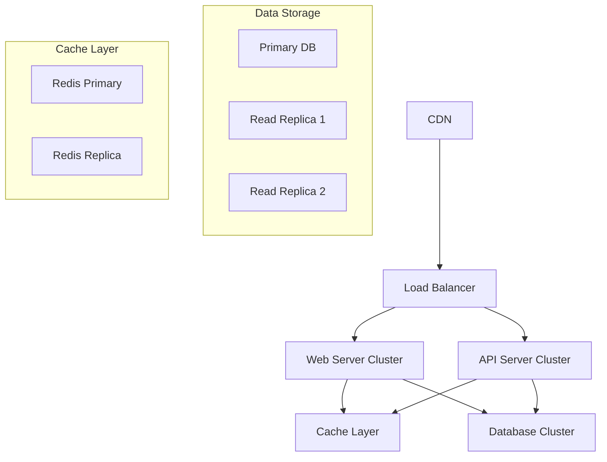

# Infrastructure Setup

## Overview
This document outlines the infrastructure setup for the Marriott Hotels platform, including cloud resources, deployment configurations, and monitoring systems. The infrastructure is designed for high availability, scalability, and security.

## Cloud Architecture

### System Diagram


## Infrastructure Components

### 1. Compute Resources
```yaml
# Kubernetes Configuration
apiVersion: apps/v1
kind: Deployment
metadata:
  name: marriott-web
spec:
  replicas: 3
  selector:
    matchLabels:
      app: marriott-web
  template:
    metadata:
      labels:
        app: marriott-web
    spec:
      containers:
      - name: web
        image: marriott/web:latest
        resources:
          requests:
            memory: "256Mi"
            cpu: "200m"
          limits:
            memory: "512Mi"
            cpu: "500m"
        readinessProbe:
          httpGet:
            path: /health
            port: 3000
```

### 2. Database Configuration
```yaml
# Database Configuration
apiVersion: v1
kind: ConfigMap
metadata:
  name: db-config
data:
  DB_HOST: "postgres-primary"
  DB_PORT: "5432"
  DB_NAME: "marriott"
  
---
apiVersion: apps/v1
kind: StatefulSet
metadata:
  name: postgres
spec:
  serviceName: postgres
  replicas: 3
  template:
    spec:
      containers:
      - name: postgres
        image: postgres:14
        env:
        - name: POSTGRES_DB
          valueFrom:
            configMapKeyRef:
              name: db-config
              key: DB_NAME
```

## Network Configuration

### 1. Load Balancer Setup
```yaml
# Load Balancer Configuration
apiVersion: v1
kind: Service
metadata:
  name: marriott-lb
  annotations:
    service.beta.kubernetes.io/aws-load-balancer-type: nlb
spec:
  type: LoadBalancer
  ports:
  - port: 80
    targetPort: 3000
  selector:
    app: marriott-web
```

### 2. Network Policies
```yaml
# Network Policy
apiVersion: networking.k8s.io/v1
kind: NetworkPolicy
metadata:
  name: api-network-policy
spec:
  podSelector:
    matchLabels:
      app: marriott-api
  policyTypes:
  - Ingress
  - Egress
  ingress:
  - from:
    - podSelector:
        matchLabels:
          app: marriott-web
    ports:
    - protocol: TCP
      port: 8080
```

## Security Configuration

### 1. SSL/TLS Setup
```yaml
# Certificate Manager
apiVersion: cert-manager.io/v1
kind: Certificate
metadata:
  name: marriott-tls
spec:
  secretName: marriott-tls-secret
  issuerRef:
    name: letsencrypt-prod
    kind: ClusterIssuer
  dnsNames:
  - api.marriott.com
  - www.marriott.com
```

### 2. IAM Policies
```json
{
  "Version": "2012-10-17",
  "Statement": [
    {
      "Effect": "Allow",
      "Action": [
        "s3:GetObject",
        "s3:PutObject"
      ],
      "Resource": [
        "arn:aws:s3:::marriott-assets/*"
      ]
    }
  ]
}
```

## Monitoring Setup

### 1. Prometheus Configuration
```yaml
# Prometheus Config
apiVersion: monitoring.coreos.com/v1
kind: ServiceMonitor
metadata:
  name: marriott-monitor
spec:
  selector:
    matchLabels:
      app: marriott-web
  endpoints:
  - port: metrics
    interval: 15s
```

### 2. Grafana Dashboards
```json
{
  "dashboard": {
    "id": null,
    "title": "Marriott Platform Metrics",
    "panels": [
      {
        "title": "Request Latency",
        "type": "graph",
        "datasource": "Prometheus",
        "targets": [
          {
            "expr": "http_request_duration_seconds"
          }
        ]
      }
    ]
  }
}
```

## Backup and Recovery

### 1. Backup Configuration
```yaml
# Backup Job
apiVersion: batch/v1beta1
kind: CronJob
metadata:
  name: db-backup
spec:
  schedule: "0 2 * * *"
  jobTemplate:
    spec:
      template:
        spec:
          containers:
          - name: backup
            image: marriott/backup:latest
            env:
            - name: BACKUP_PATH
              value: "/backups"
```

### 2. Recovery Procedures
```bash
#!/bin/bash
# Database Recovery Script

# Set variables
DB_NAME="marriott"
BACKUP_FILE="/path/to/backup.sql"

# Restore database
psql -U postgres -d $DB_NAME -f $BACKUP_FILE

# Verify restoration
psql -U postgres -d $DB_NAME -c "SELECT COUNT(*) FROM users;"
```

## Scaling Configuration

### 1. Horizontal Pod Autoscaling
```yaml
# HPA Configuration
apiVersion: autoscaling/v2beta2
kind: HorizontalPodAutoscaler
metadata:
  name: marriott-hpa
spec:
  scaleTargetRef:
    apiVersion: apps/v1
    kind: Deployment
    name: marriott-web
  minReplicas: 3
  maxReplicas: 10
  metrics:
  - type: Resource
    resource:
      name: cpu
      target:
        type: Utilization
        averageUtilization: 70
```

### 2. Vertical Pod Autoscaling
```yaml
# VPA Configuration
apiVersion: autoscaling.k8s.io/v1
kind: VerticalPodAutoscaler
metadata:
  name: marriott-vpa
spec:
  targetRef:
    apiVersion: apps/v1
    kind: Deployment
    name: marriott-web
  updatePolicy:
    updateMode: Auto
```

## Deployment Pipeline

### 1. CI/CD Configuration
```yaml
# GitHub Actions Workflow
name: Deploy to Production
on:
  push:
    branches: [main]
jobs:
  deploy:
    runs-on: ubuntu-latest
    steps:
    - uses: actions/checkout@v2
    - name: Build
      run: |
        docker build -t marriott/web:${{ github.sha }} .
    - name: Deploy
      run: |
        kubectl set image deployment/marriott-web \
          web=marriott/web:${{ github.sha }}
```

### 2. Rollback Procedures
```bash
#!/bin/bash
# Rollback Script

# Get previous deployment
PREV_REVISION=$(kubectl rollout history deployment/marriott-web | tail -n 2 | head -n 1 | awk '{print $1}')

# Rollback to previous version
kubectl rollout undo deployment/marriott-web --to-revision=$PREV_REVISION

# Verify rollback
kubectl rollout status deployment/marriott-web
```

## Environment Configuration

### 1. Production Environment
```yaml
# Production Config
apiVersion: v1
kind: ConfigMap
metadata:
  name: prod-config
data:
  NODE_ENV: "production"
  API_URL: "https://api.marriott.com"
  REDIS_URL: "redis://redis-primary:6379"
```

### 2. Staging Environment
```yaml
# Staging Config
apiVersion: v1
kind: ConfigMap
metadata:
  name: staging-config
data:
  NODE_ENV: "staging"
  API_URL: "https://api-staging.marriott.com"
  REDIS_URL: "redis://redis-staging:6379"
```

## Disaster Recovery

### 1. Failover Configuration
```yaml
# Database Failover
apiVersion: postgresql.acid.zalan.do/v1
kind: postgresql
metadata:
  name: marriott-db-cluster
spec:
  numberOfInstances: 3
  patroni:
    synchronous_mode: true
    synchronous_mode_strict: true
```

### 2. Recovery Plan
1. Incident Detection
2. Team Notification
3. Impact Assessment
4. Recovery Execution
5. Service Verification
6. Post-mortem Analysis

## Maintenance Procedures

### 1. Update Procedures
```bash
# Update Script
#!/bin/bash

# Update dependencies
npm update

# Run tests
npm test

# Build new image
docker build -t marriott/web:latest .

# Deploy update
kubectl apply -f k8s/deployment.yaml
```

### 2. Health Checks
```yaml
# Health Check Configuration
livenessProbe:
  httpGet:
    path: /health
    port: 3000
  initialDelaySeconds: 30
  periodSeconds: 10
readinessProbe:
  httpGet:
    path: /ready
    port: 3000
  initialDelaySeconds: 5
  periodSeconds: 5
```

## Documentation

### 1. Setup Guide
- Prerequisites
- Installation steps
- Configuration
- Verification
- Troubleshooting

### 2. Maintenance Guide
- Regular tasks
- Update procedures
- Backup verification
- Performance tuning
- Security updates

## Future Improvements

### 1. Infrastructure Roadmap
- Multi-region deployment
- Service mesh implementation
- Zero-downtime updates
- Automated failover
- Enhanced monitoring

### 2. Research Areas
- Container optimization
- Cost optimization
- Security enhancements
- Performance improvements
- Automation opportunities 