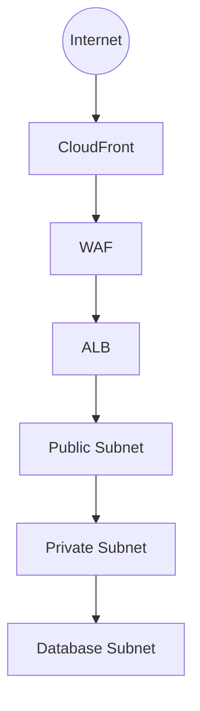
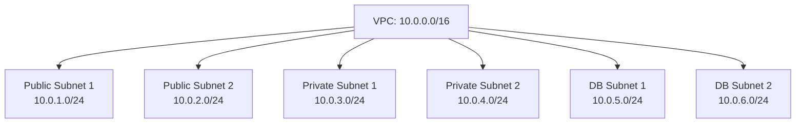

# Network Architecture Documentation

## Overview
This document outlines the network architecture for the Marriott Hotels platform, detailing the network topology, security measures, and connectivity configurations.

## Table of Contents
- [Network Topology](#network-topology)
- [VPC Configuration](#vpc-configuration)
- [Security Groups](#security-groups)
- [Load Balancing](#load-balancing)
- [Network Monitoring](#network-monitoring)

## Network Topology

### High-Level Architecture


### VPC Layout


## VPC Configuration

### Network ACLs
```yaml
# Network ACL Configuration
network_acls:
  public:
    inbound:
      - rule_number: 100
        protocol: tcp
        port_range: 80-443
        source: 0.0.0.0/0
        action: allow
    outbound:
      - rule_number: 100
        protocol: -1
        port_range: all
        destination: 0.0.0.0/0
        action: allow
        
  private:
    inbound:
      - rule_number: 100
        protocol: tcp
        port_range: all
        source: 10.0.0.0/16
        action: allow
    outbound:
      - rule_number: 100
        protocol: -1
        port_range: all
        destination: 0.0.0.0/0
        action: allow
```

### Route Tables
```yaml
# Route Table Configuration
route_tables:
  public:
    - destination: 0.0.0.0/0
      target: igw-id
    - destination: 10.0.0.0/16
      target: local
      
  private:
    - destination: 0.0.0.0/0
      target: nat-gateway-id
    - destination: 10.0.0.0/16
      target: local
```

## Security Groups

### Application Layer
```yaml
# Application Security Groups
security_groups:
  alb:
    inbound:
      - protocol: tcp
        port: 443
        source: 0.0.0.0/0
        description: HTTPS from internet
        
  application:
    inbound:
      - protocol: tcp
        port: 8080
        source: sg-alb
        description: Traffic from ALB
        
  cache:
    inbound:
      - protocol: tcp
        port: 6379
        source: sg-application
        description: Redis from application
```

### Database Layer
```yaml
# Database Security Groups
security_groups:
  database:
    inbound:
      - protocol: tcp
        port: 5432
        source: sg-application
        description: PostgreSQL from application
```

## Load Balancing

### ALB Configuration
```yaml
# Application Load Balancer
alb:
  scheme: internet-facing
  ip_address_type: ipv4
  security_groups:
    - sg-alb
  subnets:
    - subnet-public-1
    - subnet-public-2
    
  listeners:
    - port: 443
      protocol: HTTPS
      ssl_policy: ELBSecurityPolicy-TLS-1-2-2017-01
      certificate: arn:aws:acm:region:account:certificate/cert-id
      
  target_groups:
    - name: api
      port: 8080
      protocol: HTTP
      health_check:
        path: /health
        interval: 30
        timeout: 5
        healthy_threshold: 2
        unhealthy_threshold: 3
```

### DNS Configuration
```yaml
# Route 53 Configuration
route53:
  zones:
    - name: marriott.com
      type: public
      records:
        - name: api.marriott.com
          type: A
          alias:
            name: alb-dns-name
            zone_id: alb-zone-id
```

## Network Monitoring

### Flow Logs
```yaml
# VPC Flow Logs
flow_logs:
  destination: cloudwatch
  traffic_type: ALL
  format: ${version} ${account-id} ${interface-id} ${srcaddr} ${dstaddr} ${srcport} ${dstport} ${protocol} ${packets} ${bytes} ${start} ${end} ${action} ${log-status}
```

### Metrics
```yaml
# CloudWatch Metrics
metrics:
  namespace: NetworkMetrics
  dimensions:
    - VPC
    - Subnet
    - SecurityGroup
  metrics:
    - name: BytesTransferred
      unit: Bytes
      statistic: Sum
    - name: PacketsTransferred
      unit: Count
      statistic: Sum
```

### Alerts
```yaml
# CloudWatch Alarms
alarms:
  high_error_rate:
    metric: HTTPCode_ELB_5XX_Count
    threshold: 10
    period: 300
    evaluation_periods: 2
    comparison_operator: GreaterThanThreshold
    
  high_latency:
    metric: TargetResponseTime
    threshold: 2
    period: 300
    evaluation_periods: 2
    comparison_operator: GreaterThanThreshold
```

## Best Practices

### 1. Security
- Implement defense in depth
- Use security groups effectively
- Enable flow logs
- Regular security audits

### 2. Performance
- Optimize routing
- Use appropriate subnets
- Monitor network metrics
- Regular performance testing

### 3. Reliability
- Multi-AZ deployment
- Redundant connectivity
- Automated failover
- Disaster recovery plan

### 4. Cost Management
- Optimize data transfer
- Use VPC endpoints
- Monitor bandwidth usage
- Regular cost review

## Maintenance Procedures

### Daily Tasks
1. Monitor network metrics
2. Review flow logs
3. Check connectivity
4. Verify security groups

### Weekly Tasks
1. Performance analysis
2. Security review
3. Capacity planning
4. Update documentation

### Monthly Tasks
1. Network audit
2. Cost optimization
3. Compliance check
4. Architecture review

### Quarterly Tasks
1. Disaster recovery test
2. Security assessment
3. Performance optimization
4. Documentation update