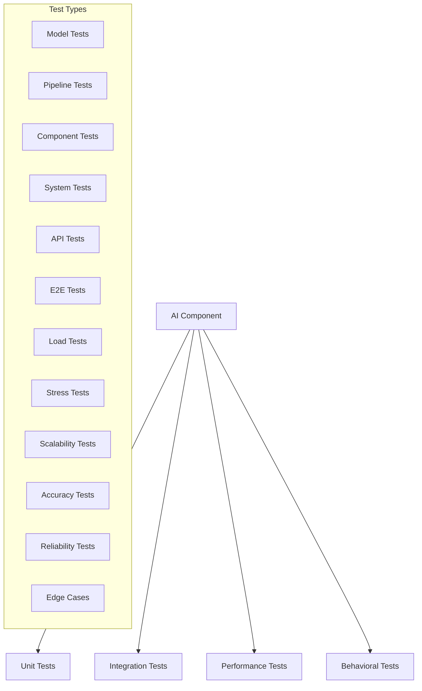

# AI Component Testing

## Overview
This document outlines the testing strategy for AI components in the Marriott Hotels platform, including chatbot, voice processing, recommendation system, and natural language processing components.

## Architecture

### Testing Flow


## Implementation

### 1. Model Testing
```typescript
// tests/models/chatbot.test.ts
import { ChatbotModel } from '@/models/chatbot';
import { TestDataGenerator } from '@/utils/testing';

describe('Chatbot Model', () => {
  let model: ChatbotModel;
  let testData: TestData;
  
  beforeEach(async () => {
    model = new ChatbotModel();
    testData = await TestDataGenerator.generate();
  });
  
  it('should generate appropriate responses', async () => {
    const testCases = [
      {
        input: 'I want to book a room',
        expectedIntent: 'booking',
        expectedEntities: ['room'],
      },
      {
        input: 'What amenities do you have?',
        expectedIntent: 'amenities',
        expectedEntities: [],
      },
    ];
    
    for (const testCase of testCases) {
      const response = await model.process(testCase.input);
      
      expect(response.intent).toBe(testCase.expectedIntent);
      expect(response.entities).toEqual(
        expect.arrayContaining(testCase.expectedEntities)
      );
    }
  });
  
  it('should handle edge cases', async () => {
    const edgeCases = [
      '',
      'a'.repeat(1000),
      '!@#$%^&*()',
      '你好',
    ];
    
    for (const input of edgeCases) {
      const response = await model.process(input);
      expect(response).toBeDefined();
      expect(response.error).toBeUndefined();
    }
  });
  
  it('should maintain context', async () => {
    const conversation = [
      'I want to book a room',
      'For tomorrow night',
      'Yes, that works',
    ];
    
    const context = {};
    
    for (const message of conversation) {
      const response = await model.process(message, context);
      expect(response.context).toBeDefined();
      Object.assign(context, response.context);
    }
    
    expect(context).toHaveProperty('bookingDetails');
  });
});
```

### 2. Pipeline Testing
```typescript
// tests/pipeline/nlp.test.ts
import { NLPPipeline } from '@/pipelines/nlp';
import { MockTokenizer, MockClassifier } from '@/mocks/nlp';

describe('NLP Pipeline', () => {
  let pipeline: NLPPipeline;
  
  beforeEach(() => {
    pipeline = new NLPPipeline({
      tokenizer: new MockTokenizer(),
      classifier: new MockClassifier(),
    });
  });
  
  it('should process text correctly', async () => {
    const input = 'Book a luxury room for two nights';
    const result = await pipeline.process(input);
    
    expect(result).toMatchObject({
      tokens: expect.any(Array),
      intent: expect.any(String),
      entities: expect.any(Array),
    });
  });
  
  it('should handle pipeline failures gracefully', async () => {
    const failingPipeline = new NLPPipeline({
      tokenizer: {
        tokenize: () => {
          throw new Error('Tokenization failed');
        },
      },
      classifier: new MockClassifier(),
    });
    
    const input = 'Test input';
    await expect(failingPipeline.process(input))
      .rejects
      .toThrow('Pipeline error');
  });
  
  it('should preserve order of operations', async () => {
    const operations: string[] = [];
    
    const trackedPipeline = new NLPPipeline({
      tokenizer: {
        tokenize: (text: string) => {
          operations.push('tokenize');
          return text.split(' ');
        },
      },
      classifier: {
        classify: () => {
          operations.push('classify');
          return 'intent';
        },
      },
    });
    
    await trackedPipeline.process('Test input');
    
    expect(operations).toEqual(['tokenize', 'classify']);
  });
});
```

### 3. Integration Testing
```typescript
// tests/integration/ai-services.test.ts
import { AIServices } from '@/services/ai';
import { TestEnvironment } from '@/utils/testing';

describe('AI Services Integration', () => {
  let services: AIServices;
  let env: TestEnvironment;
  
  beforeAll(async () => {
    env = await TestEnvironment.setup();
    services = new AIServices(env.config);
  });
  
  afterAll(async () => {
    await env.teardown();
  });
  
  it('should process end-to-end booking flow', async () => {
    const conversation = [
      {
        input: 'I want to book a room',
        expectedFlow: ['chatbot', 'nlp', 'booking'],
      },
      {
        input: 'For tomorrow night',
        expectedFlow: ['chatbot', 'nlp', 'datetime', 'booking'],
      },
      {
        input: 'Yes, confirm the booking',
        expectedFlow: ['chatbot', 'nlp', 'booking', 'confirmation'],
      },
    ];
    
    const context = {};
    const flowTracker = new FlowTracker();
    
    for (const step of conversation) {
      const response = await services.process(
        step.input,
        context,
        flowTracker
      );
      
      expect(flowTracker.getFlow()).toEqual(step.expectedFlow);
      expect(response.status).toBe('success');
    }
  });
  
  it('should handle service failures gracefully', async () => {
    const failingServices = new AIServices({
      ...env.config,
      nlp: {
        endpoint: 'invalid-endpoint',
      },
    });
    
    const response = await failingServices.process(
      'Test input',
      {}
    );
    
    expect(response.status).toBe('error');
    expect(response.fallback).toBeDefined();
  });
});
```

### 4. Performance Testing
```typescript
// tests/performance/ai-components.test.ts
import { PerformanceMonitor } from '@/utils/monitoring';
import { LoadGenerator } from '@/utils/load';
import { AIComponents } from '@/components/ai';

describe('AI Components Performance', () => {
  let components: AIComponents;
  let monitor: PerformanceMonitor;
  let loadGen: LoadGenerator;
  
  beforeEach(async () => {
    components = new AIComponents();
    monitor = new PerformanceMonitor();
    loadGen = new LoadGenerator();
  });
  
  it('should handle concurrent requests', async () => {
    const concurrency = 100;
    const duration = 60; // seconds
    
    const results = await loadGen.run({
      target: components.chatbot.process,
      concurrency,
      duration,
      payload: 'Test input',
    });
    
    expect(results.successRate).toBeGreaterThan(0.99);
    expect(results.averageLatency).toBeLessThan(500);
    expect(results.maxLatency).toBeLessThan(2000);
  });
  
  it('should maintain response quality under load', async () => {
    const baseline = await components.chatbot.process(
      'Book a room'
    );
    
    await loadGen.generateLoad({
      target: components.chatbot.process,
      intensity: 'high',
      duration: 30,
    });
    
    const underLoad = await components.chatbot.process(
      'Book a room'
    );
    
    expect(underLoad.quality).toBeGreaterThanOrEqual(
      baseline.quality * 0.9
    );
  });
  
  it('should scale with input size', async () => {
    const inputSizes = [10, 100, 1000, 10000];
    const measurements = [];
    
    for (const size of inputSizes) {
      const input = 'a'.repeat(size);
      const start = performance.now();
      
      await components.nlp.process(input);
      
      measurements.push({
        size,
        duration: performance.now() - start,
      });
    }
    
    // Check for sub-linear scaling
    const scaling = monitor.calculateScaling(measurements);
    expect(scaling.factor).toBeLessThan(1);
  });
});
```

### 5. Behavioral Testing
```typescript
// tests/behavioral/ai-responses.test.ts
import { AIBehaviorTester } from '@/utils/testing';
import { ResponseValidator } from '@/utils/validation';

describe('AI Response Behavior', () => {
  let tester: AIBehaviorTester;
  let validator: ResponseValidator;
  
  beforeEach(() => {
    tester = new AIBehaviorTester();
    validator = new ResponseValidator();
  });
  
  it('should maintain consistent personality', async () => {
    const conversations = await tester.generateConversations(10);
    const personalities = await tester.analyzePersonalities(
      conversations
    );
    
    expect(personalities.consistency).toBeGreaterThan(0.8);
  });
  
  it('should handle sensitive topics appropriately', async () => {
    const sensitiveTopics = [
      'personal information',
      'financial details',
      'medical conditions',
    ];
    
    for (const topic of sensitiveTopics) {
      const response = await tester.testTopic(topic);
      expect(response.sensitivity).toBe('high');
      expect(response.containsPersonalInfo).toBe(false);
    }
  });
  
  it('should provide accurate information', async () => {
    const testCases = await tester.generateFactualTestCases();
    
    for (const testCase of testCases) {
      const response = await tester.testFactualAccuracy(
        testCase
      );
      
      expect(response.accuracy).toBeGreaterThan(0.95);
      expect(response.citations).toBeDefined();
    }
  });
});
```

## Test Automation

### 1. CI/CD Integration
```yaml
# .github/workflows/ai-tests.yml
name: AI Component Tests

on:
  push:
    paths:
      - 'src/ai/**'
      - 'tests/ai/**'
  pull_request:
    paths:
      - 'src/ai/**'
      - 'tests/ai/**'

jobs:
  test:
    runs-on: ubuntu-latest
    
    steps:
      - uses: actions/checkout@v2
      
      - name: Setup Node.js
        uses: actions/setup-node@v2
        with:
          node-version: '16'
          
      - name: Install dependencies
        run: npm ci
        
      - name: Run unit tests
        run: npm run test:ai:unit
        
      - name: Run integration tests
        run: npm run test:ai:integration
        
      - name: Run performance tests
        run: npm run test:ai:performance
        
      - name: Run behavioral tests
        run: npm run test:ai:behavioral
        
      - name: Upload test results
        uses: actions/upload-artifact@v2
        with:
          name: test-results
          path: coverage/
```

### 2. Test Monitoring
```typescript
// monitoring/test-monitor.ts
import { TestResults } from '@/types/testing';
import { MetricsClient } from '@/lib/metrics';

export class TestMonitor {
  private metrics: MetricsClient;
  
  constructor() {
    this.metrics = new MetricsClient();
  }
  
  async trackResults(results: TestResults): Promise<void> {
    // Track test metrics
    await this.metrics.record('ai.tests', {
      success_rate: results.successRate,
      coverage: results.coverage,
      duration: results.duration,
      timestamp: Date.now(),
    });
    
    // Track performance metrics
    await this.metrics.record('ai.performance', {
      latency: results.latency,
      throughput: results.throughput,
      error_rate: results.errorRate,
      timestamp: Date.now(),
    });
    
    // Track quality metrics
    await this.metrics.record('ai.quality', {
      accuracy: results.accuracy,
      consistency: results.consistency,
      relevance: results.relevance,
      timestamp: Date.now(),
    });
  }
  
  async alertOnFailure(error: Error): Promise<void> {
    await this.metrics.alert('ai.test.failure', {
      error: error.message,
      stack: error.stack,
      timestamp: Date.now(),
    });
  }
}
```

## Documentation

### 1. Test Guide
- Test setup
- Test execution
- Result analysis
- Error handling

### 2. Maintenance Guide
- Test updates
- Coverage monitoring
- Performance tuning
- Quality assurance

## Future Improvements

### 1. Technical Roadmap
- Automated test generation
- Fuzzing tests
- Property-based testing
- Chaos testing

### 2. Research Areas
- Test coverage metrics
- Performance benchmarks
- Quality metrics
- Automated validation 