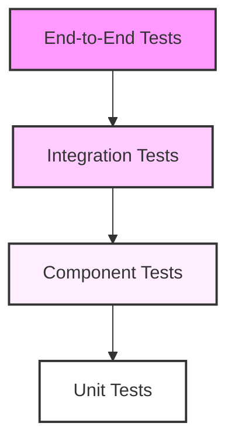

# Testing Strategy

## Overview
This document outlines the comprehensive testing strategy for the Marriott Hotels platform. It covers all aspects of testing, from unit tests to end-to-end integration tests, including AI component testing and performance testing.

## Testing Architecture

### Testing Pyramid


## Unit Testing

### 1. Component Tests
```typescript
// Hotel Component Test
describe('HotelService', () => {
  let service: HotelService;
  let mockRepository: MockType<HotelRepository>;
  
  beforeEach(() => {
    mockRepository = {
      find: jest.fn(),
      findById: jest.fn()
    };
    
    service = new HotelService(mockRepository);
  });
  
  it('should find available hotels', async () => {
    const mockHotels = [
      { id: '1', name: 'Test Hotel' }
    ];
    
    mockRepository.find.mockResolvedValue(mockHotels);
    
    const result = await service.findHotels({});
    expect(result).toEqual(mockHotels);
  });
});
```

### 2. AI Service Tests
```typescript
// AI Chat Service Test
describe('ChatService', () => {
  let service: ChatService;
  let mockOpenAI: MockType<OpenAIClient>;
  
  beforeEach(() => {
    mockOpenAI = {
      createCompletion: jest.fn()
    };
    
    service = new ChatService(mockOpenAI);
  });
  
  it('should process chat messages', async () => {
    const mockResponse = {
      choices: [{ message: { content: 'Test response' } }]
    };
    
    mockOpenAI.createCompletion.mockResolvedValue(mockResponse);
    
    const result = await service.processMessage({
      text: 'Hello',
      userId: '123'
    });
    
    expect(result.text).toBe('Test response');
  });
});
```

## Integration Testing

### 1. API Integration Tests
```typescript
// Booking API Test
describe('Booking API', () => {
  let app: Express;
  let prisma: PrismaClient;
  
  beforeAll(async () => {
    app = await createTestApp();
    prisma = new PrismaClient();
  });
  
  it('should create a booking', async () => {
    const response = await request(app)
      .post('/api/bookings')
      .send({
        hotelId: '123',
        checkIn: '2024-07-01',
        checkOut: '2024-07-05'
      });
      
    expect(response.status).toBe(201);
    expect(response.body).toHaveProperty('id');
  });
});
```

### 2. Database Integration Tests
```typescript
// Database Integration Test
describe('Hotel Repository', () => {
  let repository: HotelRepository;
  let prisma: PrismaClient;
  
  beforeAll(async () => {
    prisma = new PrismaClient();
    repository = new HotelRepository(prisma);
  });
  
  it('should find hotels with rooms', async () => {
    const hotels = await repository.findAvailable({
      checkIn: new Date(),
      checkOut: new Date()
    });
    
    expect(hotels).toBeInstanceOf(Array);
    expect(hotels[0]).toHaveProperty('rooms');
  });
});
```

## End-to-End Testing

### 1. User Flow Tests
```typescript
// Booking Flow Test
describe('Booking Flow', () => {
  let page: Page;
  
  beforeAll(async () => {
    page = await browser.newPage();
  });
  
  it('should complete booking flow', async () => {
    // Navigate to hotel page
    await page.goto('/hotels/123');
    
    // Select dates
    await page.click('[data-testid="date-picker"]');
    await page.click('[data-testid="check-in-date"]');
    await page.click('[data-testid="check-out-date"]');
    
    // Complete booking
    await page.click('[data-testid="book-now"]');
    
    // Verify confirmation
    const confirmation = await page.waitForSelector(
      '[data-testid="booking-confirmation"]'
    );
    expect(confirmation).toBeTruthy();
  });
});
```

### 2. AI Integration Tests
```typescript
// AI Chat Flow Test
describe('AI Chat Integration', () => {
  let page: Page;
  
  beforeAll(async () => {
    page = await browser.newPage();
  });
  
  it('should handle chat conversation', async () => {
    await page.goto('/chat');
    
    // Send message
    await page.type('[data-testid="chat-input"]', 'Book a room');
    await page.click('[data-testid="send-message"]');
    
    // Wait for AI response
    const response = await page.waitForSelector(
      '[data-testid="ai-response"]'
    );
    expect(response).toBeTruthy();
  });
});
```

## Performance Testing

### 1. Load Testing
```typescript
// Load Test Configuration
import { check } from 'k6';
import http from 'k6/http';

export const options = {
  stages: [
    { duration: '1m', target: 100 },
    { duration: '5m', target: 100 },
    { duration: '1m', target: 0 }
  ]
};

export default function() {
  const response = http.get('https://api.marriott.com/hotels');
  
  check(response, {
    'status is 200': (r) => r.status === 200,
    'response time < 200ms': (r) => r.timings.duration < 200
  });
}
```

### 2. Stress Testing
```typescript
// Stress Test Configuration
import { check } from 'k6';
import http from 'k6/http';

export const options = {
  stages: [
    { duration: '2m', target: 1000 },
    { duration: '5m', target: 1000 },
    { duration: '2m', target: 0 }
  ]
};

export default function() {
  const response = http.post('https://api.marriott.com/bookings', {
    hotelId: '123',
    checkIn: '2024-07-01',
    checkOut: '2024-07-05'
  });
  
  check(response, {
    'status is 201': (r) => r.status === 201,
    'response time < 500ms': (r) => r.timings.duration < 500
  });
}
```

## Security Testing

### 1. Penetration Testing
```typescript
// Security Test Suite
describe('Security Tests', () => {
  let app: Express;
  
  beforeAll(async () => {
    app = await createTestApp();
  });
  
  it('should prevent SQL injection', async () => {
    const response = await request(app)
      .get('/api/hotels')
      .query({ search: "'; DROP TABLE hotels; --" });
      
    expect(response.status).toBe(400);
  });
  
  it('should prevent XSS attacks', async () => {
    const response = await request(app)
      .post('/api/reviews')
      .send({
        content: '<script>alert("XSS")</script>'
      });
      
    expect(response.body.content).not.toContain('<script>');
  });
});
```

### 2. Authentication Tests
```typescript
// Auth Test Suite
describe('Authentication', () => {
  let app: Express;
  
  beforeAll(async () => {
    app = await createTestApp();
  });
  
  it('should require authentication', async () => {
    const response = await request(app)
      .get('/api/user/profile');
      
    expect(response.status).toBe(401);
  });
  
  it('should validate JWT tokens', async () => {
    const response = await request(app)
      .get('/api/user/profile')
      .set('Authorization', 'Bearer invalid-token');
      
    expect(response.status).toBe(401);
  });
});
```

## AI Component Testing

### 1. Model Testing
```typescript
// AI Model Test
describe('AI Model Tests', () => {
  let service: AIService;
  
  beforeAll(async () => {
    service = new AIService();
  });
  
  it('should handle hotel recommendations', async () => {
    const result = await service.getRecommendations({
      location: 'New York',
      preferences: ['luxury', 'spa']
    });
    
    expect(result).toHaveLength(5);
    expect(result[0]).toHaveProperty('score');
  });
});
```

### 2. Conversation Testing
```typescript
// Conversation Flow Test
describe('Conversation Flow', () => {
  let service: ConversationService;
  
  beforeAll(async () => {
    service = new ConversationService();
  });
  
  it('should maintain context', async () => {
    const conversation = await service.createConversation();
    
    await service.addMessage(conversation.id, {
      role: 'user',
      content: 'I want to book a luxury hotel'
    });
    
    const response = await service.getNextResponse(conversation.id);
    expect(response.content).toContain('luxury');
  });
});
```

## Test Automation

### 1. CI Pipeline Configuration
```yaml
# Test Pipeline
name: Run Tests
on: [push, pull_request]

jobs:
  test:
    runs-on: ubuntu-latest
    steps:
      - uses: actions/checkout@v2
      
      - name: Setup Node.js
        uses: actions/setup-node@v2
        with:
          node-version: '16'
          
      - name: Install Dependencies
        run: npm ci
        
      - name: Run Tests
        run: |
          npm run test:unit
          npm run test:integration
          npm run test:e2e
```

### 2. Test Reports
```typescript
// Test Reporter Configuration
module.exports = {
  reporters: [
    'default',
    [
      'jest-junit',
      {
        outputDirectory: 'reports/junit',
        outputName: 'junit.xml',
        classNameTemplate: '{classname}',
        titleTemplate: '{title}'
      }
    ],
    [
      'jest-html-reporter',
      {
        pageTitle: 'Test Report',
        outputPath: 'reports/html/test-report.html'
      }
    ]
  ]
};
```

## Test Coverage

### 1. Coverage Requirements
- Unit Tests: 90% coverage
- Integration Tests: 80% coverage
- E2E Tests: Key user flows
- Performance Tests: Response time < 200ms
- Security Tests: OWASP Top 10

### 2. Coverage Reports
```typescript
// Jest Coverage Configuration
module.exports = {
  collectCoverage: true,
  coverageDirectory: 'coverage',
  coverageReporters: ['text', 'lcov', 'html'],
  coverageThreshold: {
    global: {
      branches: 80,
      functions: 80,
      lines: 80,
      statements: 80
    }
  }
};
```

## Documentation

### 1. Test Documentation
- Test cases
- Test scenarios
- Test data
- Test environment setup
- Test execution guidelines

### 2. Maintenance Guide
- Test suite maintenance
- Test data management
- Environment management
- CI/CD pipeline updates
- Coverage monitoring

## Future Improvements

### 1. Testing Roadmap
- AI model validation framework
- Automated performance testing
- Enhanced security testing
- Visual regression testing
- Contract testing

### 2. Research Areas
- AI testing methodologies
- Performance optimization
- Security testing tools
- Test automation frameworks
- Coverage improvement strategies 